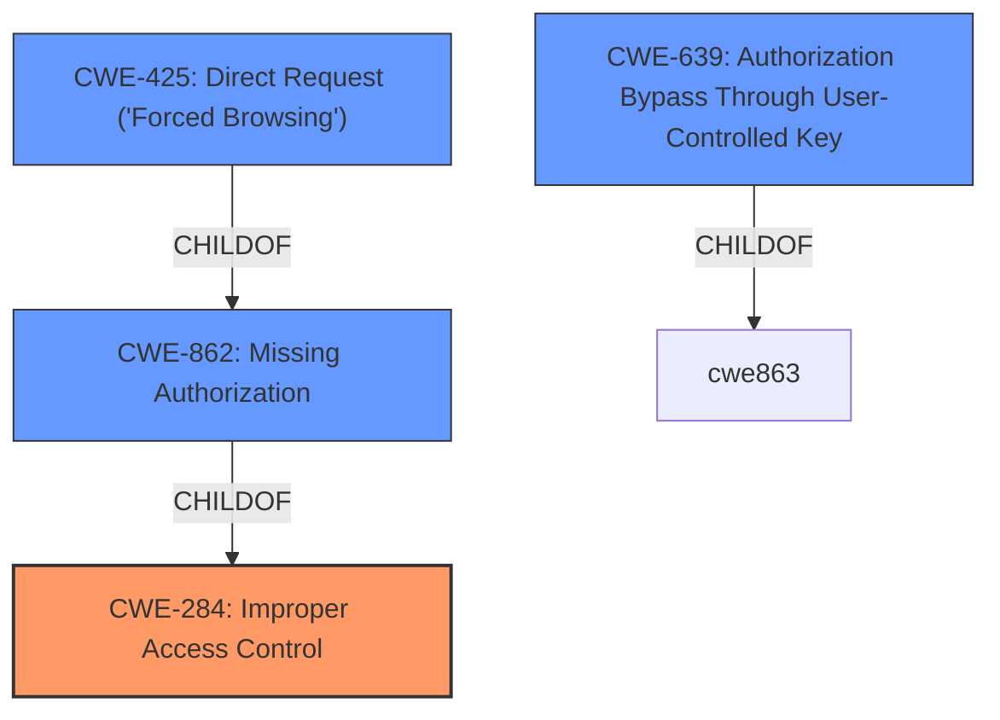

# Raw Analyzer Response for CVE-2022-25342

# Summary
| CWE ID | CWE Name | Confidence | CWE Abstraction Level | CWE Vulnerability Mapping Label | CWE-Vulnerability Mapping Notes |
|---|---|---|---|---|---|
| CWE-284 | Improper Access Control | 0.9 | Pillar | Discouraged | This CWE is a high-level Pillar and should be avoided if more specific CWEs are available. |
| CWE-862 | Missing Authorization | 0.8 | Class | Allowed-with-Review | This CWE is a Class and might have Base-level children that would be more appropriate. |
| CWE-425 | Direct Request ('Forced Browsing') | 0.7 | Base | Allowed |  This CWE is at the Base level of abstraction, which is a preferred level of abstraction for mapping to the root causes of vulnerabilities. |
| CWE-639 | Authorization Bypass Through User-Controlled Key | 0.6 | Base | Allowed | This CWE is at the Base level of abstraction, which is a preferred level of abstraction for mapping to the root causes of vulnerabilities. |

## Evidence and Confidence

*   **Confidence Score:** 0.8
*   **Evidence Strength:** HIGH

## Relationship Analysis
The primary relationship that impacted my decision was the parent-child relationship between **CWE-284 (Improper Access Control)**, **CWE-862 (Missing Authorization)**, and **CWE-425 (Direct Request ('Forced Browsing'))**. While **CWE-284** is too general (Pillar), **CWE-862** is a Class level that is more specific but it is a parent of **CWE-425**. **CWE-425** is more specific (Base). I also considered **CWE-639 (Authorization Bypass Through User-Controlled Key)** because the vulnerability description mentions unauthorized access to data.

## Vulnerability Chain
The vulnerability chain starts with the **improper access control**, leading to **missing authorization** checks, which results in the ability to make **direct requests** to unauthorized pages, potentially by manipulating user-controlled keys.

## Summary of Analysis
Initially, the description points to a general **broken access control** issue. However, analyzing the details, the root cause is more specific: the application **does not properly validate requests** for access to data and functionality. This indicates a **missing authorization** check. The ability to access unauthorized pages can be viewed as making **direct requests** to these resources without proper validation.

The primary driver for my CWE selection was the evidence within the vulnerability description and CVE Reference Links Content Summary, specifically the phrases: "**broken access control**", "**does not properly validate requests**", and "**insufficient authorization checks**".

The graph relationships helped to refine the selection. While **CWE-284 (Improper Access Control)** is a high-level classification, more specific options exist. **CWE-862 (Missing Authorization)** and **CWE-425 (Direct Request ('Forced Browsing'))** are better fits.

While the overall weakness is **CWE-284 (Improper Access Control)**, the lack of proper validation mechanisms means the more specific weakness is **CWE-862 (Missing Authorization)**. Also since the attacker can directly view pages that are not allowed by crafting http get requests, then **CWE-425 (Direct Request ('Forced Browsing'))** also applies. While not specifically mentioned, there is the possiblity that the attacker can modify the key value identifying the data, then **CWE-639 (Authorization Bypass Through User-Controlled Key)** can also be considered.

Relevant CWE Information:

# Enhanced Context (25 CWEs)
The following CWEs were identified as potentially relevant to this vulnerability:

## CWE-639: Authorization Bypass Through User-Controlled Key
**Abstraction Level**: Base
**Similarity Score**: 0.75
**Source**: dense

**Description**:
The system's authorization functionality does not prevent one user from gaining access to another user's data or record by modifying the key value identifying the data.

**Mapping Guidance**:
- Usage: Allowed
- Rationale: This CWE entry is at the Base level of abstraction, which is a preferred level of abstraction for mapping to the root causes of vulnerabilities.

## CWE-807: Reliance on Untrusted Inputs in a Security Decision
**Abstraction Level**: Base
**Similarity Score**: 0.74
**Source**: dense

**Description**:
The product uses a protection mechanism that relies on the existence or values of an input, but the input can be modified by an untrusted actor in a way that bypasses the protection mechanism.

**Mapping Guidance**:
- Usage: Allowed
- Rationale: This CWE entry is at the Base level of abstraction, which is a preferred level of abstraction for mapping to the root causes of vulnerabilities.

## CWE-274: Improper Handling of Insufficient Privileges
**Abstraction Level**: Base
**Similarity Score**: 0.74
**Source**: dense

**Description**:
The product does not handle or incorrectly handles when it has insufficient privileges to perform an operation, leading to resultant weaknesses.

**Mapping Guidance**:
- Usage: Discouraged
- Rationale: This CWE entry could be deprecated in a future version of CWE.

## CWE-1390: Weak Authentication
**Abstraction Level**: Class
**Similarity Score**: 0.74
**Source**: dense

**Description**:
The product uses an authentication mechanism to restrict access to specific users or identities, but the mechanism does not sufficiently prove that the claimed identity is correct.

**Mapping Guidance**:
- Usage: Allowed-with-Review
- Rationale: This CWE entry is a Class and might have Base-level children that would be more appropriate

## CWE-1220: Insufficient Granularity of Access Control
**Abstraction Level**: Base
**Similarity Score**: 0.74
**Source**: dense

**Description**:
The product implements access controls via a policy or other feature with the intention to disable or restrict accesses (reads and/or writes) to assets in a system from untrusted agents. However, implemented access controls lack required granularity, which renders the control policy too broad because it allows accesses from unauthorized agents to the security-sensitive assets.

**Mapping Guidance**:
- Usage: Allowed
- Rationale: This CWE entry is at the Base level of abstraction, which is a preferred level of abstraction for mapping to the root causes of vulnerabilities.

## CWE-280: Improper Handling of Insufficient Permissions or Privileges
**Abstraction Level**: Base
**Similarity Score**: 0.73
**Source**: dense

**Description**:
The product does not handle or incorrectly handles when it has insufficient privileges to access resources or functionality as specified by their permissions. This may cause it to follow unexpected code paths that may leave the product in an invalid state.

**Mapping Guidance**:
- Usage: Allowed
- Rationale: This CWE entry is at the Base level of abstraction, which is a preferred level of abstraction for mapping to the root causes of vulnerabilities.

## CWE-424: Improper Protection of Alternate Path
**Abstraction Level**: Class
**Similarity Score**: 0.73
**Source**: dense

**Description**:
The product does not sufficiently protect all possible paths that a user can take to access restricted functionality or resources.

**Mapping Guidance**:
- Usage: Allowed-with-Review
- Rationale: This CWE entry is a Class and might have Base-level children that would be more appropriate

## CWE-668: Exposure of Resource to Wrong Sphere
**Abstraction Level**: Class
**Similarity Score**: 0.73
**Source**: dense

**Description**:
The product exposes a resource to the wrong control sphere, providing unintended actors with inappropriate access to the resource.

**Mapping Guidance**:
- Usage: Discouraged
- Rationale: CWE-668 is high-level and is often misused as a catch-all when lower-level CWE IDs might be applicable. It is sometimes used for low-information vulnerability reports [REF-1287]. It is a level-1 Class (i.e., a child of a Pillar). It is not useful for trend analysis.

## CWE-472: External Control of Assumed-Immutable Web Parameter
**Abstraction Level**: Base
**Similarity Score**: 0.73
**Source**: dense

**Description**:
The web application does