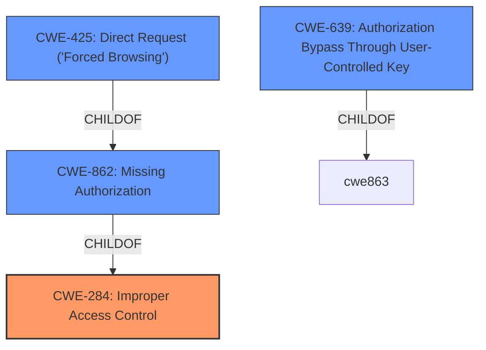

# Analysis for CVE-2022-25342

# Summary
| CWE ID | CWE Name | Confidence | CWE Abstraction Level | CWE Vulnerability Mapping Label | CWE-Vulnerability Mapping Notes |
|---|---|---|---|---|---|
| CWE-284 | Improper Access Control | 0.9 | Pillar | Discouraged | This CWE is a high-level Pillar and should be avoided if more specific CWEs are available. |
| CWE-862 | Missing Authorization | 0.8 | Class | Allowed-with-Review | This CWE is a Class and might have Base-level children that would be more appropriate. |
| CWE-425 | Direct Request ('Forced Browsing') | 0.7 | Base | Allowed |  This CWE is at the Base level of abstraction, which is a preferred level of abstraction for mapping to the root causes of vulnerabilities. |
| CWE-639 | Authorization Bypass Through User-Controlled Key | 0.6 | Base | Allowed | This CWE is at the Base level of abstraction, which is a preferred level of abstraction for mapping to the root causes of vulnerabilities. |

## Evidence and Confidence

*   **Confidence Score:** 0.8
*   **Evidence Strength:** HIGH

## Relationship Analysis
The primary relationship that impacted my decision was the parent-child relationship between **CWE-284 (Improper Access Control)**, **CWE-862 (Missing Authorization)**, and **CWE-425 (Direct Request ('Forced Browsing'))**. While **CWE-284** is too general (Pillar), **CWE-862** is a Class level that is more specific but it is a parent of **CWE-425**. **CWE-425** is more specific (Base). I also considered **CWE-639 (Authorization Bypass Through User-Controlled Key)** because the vulnerability description mentions unauthorized access to data.

## Vulnerability Chain
The vulnerability chain starts with the **improper access control**, leading to **missing authorization** checks, which results in the ability to make **direct requests** to unauthorized pages, potentially by manipulating user-controlled keys.

## Summary of Analysis
Initially, the description points to a general **broken access control** issue. However, analyzing the details, the root cause is more specific: the application **does not properly validate requests** for access to data and functionality. This indicates a **missing authorization** check. The ability to access unauthorized pages can be viewed as making **direct requests** to these resources without proper validation.

The primary driver for my CWE selection was the evidence within the vulnerability description and CVE Reference Links Content Summary, specifically the phrases: "**broken access control**", "**does not properly validate requests**", and "**insufficient authorization checks**".

The graph relationships helped to refine the selection. While **CWE-284 (Improper Access Control)** is a high-level classification, more specific options exist. **CWE-862 (Missing Authorization)** and **CWE-425 (Direct Request ('Forced Browsing'))** are better fits.

While the overall weakness is **CWE-284 (Improper Access Control)**, the lack of proper validation mechanisms means the more specific weakness is **CWE-862 (Missing Authorization)**. Also since the attacker can directly view pages that are not allowed by crafting http get requests, then **CWE-425 (Direct Request ('Forced Browsing'))** also applies. While not specifically mentioned, there is the possiblity that the attacker can modify the key value identifying the data, then **CWE-639 (Authorization Bypass Through User-Controlled Key)** can also be considered.

Relevant CWE Information:

# Enhanced Context (25 CWEs)
The following CWEs were identified as potentially relevant to this vulnerability:

## CWE-639: Authorization Bypass Through User-Controlled Key
**Abstraction Level**: Base
**Similarity Score**: 0.75
**Source**: dense

**Description**:
The system's authorization functionality does not prevent one user from gaining access to another user's data or record by modifying the key value identifying the data.

**Mapping Guidance**:
- Usage: Allowed
- Rationale: This CWE entry is at the Base level of abstraction, which is a preferred level of abstraction for mapping to the root causes of vulnerabilities.

## CWE-807: Reliance on Untrusted Inputs in a Security Decision
**Abstraction Level**: Base
**Similarity Score**: 0.74
**Source**: dense

**Description**:
The product uses a protection mechanism that relies on the existence or values of an input, but the input can be modified by an untrusted actor in a way that bypasses the protection mechanism.

**Mapping Guidance**:
- Usage: Allowed
- Rationale: This CWE entry is at the Base level of abstraction, which is a preferred level of abstraction for mapping to the root causes of vulnerabilities.

## CWE-274: Improper Handling of Insufficient Privileges
**Abstraction Level**: Base
**Similarity Score**: 0.74
**Source**: dense

**Description**:
The product does not handle or incorrectly handles when it has insufficient privileges to perform an operation, leading to resultant weaknesses.

**Mapping Guidance**:
- Usage: Discouraged
- Rationale: This CWE entry could be deprecated in a future version of CWE.

## CWE-1390: Weak Authentication
**Abstraction Level**: Class
**Similarity Score**: 0.74
**Source**: dense

**Description**:
The product uses an authentication mechanism to restrict access to specific users or identities, but the mechanism does not sufficiently prove that the claimed identity is correct.

**Mapping Guidance**:
- Usage: Allowed-with-Review
- Rationale: This CWE entry is a Class and might have Base-level children that would be more appropriate

## CWE-1220: Insufficient Granularity of Access Control
**Abstraction Level**: Base
**Similarity Score**: 0.74
**Source**: dense

**Description**:
The product implements access controls via a policy or other feature with the intention to disable or restrict accesses (reads and/or writes) to assets in a system from untrusted agents. However, implemented access controls lack required granularity, which renders the control policy too broad because it allows accesses from unauthorized agents to the security-sensitive assets.

**Mapping Guidance**:
- Usage: Allowed
- Rationale: This CWE entry is at the Base level of abstraction, which is a preferred level of abstraction for mapping to the root causes of vulnerabilities.

## CWE-280: Improper Handling of Insufficient Permissions or Privileges
**Abstraction Level**: Base
**Similarity Score**: 0.73
**Source**: dense

**Description**:
The product does not handle or incorrectly handles when it has insufficient privileges to access resources or functionality as specified by their permissions. This may cause it to follow unexpected code paths that may leave the product in an invalid state.

**Mapping Guidance**:
- Usage: Allowed
- Rationale: This CWE entry is at the Base level of abstraction, which is a preferred level of abstraction for mapping to the root causes of vulnerabilities.

## CWE-424: Improper Protection of Alternate Path
**Abstraction Level**: Class
**Similarity Score**: 0.73
**Source**: dense

**Description**:
The product does not sufficiently protect all possible paths that a user can take to access restricted functionality or resources.

**Mapping Guidance**:
- Usage: Allowed-with-Review
- Rationale: This CWE entry is a Class and might have Base-level children that would be more appropriate

## CWE-668: Exposure of Resource to Wrong Sphere
**Abstraction Level**: Class
**Similarity Score**: 0.73
**Source**: dense

**Description**:
The product exposes a resource to the wrong control sphere, providing unintended actors with inappropriate access to the resource.

**Mapping Guidance**:
- Usage: Discouraged
- Rationale: CWE-668 is high-level and is often misused as a catch-all when lower-level CWE IDs might be applicable. It is sometimes used for low-information vulnerability reports [REF-1287]. It is a level-1 Class (i.e., a child of a Pillar). It is not useful for trend analysis.

## CWE-472: External Control of Assumed-Immutable Web Parameter
**Abstraction Level**: Base
**Similarity Score**: 0.73
**Source**: dense

**Description**:
The web application does

# Enhanced Query for CVE-2022-25342

## Vulnerability Description
An issue was discovered on Olivetti d-COLOR MF3555 2XD_S000.002.271 devices. The Web Application is affected by Broken Access Control. It does not properly validate requests for access to data and functionality under the /mngset/authset path. By not verifying permissions for access to resources, it allows a potential attacker to view pages that are not allowed.

### Vulnerability Description Key Phrases
- **rootcause:** **broken access control**
- **impact:** view unauthorized pages
- **product:** Olivetti d-COLOR MF3555
- **version:** 2XD_S000.002.271
- **component:** /mngset/authset path

## CVE Reference Links Content Summary
Based on the provided content, here's a breakdown of the vulnerability information related to CVE-2022-25342:

**CVE-2022-25342**

*   **Root Cause of Vulnerability:** Improper Access Control. The web application does not properly validate requests for access to data and functionality under the `/mngset/authset` path.
*   **Weaknesses/Vulnerabilities Present:** Broken access control, insufficient authorization checks. The application allows unauthorized access to restricted resources.
*   **Impact of Exploitation:** A potential attacker can view pages and modify user details (including passwords) that should be restricted to administrative users. This can lead to privilege escalation where an attacker gains full control of the system by modifying admin user details.
*  **Attack Vectors:** The vulnerability is exploitable by sending a crafted HTTP GET request to specific endpoints under the `/mngset/authset` path.
*   **Required Attacker Capabilities/Position:** The attacker needs to be an authenticated user with at least one system administrator permission. The attacker needs to intercept a request from a privileged user and modify it to access administrative panels.

**Summary of Vulnerabilities from the Document (Excluding CVE-2022-25342):**

The document provides detailed information regarding several CVEs. Here's a summary:

**Stack-based Buffer Overflow:**

*   **CVE-2024-52949 (iptraf-ng):** A stack-based buffer overflow vulnerability in `iptraf-ng` (version 1.2.1) can be exploited by an attacker providing a malicious configuration file through the `-C` argument. This leads to arbitrary code execution with root privileges.

**Plaintext Password Storage:**

*   **CVE-2024-49351 (IBM Workload Scheduler):** Passwords for engine connections are stored in cleartext in the connection properties panel, accessible to authenticated remote administrators which can cause privilege escalation and data breaches.
*   **CVE-2023-38328 (eGroupWare):** The database password is stored in cleartext accessible to admin users through the setup panel, potentially leading to database data access.
*    **CVE-2024-31840 (Italtel Embrace):** Plaintext passwords for the email server are displayed within the HTML source code when editing email server configuration.

**Improper Parameter Handling/Open Redirect:**
*   **CVE-2024-9329 (Eclipse Glassfish):** Improper handling of the `Host` HTTP parameter allows for open redirection to a malicious site which could be used for phishing attacks.
*   **CVE-2024-43683 (Microchip TP4100):** Open redirect vulnerability occurs due to the lack of proper validation of the Host header.
*    **CVE-2022-46407 (Ericsson Network Manager):**  Open redirect through the editprofile endpoint.

**Remote Code Execution:**

*   **CVE-2024-9054 (Microchip TP4100):** Remote command execution is possible by uploading a configuration file with malicious bash commands in the "secret_key" parameter.
*  **CVE-2024-31843 (Italtel Embrace):** OS command injection is possible by exploiting a lack of input validation in the `/removeBackup` endpoint.
*   **CVE-2023-49328 (Wolters Kluwer B.POINT):** Remote code execution vulnerability exists in a server-to-server communication module due to argument injection.
*   **CVE-2022-47531 (Ericsson EPG):** Missing input validation leading to arbitrary command execution via system CLI.
*   **CVE-2022-39819 (Nokia 1350 OMS):** OS command injection is possible for authenticated users.
*  **CVE-2022-39818 (NOKIA NFM-T VM Manager WebUI):** Authenticated users can inject system commands in log.pl using the `cmd` parameter.
*   **CVE-2022-41763 (NOKIA AMS):** Remote code execution via debugger in `ipAddress` variable, allowing command injection in the PING function.
*   **CVE-2020-27583 (IBM InfoSphere Information Server):** Remote unauthenticated arbitrary code execution due to deserialization of untrusted data.
*    **CVE-2022-39815 (Nokia 1350 OMS):**  OS command injection vulnerability with unauthenticated access.

**SQL Injection:**

*   **CVE-2024-7801 (Microchip TP4100):** Unauthenticated SQL injection vulnerability in the `get_chart_data` endpoint through the `channelId` parameter, allowing information extraction.
*   **CVE-2022-39822 (NOKIA NFM-T VM Manager WebUI):** Authenticated users can inject SQL code in `easy1350.pl` using the `id` and `host` parameters.
*   **CVE-2022-39817 (Nokia 1350 OMS):** Multiple SQL Injection Vulnerabilities with authenticated access.
*   **CVE-2019-19986 (Selesta Visual Access Manager):**  SQL injection vulnerability with unauthenticated access.
*   **CVE-2022-28862 (ARCHIBUS Web Central):** Multiple SQL injection vulnerabilities in workflow execution endpoint, this is fixed in all recent versions.

**Cross-Site Scripting (XSS):**

*   **CVE-2024-5532 (OpenText Operations Agent):** Stored XSS is possible by adding a malicious payload in the CORE\_ID value of the agent configuration file which results in arbitrary Javascript code execution.
*   **CVE-2024-43687 (Microchip TP4100):** Stored XSS in the "Custom Banner" field.
*   **CVE-2024-43686 (Microchip TP4100):** Reflected XSS in the `channelId` parameter of the `get_chart_data` endpoint.
*   **CVE-2024-31847 (Italtel Embrace):** Stored XSS vulnerability through an unvalidated `HTTP/GET` parameter logged in the activity log.
*   **CVE-2024-28804 (Italtel i-MCS NFV):** Stored XSS through `j_username` parameter in the login endpoint.
*   **CVE-2024-20906 (Oracle ILOM):** Reflected XSS vulnerability with network access through ICMP.
*   **CVE-2024-40680 (Fortinet FortiOS):** Stored XSS in replacement messages.
*   **CVE-2022-45179 (LiveBox Collaboration vDesk):** Stored XSS by injecting arbitrary HTML code in the reminder section title.
*   **CVE-2022-45176 (LiveBox Collaboration vDesk):** Stored XSS using malicious files in vShare functionality.
*   **CVE-2022-43675 (NOKIA NFM-T):** Multiple reflected XSS vulnerabilities using GET parameters
*   **CVE-2022-41762 (NOKIA NFM-T):** Multiple reflected XSS vulnerabilities through various GET parameters.
*   **CVE-2022-40714 (Nokia 1350 OMS):** Reflected XSS on multiple endpoints.
*   **CVE-2022-40712 (Nokia 1350 OMS):** Reflected XSS on multiple endpoints.
*   **CVE-2022-39813 (Italtel NetMatch-S CI):** Reflected and stored XSS via `j_username`, `name` and `actLine` parameters.
*    **CVE-2022-39810 (WSO2 Enterprise Integrator):** Reflected XSS in the Management Console via the `driver` parameter.
*   **CVE-2022-39809 (WSO2 Enterprise Integrator):** Reflected XSS in the Management Console via the `name` parameter.
*   **CVE-2022-45179 (LiveBox Collaboration vDesk):** Reflected XSS using the reminder functionality.
*   **CVE-2022-28867 (Nokia NetAct):** Stored XSS through modification of the `templateName` parameter.
*    **CVE-2022-28865 (Nokia NetAct):** Stored XSS with arbitrary uploaded filename.
*    **CVE-2022-40680 (Fortinet FortiOS):** Stored XSS by injecting malicious code into replacement messages.
*   **CVE-2022-27880 (F5 Traffix Signal Delivery Controller):** Stored XSS through the "User Name" parameter
*   **CVE-2022-25344 (Olivetti d-COLOR MF3555):** Stored XSS via the `arg01.Hostname` parameter.
*    **CVE-2021-43080 (Fortinet FortiOS):** Stored XSS using the URI parameter for threat feed IP addresses
*   **CVE-2021-41555 (ARCHIBUS Web Central):** Multiple stored XSS in `workflow.runWorkflowRule.dwr` (fixed in recent versions).
*   **CVE-2021-35490 (Thruk):** Stored XSS in a specific parameter.
*   **CVE-2021-35489 (Thruk):** Reflected XSS via `host` and `service` parameters in `extinfo.cgi`.
*   **CVE-2021-35488 (Thruk):** Reflected XSS via `host` and `title` parameters in `status.cgi`.
*   **CVE-2021-29661 (Softing AG OPC Toolbox):** Stored XSS via `ITEMLISTVALUES##ITEMID` parameter.
*    **CVE-2021-41762 (NOKIA NFM-T Network Element Manager):** Multiple reflected XSS using various GET parameters.
*   **CVE-2021-26596 (NOKIA NetAct):** Stored XSS through the filename parameter in the Site Configuration Tool section.
*   **CVE-2021-3314 (Oracle GlassFish Server):** Stored XSS via `logViewer.jsf` (unsupported).
*   **CVE-2020-17458 (MultiUX):** Stored XSS via multiple parameters in the mailbox creation page.
*   **CVE-2020-17457 (Fujitsu ServerView Suite iRMC):** Reflected XSS via the `PSCU_FILE_INIT` parameter.
*   **CVE-2020-35589 (WordPress Plugin Limit Login Attempts Reloaded):** Reflected XSS in the plugin's settings page.
*   **CVE-2022-29540 (RESI S.p.A):**  Multiple Reflected XSS via various GET parameters.
*   **CVE-2019-19991 (Selesta Visual Access Manager):**  Multiple reflected XSS on various GET/POST parameters.
*   **CVE-2019-19990 (Selesta Visual Access Manager):** Multiple stored XSS on various GET/POST parameters.
*   **CVE-2020-14690 (ORACLE Business Intelligence):** Stored and Reflected XSS through the Analytics Actions component.
*    **CVE-2019-17405 (NOKIA IMPACT):** Reflected XSS in the manual page of Nokia CDP.
*    **CVE-2019-19456 (WOWZA Streaming Engine):** Reflected XSS on the server selection box of the login page.
*   **CVE-2022-26483 (Veritas Operations Manager):** Reflected XSS through the GET parameter
    
**Cross-Site Request Forgery (CSRF):**

*   **CVE-2024-43684 (Microchip TP4100):** CSRF vulnerability due to the lack of anti-CSRF tokens.
*   **CVE-2022-30280 (Nokia NetAct):** CSRF vulnerability which allows creation of arbitrary user accounts through the createuser endpoint.
*    **CVE-2021-35491 (Wowza Streaming Engine):** CSRF, allowing deletion of users by tricking an admin into visiting a malicious page.
*   **CVE-2021-29660 (Softing AG OPC Toolbox):**  CSRF allowing password reset by tricking an administrator into visiting a controlled URL.
*    **CVE-2019-19987 (Selesta Visual Access Manager):**  Multiple CSRF vulnerabilities on the web application without authentication.

**Improper Access Control/Privilege Escalation:**

*   **CVE-2024-31846 (Italtel Embrace):** Improper access control leads to exposure of client data without authentication.
*    **CVE-2024-28805 (Italtel i-MCS NFV):** Improper access control, with some features accessible by unauthorized roles/unauthenticated users.
*    **CVE-2022-45180 (LiveBox Collaboration vDesk):** Broken access control to export user information for an authenticated user.
*    **CVE-2022-45178 (LiveBox Collaboration vDesk):**  Privilege escalation from FGM to GGU user using specific endpoints.
*   **CVE-2022-45172 (LiveBox Collaboration vDesk):** Improper access control enabling creation and stealing of user accounts including administrator accounts.
*   **CVE-2022-26062 (Nokia Web Element Manager):** Improper access control allows unprivileged users to execute admin functions by modifying the HTTP response of the login request.
*   **CVE-2023-39909 (Ericsson Network Manager):** Improper access control allows unauthenticated users to access the NCM application.
*  **CVE-2022-28866 (Nokia AirFrame BMC):** Improper access control through multiple endpoints, allowing for privilege escalation from an operator to administrator role.
*  **CVE-2022-39811 (Italtel NetMatch-S CI):** Improper Access control to view unauthorized pages or modify configurations.
*   **CVE-2021-41554 (ARCHIBUS Web Central):**  Broken access control in multiple endpoints allowing unauthorized modification of users (fixed in recent versions).
*   **CVE-2021-36200 (Johnson Controls Metasys MREWeb Service):** Unauthenticated access to user enumeration.
*  **CVE-2020-7573 (Schneider Electric StruxureWare Building Operation WebReports):** Improper access control, with a resource accessible by unauthorized users.
*   **CVE-2021-28488 (Ericsson Network Manager):** Exposure of user data to other users within the same authorization group.
*    **CVE-2019-19989 (Selesta Visual Access Manager):** Broken access control with unauthenticated access to various parts of the application
*   **CVE-2022-45175 (LiveBox Collaboration vDesk):**  Insecure direct object reference in OnlyOffice file caching, allowing unauthorized access.
*   **CVE-2022-39811 (Italtel NetMatch-S CI):** Multiple improper access control on different endpoints without any authentication.

**Authentication Bypass:**

*   **CVE-2022-45174 (LiveBox Collaboration vDesk):** Bypass of Two-Factor Authentication for SAML Users, using any string as a backup code.
*   **CVE-2022-45173 (LiveBox Collaboration vDesk):** Two-Factor Authentication bypass by modifying the server response, due to client side validation.
*   **CVE-2022-45168 (Livebox Collaboration vDesk):** Two-factor authentication bypass by generating backup codes before authenticating with TOTP.
*  **CVE-2024-34399 (BMC Remedy Mid Tier):** Unauthenticated remote access of any user account without a password (unsupported product).

**Path Traversal:**

*   **CVE-2024-31841 (Italtel Embrace):** Multiple relative path traversal vulnerabilities by manipulating the `filename` parameter, allowing unauthorized file access.
*  **CVE-2024-28806 (Italtel i-MCS NFV):**  Absolute Path Traversal vulnerability, allowing arbitrary file uploads via the `uploadDir` parameter.
*    **CVE-2022-41761 (NOKIA NFM-T VM Manager WebUI):** Arbitrary file reading due to absolute path traversal via logfile parameter.
*   **CVE-2022-41760 (NOKIA NFM-T Network Element Manager):** Relative Path Traversal using the filename parameter.
*  **CVE-2022-40715 (Nokia 1350 OMS):**  Absolute Path Traversal via the `logfile` parameter
*    **CVE-2022-40713 (Nokia 1350 OMS):**  Relative Path Traversal via the `file` parameter on multiple endpoints.
*  **CVE-2022-39812 (Italtel NetMatch-S CI):** Absolute path traversal using the uploadDir parameter.
*    **CVE-2022-26484 (Veritas Operations Manager):** Absolute path traversal to read arbitrary files via GET request parameters.
*   **CVE-2021-28485 (Ericsson MSC):** Relative Path Traversal via a request parameter to read files from the system.
*  **CVE-2020-12081 (FlexNet Publisher):** Arbitrary file reading through full path traversal.
*   **CVE-2020-9050 (Johnson Controls Metasys MREWeb Service):** Absolute path traversal allows downloading files through the `/MREService/Download.aspx` endpoint without authentication.
*   **CVE-2019-17406 (NOKIA IMPACT):** Path traversal with arbitrary file saving via the `filename` parameter.
*    **CVE-2022-41761 (NOKIA NFM-T VM Manager WebUI):**  Absolute path traversal through `logfile` parameter.
*     **CVE-2019-19993 (Selesta Visual Access Manager):**  Multiple full path disclosure vulnerabilities with unauthenticated access.

**Other vulnerabilities:**

*   **CVE-2024-31845 (Italtel Embrace):** Log forging vulnerability due to improper output neutralization for logs.
*  **CVE-2024-31844 (Italtel Embrace):** Generation of error messages containing sensitive information like absolute paths of the source code, aiding attackers in subsequent attacks.
*    **CVE-2024-25007 (Ericsson Network Manager):** CSV Injection through the export function.
*   **CVE-2024-22063 (ZENIC-ONE ZTE R58):** XLSX Injection in cloned job report generation.
*   **CVE-2023-50811 (Selesta Visual Access Manager):** Authorization bypass through user controlled key allowing control of many other receptions than the assigned one.
*    **CVE-2023-26071 (HarpaItalia Mcubo ICT):** User enumeration vulnerability through Observable Response Discrepancy in the login page.
*   **CVE-2022-45177 (LiveBox Collaboration vDesk):** User enumeration through response discrepancies on multiple endpoints.
*   **CVE-2022-45171 (Livebox Collaboration vDESK):** Unrestricted file upload which can be used to upload malware.
*   **CVE-2022-45170 (LiveBox Collaboration vDesk):** Cryptographic issue allowing decryption of files without the correct encryption key.
*    **CVE-2022-45169 (Livebox Collaboration vDesk):** Open Redirect via push notifications, allowing phishing attacks.
*   **CVE-2022-46408 (Ericsson Network Manager):** CSV Injection in the Network Connectivity Manager.
*   **CVE-2022-39821 (Nokia 1350 OMS):** Insertion of sensitive data into world-readable application log files.
*   **CVE-2022-39820 (NOKIA NFM-T Network Element Manager):** Cleartext credentials in the file system, enabling unauthorized access to the web application.
*    **CVE-2022-27662 (F5 Traffix Signal Delivery Controller):** Client-side template injection leading to arbitrary code execution by an authenticated user.
*    **CVE-2021-35492 (Wowza Streaming Engine):** Uncontrolled resource consumption, resulting in a DoS by creating new virtual host logs.
*   **CVE-2021-31540 (WOWZA Streaming Engine):** Incorrect file permissions on configuration files, allowing any user to read/write.
*    **CVE-2021-31539 (WOWZA Streaming Engine):** Cleartext password storage in the configuration files.
*  **CVE-2021-28979 (Thales SafeNet KeySecure Management Console):** Cleartext password storage in HTTP responses.
*   **CVE-2021-32571 (Ericsson OSS-RC):** Incomplete cleanup leading to storage of passwords in accessible files.
*  **CVE-2021-32570 (Ericsson Network Manager):**  Exposure of data from log files to unauthorized users.
*    **CVE-2021-32569 (Ericsson OSS-RC):** Reflected XSS in customer documentation browsing library.
*    **CVE-2021-28250 (CA eHealth Performance Manager):** Privilege escalation via SUID/GUID file execution.
*    **CVE-2021-28249 (CA eHealth Performance Manager):** Privilege escalation via dynamically linked shared object library execution as root.
*  **CVE-2021-28248 (CA eHealth Performance Manager):** Excessive authentication attempts are not restricted allowing for password brute-force attacks.
*    **CVE-2021-28246 (CA eHealth Performance Manager):** Privilege escalation via dynamically linked shared object library execution as the ehealth user.
*  **CVE-2021-28250 (CA eHealth Performance Manager):**  Privilege escalation using setuid file execution as the ehealth user.
*    **CVE-2020-35590 (WordPress Plugin Limit Login Attempts Reloaded):** Rate limit bypass by forging X-Forwarded-For Header.
*   **CVE-2020-28209 (Schneider Electric StruxureWare):** Unquoted search path allows for privilege escalation by writing malicious files to service subfolders.
*  **CVE-2020-2505 (QNAP QES):** Type confusion leading to information disclosure.
*    **CVE-2020-2504 (QNAP QES):** Arbitrary File Download through an escape of the webroot
*   **CVE-2020-2503 (QNAP QES):** Stored XSS through arbitrary file uploads in File Station.
*   **CVE-2019-19994 (Selesta Visual Access Manager):** OS command injection with unauthenticated access.
*   **CVE-2019-19455 (WOWZA Streaming Engine):** Local Privilege Escalation on Linux using the manager files.
*   **CVE-2019-19454 (WOWZA Streaming Engine):** Arbitrary file download in "Download Log" functionality.
*   **CVE-2020-15794 (Siemens Desigo Insight):** Full path disclosure through error messages.
*   **CVE-2020-15793 (Siemens Desigo Insight):** Lack of X-Frame-Options header leading to clickjacking vulnerability.
*   **CVE-2020-15792 (Siemens Desigo Insight):** Blind SQL Injection via ID parameter.
*   **CVE-2020-2505 (QNAP QES):** Information disclosure using type confusion
*     **CVE-2019-19992 (Selesta Visual Access Manager):** Arbitrary file reading via the web interface.
*     **CVE-2019-19988 (Selesta Visual Access Manager):** Arbitrary file writing via the web interface.
*    **CVE-2021-26597 (NOKIA NetAct):** Unrestricted file upload using the Site Configuration Tool web site.
*    **CVE-2021-31539 (WOWZA Streaming Engine):** cleartext password stored in `conf/admin.password`
*    **CVE-2021-31540 (WOWZA Streaming Engine):** incorrect file permissions, which allows any user to read and write configuration files.
*   **CVE-2019-17403 (NOKIA IMPACT):** Arbitrary file upload vulnerability.
*  **CVE-2021-28250 (CA eHealth Performance Manager):** Privilege escalation through a setuid file.
* **CVE-2021-28485 (Ericsson MSC):** Relative path traversal for authenticated users using the SIS web app.
*   **CVE-2020-28209 (Schneider Electric StruxureWare):** Windows Unquoted search path, that can be exploited by an attacker.
*    **CVE-2020-14843 (ORACLE Business Intelligence):**  Unrestricted upload of dangerous file types.
*    **CVE-2020-14842 (ORACLE Business Intelligence):** Stored XSS and Unrestricted file upload.
*     **CVE-2020-7570 (Schneider Electric StruxureWare Building Operation WebReports):** Stored XSS on WebReport.
*   **CVE-2020-7571 (Schneider Electric StruxureWare Building Operation WebReports):** Reflected XSS on WebReport.
*   **CVE-2020-7569 (Schneider Electric StruxureWare Building Operation WebReports):** Unrestricted file upload of dangerous types on WebReports.
*  **CVE-2020-7572 (Schneider Electric StruxureWare Building Operation WebReports):** Improper restriction of XML External Entity Reference on the server XML parser in WebReports.
*  **CVE-2020-14843 (ORACLE Business Intelligence):** Arbitrary upload of a file.
*   **CVE-2020-14842 (ORACLE Business Intelligence):** stored XSS with arbitrary file upload
*   **CVE-2020-14690 (ORACLE Business Intelligence):** Reflected and stored XSS
*     **CVE-2020-17457 (Fujitsu ServerView Suite iRMC):** Reflected XSS in the error message
*     **CVE-2021-28488 (Ericsson Network Manager):** Exposure of information within the same authorization group.
* **CVE-2019-17404 (NOKIA IMPACT):** Full path disclosure.
*     **CVE-2019-17403 (NOKIA IMPACT):** Arbitrary File Upload.
*    **CVE-2021-26597 (NOKIA NetAct):** Unrestricted File upload.
*   **CVE-2019-19453 (WOWZA Streaming Engine):**  Stored XSS via proxy license editing.
*    **CVE-2019-19455 (WOWZA Streaming Engine):** Local privilege escalation by writing arbitrary commands in specific files.
*  **CVE-2020-35590 (WordPress Plugin Limit Login Attempts Reloaded):** Brute force attack bypass.
*  **CVE-2020-35589 (WordPress Plugin Limit Login Attempts Reloaded):** Reflected Cross Site Scripting
*   **CVE-2019-19994 (Selesta Visual Access Manager):** Pre-Auth OS command injection.
*   **CVE-2019-19993 (Selesta Visual Access Manager):** Pre-Auth full path disclosure.
*   **CVE-2019-19992 (Selesta Visual Access Manager):** Post-auth arbitrary file read.
*   **CVE-2019-19988 (Selesta Visual Access Manager):** Post-Auth arbitrary file write.
*   **CVE-2019-19989 (Selesta Visual Access Manager):** Pre-Auth broken access control
*   **CVE-2019-19987 (Selesta Visual Access Manager):**  Pre authentication Cross-Site request forgery
*   **CVE-2019-19986 (Selesta Visual Access Manager):** Pre-Auth SQL Injection.

The provided content details the vulnerabilities discovered by TIM's Vulnerability Research team and provides clear descriptions, attack vectors, and impacts of each CVE which is very useful for security analysis.

## Retriever Results

### Top Combined Results

| Rank | CWE ID | Name | Abstraction | Usage  | Retrievers | Individual Scores |
|------|--------|------|-------------|-------|------------|-------------------|
| 1 | 1390 | Weak Authentication | Class | Allowed-with-Review | sparse | 0.363 |
| 2 | 639 | Authorization Bypass Through User-Controlled Key | Base | Allowed | sparse | 0.363 |
| 3 | 306 | Missing Authentication for Critical Function | Base | Allowed | sparse | 0.362 |
| 4 | 285 | Improper Authorization | Class | Discouraged | sparse | 0.359 |
| 5 | 863 | Incorrect Authorization | Class | Allowed-with-Review | sparse | 0.357 |
| 6 | 284 | Improper Access Control | Pillar | Discouraged | dense | 0.577 |
| 7 | 471 | Modification of Assumed-Immutable Data (MAID) | Base | Allowed | graph | 0.002 |
| 8 | 287 | Improper Authentication | Class | Discouraged | sparse | 0.351 |
| 9 | 862 | Missing Authorization | Class | Allowed-with-Review | sparse | 0.347 |
| 10 | 425 | Direct Request ('Forced Browsing') | Base | Allowed | sparse | 0.346 |

# Complete CWE Specifications

## CWE-1390: Weak Authentication
**Abstraction:** Class
**Status:** Incomplete

### Description
The product uses an authentication mechanism to restrict access to specific users or identities, but the mechanism does not sufficiently prove that the claimed identity is correct.

### Extended Description

Attackers may be able to bypass weak authentication faster and/or with less effort than expected.

### Alternative Terms
None

### Relationships
ChildOf -> CWE-287

### Mapping Guidance
**Usage:** Allowed-with-Review
**Rationale:** This CWE entry is a Class and might have Base-level children that would be more appropriate
**Comments:** Examine children of this entry to see if there is a better fit
**Reasons:**
- Abstraction

### Observed Examples
- **CVE-2022-30034:** Chain: Web UI for a Python RPC framework does not use regex anchors to validate user login emails (CWE-777), potentially allowing bypass of OAuth (CWE-1390).
- **CVE-2022-35248:** Chat application skips validation when Central Authentication Service (CAS) is enabled, effectively removing the second factor from two-factor authentication
- **CVE-2021-3116:** Chain: Python-based HTTP Proxy server uses the wrong boolean operators (CWE-480) causing an incorrect comparison (CWE-697) that identifies an authN failure if all three conditions are met instead of only one, allowing bypass of the proxy authentication (CWE-1390)

## CWE-639: Authorization Bypass Through User-Controlled Key
**Abstraction:** Base
**Status:** Incomplete

### Description
The system's authorization functionality does not prevent one user from gaining access to another user's data or record by modifying the key value identifying the data.

### Extended Description

Retrieval of a user record occurs in the system based on some key value that is under user control. The key would typically identify a user-related record stored in the system and would be used to lookup that record for presentation to the user. It is likely that an attacker would have to be an authenticated user in the system. However, the authorization process would not properly check the data access operation to ensure that the authenticated user performing the operation has sufficient entitlements to perform the requested data access, hence bypassing any other authorization checks present in the system.

For example, attackers can look at places where user specific data is retrieved (e.g. search screens) and determine whether the key for the item being looked up is controllable externally. The key may be a hidden field in the HTML form field, might be passed as a URL parameter or as an unencrypted cookie variable, then in each of these cases it will be possible to tamper with the key value.

One manifestation of this weakness is when a system uses sequential or otherwise easily-guessable session IDs that would allow one user to easily switch to another user's session and read/modify their data.

### Alternative Terms
Insecure Direct Object Reference / IDOR: The "Insecure Direct Object Reference" term, as described in the OWASP Top Ten, is broader than this CWE because it also covers path traversal (CWE-22). Within the context of vulnerability theory, there is a similarity between the OWASP concept and CWE-706: Use of Incorrectly-Resolved Name or Reference.
Broken Object Level Authorization / BOLA: BOLA is used in the 2019 OWASP API Security Top 10 and is said to be the same as IDOR.
Horizontal Authorization: "Horizontal Authorization" is used to describe situations in which two users have the same privilege level, but must be prevented from accessing each other's resources. This is fairly common when using key-based access to resources in a multi-user context.

### Relationships
ChildOf -> CWE-863
ChildOf -> CWE-863
ChildOf -> CWE-284

### Mapping Guidance
**Usage:** Allowed
**Rationale:** This CWE entry is at the Base level of abstraction, which is a preferred level of abstraction for mapping to the root causes of vulnerabilities.
**Comments:** Carefully read both the name and description to ensure that this mapping is an appropriate fit. Do not try to 'force' a mapping to a lower-level Base/Variant simply to comply with this preferred level of abstraction.
**Reasons:**
- Acceptable-Use

### Observed Examples
- **CVE-2021-36539:** An educational application does not appropriately restrict file IDs to a particular user. The attacker can brute-force guess IDs, indicating IDOR.

## CWE-306: Missing Authentication for Critical Function
**Abstraction:** Base
**Status:** Draft

### Description
The product does not perform any authentication for functionality that requires a provable user identity or consumes a significant amount of resources.

### Extended Description
Not provided

### Alternative Terms
None

### Relationships
ChildOf -> CWE-287
ChildOf -> CWE-287

### Mapping Guidance
**Usage:** Allowed
**Rationale:** This CWE entry is at the Base level of abstraction, which is a preferred level of abstraction for mapping to the root causes of vulnerabilities.
**Comments:** Carefully read both the name and description to ensure that this mapping is an appropriate fit. Do not try to 'force' a mapping to a lower-level Base/Variant simply to comply with this preferred level of abstraction.
**Reasons:**
- Acceptable-Use

### Observed Examples
- **CVE-2022-31260:** Chain: a digital asset management program has an undisclosed backdoor in the legacy version of a PHP script (CWE-912) that could allow an unauthenticated user to export metadata (CWE-306)
- **CVE-2022-29951:** TCP-based protocol in Programmable Logic Controller (PLC) has no authentication.
- **CVE-2022-29952:** Condition Monitor firmware uses a protocol that does not require authentication.

## CWE-285: Improper Authorization
**Abstraction:** Class
**Status:** Draft

### Description
The product does not perform or incorrectly performs an authorization check when an actor attempts to access a resource or perform an action.

### Extended Description

Assuming a user with a given identity, authorization is the process of determining whether that user can access a given resource, based on the user's privileges and any permissions or other access-control specifications that apply to the resource.

When access control checks are not applied consistently - or not at all - users are able to access data or perform actions that they should not be allowed to perform. This can lead to a wide range of problems, including information exposures, denial of service, and arbitrary code execution.

### Alternative Terms
AuthZ: "AuthZ" is typically used as an abbreviation of "authorization" within the web application security community. It is distinct from "AuthN" (or, sometimes, "AuthC") which is an abbreviation of "authentication." The use of "Auth" as an abbreviation is discouraged, since it could be used for either authentication or authorization.

### Relationships
ChildOf -> CWE-284
ChildOf -> CWE-284

### Mapping Guidance
**Usage:** Discouraged
**Rationale:** CWE-285 is high-level and lower-level CWEs can frequently be used instead. It is a level-1 Class (i.e., a child of a Pillar).
**Comments:** Look at CWE-285's children and consider mapping to CWEs such as CWE-862: Missing Authorization, CWE-863: Incorrect Authorization, CWE-732: Incorrect Permission Assignment for Critical Resource, or others.
**Reasons:**
- Abstraction
**Suggested Alternatives:**
- CWE-862: Missing Authorization
- CWE-863: Incorrect Authorization
- CWE-732: Incorrect Permission Assignment for Critical Resource

### Observed Examples
- **CVE-2022-24730:** Go-based continuous deployment product does not check that a user has certain privileges to update or create an app, allowing adversaries to read sensitive repository information
- **CVE-2009-3168:** Web application does not restrict access to admin scripts, allowing authenticated users to reset administrative passwords.
- **CVE-2009-2960:** Web application does not restrict access to admin scripts, allowing authenticated users to modify passwords of other users.

## CWE-863: Incorrect Authorization
**Abstraction:** Class
**Status:** Incomplete

### Description
The product performs an authorization check when an actor attempts to access a resource or perform an action, but it does not correctly perform the check.

### Extended Description
Not provided

### Alternative Terms
AuthZ: "AuthZ" is typically used as an abbreviation of "authorization" within the web application security community. It is distinct from "AuthN" (or, sometimes, "AuthC") which is an abbreviation of "authentication." The use of "Auth" as an abbreviation is discouraged, since it could be used for either authentication or authorization.

### Relationships
ChildOf -> CWE-285
ChildOf -> CWE-284

### Mapping Guidance
**Usage:** Allowed-with-Review
**Rationale:** This CWE entry is a Class and might have Base-level children that would be more appropriate
**Comments:** Examine children of this entry to see if there is a better fit
**Reasons:**
- Abstraction

### Additional Notes
**[Terminology]** 

Assuming a user with a given identity, authorization is the process of determining whether that user can access a given resource, based on the user's privileges and any permissions or other access-control specifications that apply to the resource.

### Observed Examples
- **CVE-2021-39155:** Chain: A microservice integration and management platform compares the hostname in the HTTP Host header in a case-sensitive way (CWE-178, CWE-1289), allowing bypass of the authorization policy (CWE-863) using a hostname with mixed case or other variations.
- **CVE-2019-15900:** Chain: sscanf() call is used to check if a username and group exists, but the return value of sscanf() call is not checked (CWE-252), causing an uninitialized variable to be checked (CWE-457), returning success to allow authorization bypass for executing a privileged (CWE-863).
- **CVE-2009-2213:** Gateway uses default "Allow" configuration for its authorization settings.

## CWE-284: Improper Access Control
**Abstraction:** Pillar
**Status:** Incomplete

### Description
The product does not restrict or incorrectly restricts access to a resource from an unauthorized actor.

### Extended Description

Access control involves the use of several protection mechanisms such as:

  - Authentication (proving the identity of an actor)

  - Authorization (ensuring that a given actor can access a resource), and

  - Accountability (tracking of activities that were performed)

When any mechanism is not applied or otherwise fails, attackers can compromise the security of the product by gaining privileges, reading sensitive information, executing commands, evading detection, etc.

There are two distinct behaviors that can introduce access control weaknesses:

  - Specification: incorrect privileges, permissions, ownership, etc. are explicitly specified for either the user or the resource (for example, setting a password file to be world-writable, or giving administrator capabilities to a guest user). This action could be performed by the program or the administrator.

  - Enforcement: the mechanism contains errors that prevent it from properly enforcing the specified access control requirements (e.g., allowing the user to specify their own privileges, or allowing a syntactically-incorrect ACL to produce insecure settings). This problem occurs within the program itself, in that it does not actually enforce the intended security policy that the administrator specifies.

### Alternative Terms
Authorization: The terms "access control" and "authorization" are often used interchangeably, although many people have distinct definitions. The CWE usage of "access control" is intended as a general term for the various mechanisms that restrict which users can access which resources, and "authorization" is more narrowly defined. It is unlikely that there will be community consensus on the use of these terms.

### Relationships
None

### Mapping Guidance
**Usage:** Discouraged
**Rationale:** CWE-284 is extremely high-level, a Pillar. Its name, "Improper Access Control," is often misused in low-information vulnerability reports [REF-1287] or by active use of the OWASP Top Ten, such as "A01:2021-Broken Access Control". It is not useful for trend analysis.
**Comments:** Consider using descendants of CWE-284 that are more specific to the kind of access control involved, such as those involving authorization (Missing Authorization (CWE-862), Incorrect Authorization (CWE-863), Incorrect Permission Assignment for Critical Resource (CWE-732), etc.); authentication (Missing Authentication (CWE-306) or Weak Authentication (CWE-1390)); Incorrect User Management (CWE-286); Improper Restriction of Communication Channel to Intended Endpoints (CWE-923); etc.
**Reasons:**
- Frequent Misuse
- Abstraction
**Suggested Alternatives:**
- CWE-862: Missing Authorization
- CWE-863: Incorrect Authorization
- CWE-732: Incorrect Permission Assignment for Critical Resource
- CWE-306: Missing Authentication
- CWE-1390: Weak Authentication
- CWE-923: Improper Restriction of Communication Channel to Intended Endpoints

### Additional Notes
**[Maintenance]** 

This entry needs more work. Possible sub-categories include:

  - Trusted group includes undesired entities (partially covered by CWE-286)

  - Group can perform undesired actions

  - ACL parse error does not fail closed

### Observed Examples
- **CVE-2022-24985:** A form hosting website only checks the session authentication status for a single form, making it possible to bypass authentication when there are multiple forms
- **CVE-2022-29238:** Access-control setting in web-based document collaboration tool is not properly implemented by the code, which prevents listing hidden directories but does not prevent direct requests to files in those directories.
- **CVE-2022-23607:** Python-based HTTP library did not scope cookies to a particular domain such that "supercookies" could be sent to any domain on redirect

## CWE-471: Modification of Assumed-Immutable Data (MAID)
**Abstraction:** Base
**Status:** Draft

### Description
The product does not properly protect an assumed-immutable element from being modified by an attacker.

### Extended Description
This occurs when a particular input is critical enough to the functioning of the application that it should not be modifiable at all, but it is. Certain resources are often assumed to be immutable when they are not, such as hidden form fields in web applications, cookies, and reverse DNS lookups.

### Alternative Terms
None

### Relationships
ChildOf -> CWE-664

### Mapping Guidance
**Usage:** Allowed
**Rationale:** This CWE entry is at the Base level of abstraction, which is a preferred level of abstraction for mapping to the root causes of vulnerabilities.
**Comments:** Carefully read both the name and description to ensure that this mapping is an appropriate fit. Do not try to 'force' a mapping to a lower-level Base/Variant simply to comply with this preferred level of abstraction.
**Reasons:**
- Acceptable-Use

### Additional Notes
**[Relationship]** MAID issues can be primary to many other weaknesses, and they are a major factor in languages that provide easy access to internal program constructs, such as PHP's register_globals and similar features. However, MAID issues can also be resultant from weaknesses that modify internal state; for example, a program might validate some data and store it in memory, but a buffer overflow could overwrite that validated data, leading to a change in program logic.

**[Theoretical]** There are many examples where the MUTABILITY property is a major factor in a vulnerability.

### Observed Examples
- **CVE-2002-1757:** Relies on $PHP_SELF variable for authentication.
- **CVE-2005-1905:** Gain privileges by modifying assumed-immutable code addresses that are accessed by a driver.

## CWE-287: Improper Authentication
**Abstraction:** Class
**Status:** Draft

### Description
When an actor claims to have a given identity, the product does not prove or insufficiently proves that the claim is correct.

### Extended Description
Not provided

### Alternative Terms
authentification: An alternate term is "authentification", which appears to be most commonly used by people from non-English-speaking countries.
AuthN: "AuthN" is typically used as an abbreviation of "authentication" within the web application security community. It is also distinct from "AuthZ," which is an abbreviation of "authorization." The use of "Auth" as an abbreviation is discouraged, since it could be used for either authentication or authorization.
AuthC: "AuthC" is used as an abbreviation of "authentication," but it appears to used less frequently than "AuthN."

### Relationships
ChildOf -> CWE-284
ChildOf -> CWE-284

### Mapping Guidance
**Usage:** Discouraged
**Rationale:** This CWE entry might be misused when lower-level CWE entries are likely to be applicable. It is a level-1 Class (i.e., a child of a Pillar).
**Comments:** Consider children or descendants, beginning with CWE-1390: Weak Authentication or CWE-306: Missing Authentication for Critical Function.
**Reasons:**
- Frequent Misuse
**Suggested Alternatives:**
- CWE-1390: Weak Authentication
- CWE-306: Missing Authentication for Critical Function

### Additional Notes
**[Relationship]** This can be resultant from SQL injection vulnerabilities and other issues.

**[Maintenance]** The Taxonomy_Mappings to ISA/IEC 62443 were added in CWE 4.10, but they are still under review and might change in future CWE versions. These draft mappings were performed by members of the "Mapping CWE to 62443" subgroup of the CWE-CAPEC ICS/OT Special Interest Group (SIG), and their work is incomplete as of CWE 4.10. The mappings are included to facilitate discussion and review by the broader ICS/OT community, and they are likely to change in future CWE versions.

### Observed Examples
- **CVE-2022-35248:** Chat application skips validation when Central Authentication Service (CAS) is enabled, effectively removing the second factor from two-factor authentication
- **CVE-2022-36436:** Python-based authentication proxy does not enforce password authentication during the initial handshake, allowing the client to bypass authentication by specifying a 'None' authentication type.
- **CVE-2022-30034:** Chain: Web UI for a Python RPC framework does not use regex anchors to validate user login emails (CWE-777), potentially allowing bypass of OAuth (CWE-1390).

## CWE-862: Missing Authorization
**Abstraction:** Class
**Status:** Incomplete

### Description
The product does not perform an authorization check when an actor attempts to access a resource or perform an action.

### Extended Description
Not provided

### Alternative Terms
AuthZ: "AuthZ" is typically used as an abbreviation of "authorization" within the web application security community. It is distinct from "AuthN" (or, sometimes, "AuthC") which is an abbreviation of "authentication." The use of "Auth" as an abbreviation is discouraged, since it could be used for either authentication or authorization.

### Relationships
ChildOf -> CWE-285
ChildOf -> CWE-284

### Mapping Guidance
**Usage:** Allowed-with-Review
**Rationale:** This CWE entry is a Class and might have Base-level children that would be more appropriate
**Comments:** Examine children of this entry to see if there is a better fit
**Reasons:**
- Abstraction

### Additional Notes
**[Terminology]** Assuming a user with a given identity, authorization is the process of determining whether that user can access a given resource, based on the user's privileges and any permissions or other access-control specifications that apply to the resource.

### Observed Examples
- **CVE-2022-24730:** Go-based continuous deployment product does not check that a user has certain privileges to update or create an app, allowing adversaries to read sensitive repository information
- **CVE-2009-3168:** Web application does not restrict access to admin scripts, allowing authenticated users to reset administrative passwords.
- **CVE-2009-3597:** Web application stores database file under the web root with insufficient access control (CWE-219), allowing direct request.

## CWE-425: Direct Request ('Forced Browsing')
**Abstraction:** Base
**Status:** Incomplete

### Description
The web application does not adequately enforce appropriate authorization on all restricted URLs, scripts, or files.

### Extended Description
Web applications susceptible to direct request attacks often make the false assumption that such resources can only be reached through a given navigation path and so only apply authorization at certain points in the path.

### Alternative Terms
forced browsing: The "forced browsing" term could be misinterpreted to include weaknesses such as CSRF or XSS, so its use is discouraged.

### Relationships
ChildOf -> CWE-862
ChildOf -> CWE-862
ChildOf -> CWE-288
ChildOf -> CWE-424
CanPrecede -> CWE-471
CanPrecede -> CWE-98

### Mapping Guidance
**Usage:** Allowed
**Rationale:** This CWE entry is at the Base level of abstraction, which is a preferred level of abstraction for mapping to the root causes of vulnerabilities.
**Comments:** Carefully read both the name and description to ensure that this mapping is an appropriate fit. Do not try to 'force' a mapping to a lower-level Base/Variant simply to comply with this preferred level of abstraction.
**Reasons:**
- Acceptable-Use

### Additional Notes
**[Relationship]** Overlaps Modification of Assumed-Immutable Data (MAID), authorization errors, container errors; often primary to other weaknesses such as XSS and SQL injection.

**[Theoretical]** "Forced browsing" is a step-based manipulation involving the omission of one or more steps, whose order is assumed to be immutable. The application does not verify that the first step was performed successfully before the second step. The consequence is typically "authentication bypass" or "path disclosure," although it can be primary to all kinds of weaknesses, especially in languages such as PHP, which allow external modification of assumed-immutable variables.

### Observed Examples
- **CVE-2022-29238:** Access-control setting in web-based document collaboration tool is not properly implemented by the code, which prevents listing hidden directories but does not prevent direct requests to files in those directories.
- **CVE-2022-23607:** Python-based HTTP library did not scope cookies to a particular domain such that "supercookies" could be sent to any domain on redirect.
- **CVE-2004-2144:** Bypass authentication via direct request.

