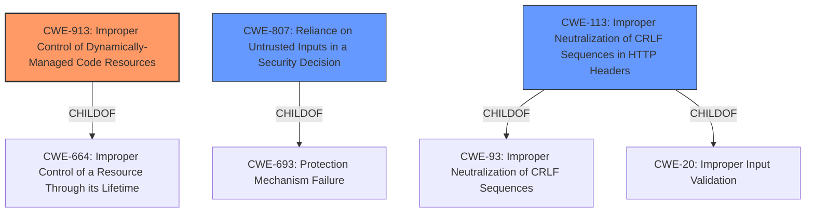

# Enhanced Analysis for CVE-2022-25355

# Summary
| CWE ID | CWE Name | Confidence | CWE Abstraction Level | CWE Vulnerability Mapping Label | CWE-Vulnerability Mapping Notes |
|---|---|---|---|---|---|
| CWE-913 | Improper Control of Dynamically-Managed Code Resources | 0.8 | Class | Allowed-with-Review | Primary CWE |
| CWE-807 | Reliance on Untrusted Inputs in a Security Decision | 0.7 | Base | Allowed | Secondary Candidate |
| CWE-113 | Improper Neutralization of CRLF Sequences in HTTP Headers ('HTTP Request/Response Splitting') | 0.5 | Variant | Allowed | Secondary Candidate |

## Evidence and Confidence

*   **Confidence Score:** 0.7
*   **Evidence Strength:** MEDIUM

## Relationship Analysis
The primary CWE, CWE-913, is a Class-level weakness. While it's generally preferred to select Base or Variant level CWEs, the evidence directly supports the classification of the vulnerability as an improper control of dynamically managed code resources. CWE-913 is a parent of more specific weaknesses, but none of them perfectly fit the vulnerability description.

CWE-807 is a Base level CWE and a child of CWE-693: Protection Mechanism Failure. This means that the application's security decision relies on an input that can be modified by an untrusted actor, bypassing the intended protection mechanism.

CWE-113 is a Variant level CWE and a child of CWE-93 (Improper Neutralization of CRLF Sequences). It addresses cases where HTTP headers are improperly handled, potentially leading to request/response splitting attacks.



## Vulnerability Chain
The vulnerability chain starts with the **improper handling of the HTTP Host header values** (root cause). This leads to the generation of forged URLs. A remote attacker can then leverage these forged URLs to send emails with forged password reset links, potentially redirecting users to malicious sites.

The chain is:
1.  **Improper Handling of HTTP Host Header Values (CWE-913)**
2.  Forged URL generation
3.  Phishing/Redirection

## Summary of Analysis
The initial assessment identified CWE-913 as the primary weakness due to the **improper handling of the HTTP Host header values**. This aligns with the description of CWE-913, which focuses on the improper control of dynamically-managed code resources. The vulnerability leads to the generation of forged reissue-password URLs, indicating that the application does not properly control the code resources (URLs) it dynamically creates based on the manipulated Host header. This is explicitly mentioned in the "CVE Reference Links Content Summary" which states: "CWE-913, which refers to 'Improper Control of Dynamically-Managed Code Resources'. This means the application doesn't properly control resources (URLs in this case) that it dynamically creates based on the manipulated Host header."

The evidence supports this classification, and the retriever results also list CWE-913 as the top candidate.

CWE-807 was considered as a secondary weakness because the application relies on the Host header for generating URLs, but it does not properly validate this input. As a result, an attacker can modify the Host header and bypass the intended protection mechanism.

CWE-113 was also considered because the vulnerability involves the improper handling of HTTP headers. However, this CWE is more specific to cases where CR and LF characters are not properly neutralized, leading to request/response splitting attacks. While the current vulnerability involves manipulating the Host header, it does not directly involve CR/LF injection.

The final decision is based on the available evidence, the retriever results, and the relationship analysis. CWE-913 is the most appropriate classification because it directly addresses the root cause of the vulnerability which is the improper control of dynamically-managed code resources. The selection of CWE-913 is also at the optimal level of specificity, as it captures the essence of the vulnerability without being overly generic or too specific.

Other CWEs considered but not selected:

*   CWE-703, CWE-653, CWE-1289, CWE-754, CWE-184, CWE-274, CWE-664, CWE-691, CWE-755: These CWEs were not selected because they are too general and do not specifically address the root cause of the vulnerability.
*   CWE-74: This CWE was considered but not selected because it is too high-level.
*   CWE-79, CWE-22: These CWEs were not selected because they do not accurately represent the vulnerability. They are related to Cross-Site Scripting and Path Traversal, respectively, which are not the primary issues in this case.
*   CWE-494, CWE-358, CWE-325, CWE-290, CWE-472, CWE-434: These CWEs are related to specific attack vectors or missing cryptographic steps, which are not the primary issues in this case.


## CWE Relationship Analysis

Current CWEs represent these abstraction levels: .


### Vulnerability Chain Analysis

**Chain starting from CWE-913:**
- 913 (Improper Control of Dynamically-Managed Code Resources) - ROOT


**Chain starting from CWE-807:**
- 807 (Reliance on Untrusted Inputs in a Security Decision) - ROOT


### CWE Relationship Diagram

```mermaid
graph TD
    classDef primary fill:#f96,stroke:#333,stroke-width:2px
    classDef secondary fill:#69f,stroke:#333
    classDef tertiary fill:#9e9,stroke:#333
```