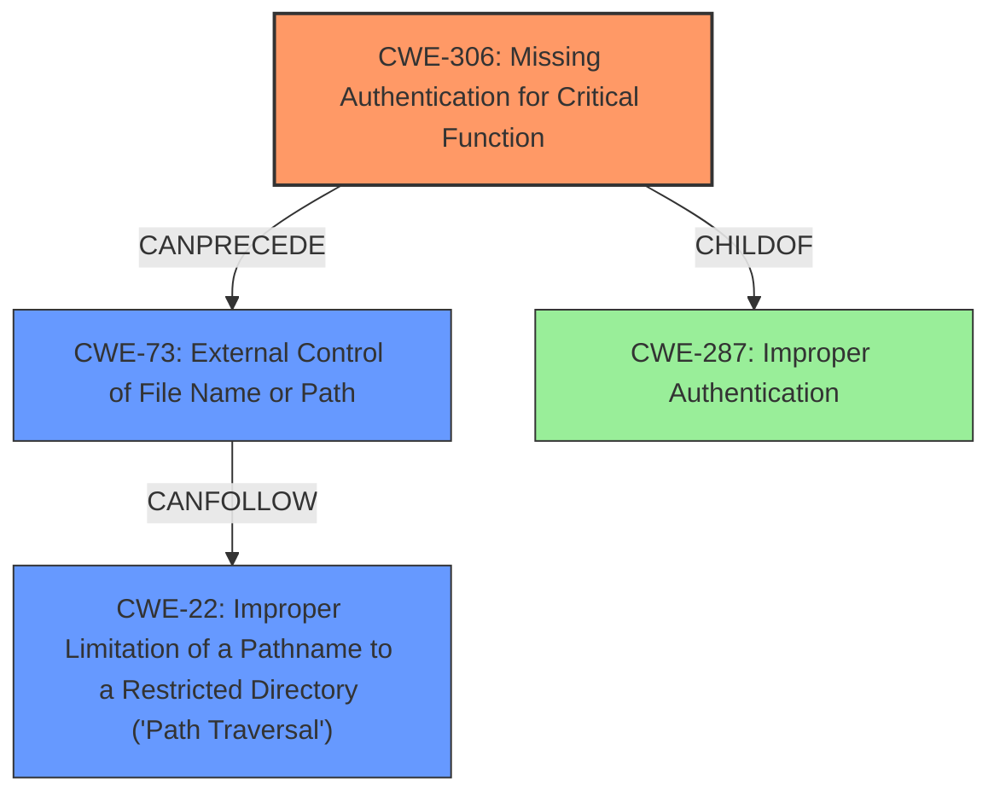

# Analysis for CVE-2022-25359

# Summary
| CWE ID  | CWE Name                                                                                                                                                               | Confidence | CWE Abstraction Level | CWE Vulnerability Mapping Label | CWE-Vulnerability Mapping Notes |
|---------|------------------------------------------------------------------------------------------------------------------------------------------------------------------------|------------|-----------------------|---------------------------------|---------------------------------|
| CWE-306 | Missing Authentication for Critical Function                                                                                                                             | 0.9        | Base                  | Allowed                         | Primary CWE                     |
| CWE-73  | External Control of File Name or Path                                                                                                                                  | 0.7        | Base                  | Allowed                         | Secondary Candidate             |
| CWE-22  | Improper Limitation of a Pathname to a Restricted Directory ('Path Traversal')                                                                                         | 0.6        | Base                  | Allowed                         | Secondary Candidate             |

## Evidence and Confidence

*   **Confidence Score:** 0.8
*   **Evidence Strength:** MEDIUM

## Relationship Analysis
The primary weakness, **CWE-306 (Missing Authentication for Critical Function)**, is a base-level CWE that indicates a lack of authentication for critical functions. It is a child of CWE-287 (Improper Authentication), which is a more general class-level weakness. The secondary candidates, **CWE-73 (External Control of File Name or Path)** and **CWE-22 (Improper Limitation of a Pathname to a Restricted Directory ('Path Traversal'))**, relate to potential path manipulation vulnerabilities, which could be a consequence of the missing authentication. These three CWEs can form a chain where missing authentication allows external control of file paths, leading to path traversal.

## Vulnerability Chain
The vulnerability chain starts with **CWE-306 (Missing Authentication for Critical Function)**, which allows unauthenticated attackers to interact with the system. This can then lead to **CWE-73 (External Control of File Name or Path)**, where the attacker can control file paths. Finally, this can result in **CWE-22 (Improper Limitation of a Pathname to a Restricted Directory ('Path Traversal'))**, enabling the attacker to overwrite, delete, or create files outside the intended directory.

## Summary of Analysis
The primary assessment is based on the vulnerability description, which states that unauthenticated remote attackers can overwrite, delete, or create files. This strongly suggests **CWE-306 (Missing Authentication for Critical Function)** as the root cause. The retriever results also support this, ranking **CWE-306** as the top candidate.

The graph relationships show how missing authentication can lead to other vulnerabilities, such as **CWE-73** and **CWE-22**. While these are plausible secondary weaknesses, the initial lack of authentication is the most direct cause of the vulnerability.

The selected CWEs are at the optimal level of specificity. **CWE-306** is a base-level CWE that accurately describes the missing authentication. **CWE-73** and **CWE-22** are also base-level CWEs that relate to potential path manipulation vulnerabilities, but they are secondary to the primary issue of missing authentication.

Relevant CWE Information:

# Enhanced Context (25 CWEs)
The following CWEs were identified as potentially relevant to this vulnerability:

## CWE-41: Improper Resolution of Path Equivalence
**Abstraction Level**: Base
**Similarity Score**: 0.76
**Source**: dense

**Description**:
The product is vulnerable to file system contents disclosure through path equivalence. Path equivalence involves the use of special characters in file and directory names. The associated manipulations are intended to generate multiple names for the same object.

**Mapping Guidance**:
- Usage: Allowed
- Rationale: This CWE entry is at the Base level of abstraction, which is a preferred level of abstraction for mapping to the root causes of vulnerabilities.

## CWE-691: Insufficient Control Flow Management
**Abstraction Level**: Pillar
**Similarity Score**: 0.76
**Source**: dense

**Description**:
The code does not sufficiently manage its control flow during execution, creating conditions in which the control flow can be modified in unexpected ways.

**Mapping Guidance**:
- Usage: Discouraged
- Rationale: This CWE entry is extremely high-level, a Pillar. However, classification research is limited for weaknesses of this type, so there can be gaps or organizational difficulties within CWE that force use of this weakness, even at such a high level of abstraction.

## CWE-73: External Control of File Name or Path
**Abstraction Level**: Base
**Similarity Score**: 0.75
**Source**: dense

**Description**:
The product allows user input to control or influence paths or file names that are used in filesystem operations.

**Mapping Guidance**:
- Usage: Allowed
- Rationale: This CWE entry is at the Base level of abstraction, which is a preferred level of abstraction for mapping to the root causes of vulnerabilities.

## CWE-23: Relative Path Traversal
**Abstraction Level**: Base
**Similarity Score**: 0.75
**Source**: dense

**Description**:
The product uses external input to construct a pathname that should be within a restricted directory, but it does not properly neutralize sequences such as ".." that can resolve to a location that is outside of that directory.

**Mapping Guidance**:
- Usage: Allowed
- Rationale: This CWE entry is at the Base level of abstraction, which is a preferred level of abstraction for mapping to the root causes of vulnerabilities.

## CWE-131: Incorrect Calculation of Buffer Size
**Abstraction Level**: Base
**Similarity Score**: 0.75
**Source**: dense

**Description**:
The product does not correctly calculate the size to be used when allocating a buffer, which could lead to a buffer overflow.

**Mapping Guidance**:
- Usage: Allowed
- Rationale: This CWE entry is at the Base level of abstraction, which is a preferred level of abstraction for mapping to the root causes of vulnerabilities.

## CWE-74: Improper Neutralization of Special Elements in Output Used by a Downstream Component ('Injection')
**Abstraction Level**: Class
**Similarity Score**: 0.75
**Source**: dense

**Description**:
The product constructs all or part of a command, data structure, or record using externally-influenced input from an upstream component, but it does not neutralize or incorrectly neutralizes special elements that could modify how it is parsed or interpreted when it is sent to a downstream component.

**Mapping Guidance**:
- Usage: Discouraged
- Rationale: CWE-74 is high-level and often misused when lower-level weaknesses are more appropriate.

## CWE-668: Exposure of Resource to Wrong Sphere
**Abstraction Level**: Class
**Similarity Score**: 0.75
**Source**: dense

**Description**:
The product exposes a resource to the wrong control sphere, providing unintended actors with inappropriate access to the resource.

**Mapping Guidance**:
- Usage: Discouraged
- Rationale: CWE-668 is high-level and is often misused as a catch-all when lower-level CWE IDs might be applicable. It is sometimes used for low-information vulnerability reports [REF-1287]. It is a level-1 Class (i.e., a child of a Pillar). It is not useful for trend analysis.

## CWE-59: Improper Link Resolution Before File Access ('Link Following')
**Abstraction Level**: Base
**Similarity Score**: 0.74
**Source**: dense

**Description**:
The product attempts to access a file based on the filename, but it does not properly prevent that filename from identifying a link or shortcut that resolves to an unintended resource.

**Mapping Guidance**:
- Usage: Allowed
- Rationale: This CWE entry is at the Base level of abstraction, which is a preferred level of abstraction for mapping to the root causes of vulnerabilities.

## CWE-653: Improper Isolation or Compartmentalization
**Abstraction Level**: Class
**Similarity Score**: 0.74
**Source**: dense

**Description**:
The product does not properly compartmentalize or isolate functionality, processes, or resources that require different privilege levels, rights, or permissions.

**Mapping Guidance**:
- Usage: Allowed
- Rationale: This CWE entry is at the Base level of abstraction, which is a preferred level of abstraction for mapping to the root causes of vulnerabilities.

## CWE-667: Improper Locking
**Abstraction Level**: Class
**Similarity Score**: