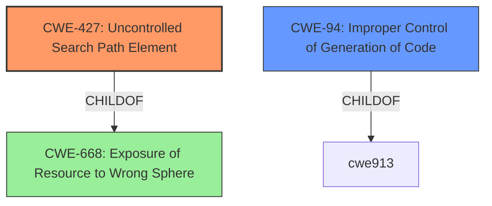

# Raw Analyzer Response for CVE-2022-25366

# Summary
| CWE ID | CWE Name | Confidence | CWE Abstraction Level | CWE Vulnerability Mapping Label | CWE-Vulnerability Mapping Notes |
|---|---|---|---|---|---|
| CWE-427 | Uncontrolled Search Path Element | 0.9 | Base | Primary CWE | Allowed |
| CWE-94 | Improper Control of Generation of Code ('Code Injection') | 0.6 | Base | Secondary Candidate CWE | Allowed-with-Review |

## Evidence and Confidence

*   **Confidence Score:** 0.75
*   **Evidence Strength:** HIGH

## Relationship Analysis
The primary CWE, CWE-427 **Uncontrolled Search Path Element**, is a Base level weakness which is appropriate. The vulnerability involves the application's use of an externally influenced mechanism (`DYLD_INSERT_LIBRARIES`) to locate dynamic libraries, which is a key aspect of the CWE-427 description. CWE-427 is related to CWE-426 **Untrusted Search Path** but differs in that CWE-427 concerns a fixed control sphere. Because the `DYLD_INSERT_LIBRARIES` environment variable is influencing where the application looks for libraries, this fits CWE-427. CWE-94 **Improper Control of Generation of Code ('Code Injection')** is also considered because the injected dylib results in code execution, however, CWE-427 better describes the root cause.

## Vulnerability Chain
The vulnerability chain starts with the application having the `com.apple.security.cs.allow-dyld-environment-variables` entitlement enabled, which permits the use of `DYLD_INSERT_LIBRARIES`. This leads to the **DYLIB injection**, allowing an attacker to inject and execute arbitrary code.

## Summary of Analysis
The initial assessment identified that the application is vulnerable to **DYLIB injection** because it has the `com.apple.security.cs.allow-dyld-environment-variables` entitlement. This allows an attacker to inject a malicious .dylib file via the `DYLD_INSERT_LIBRARIES` environment variable.

The vulnerability description clearly states the **root cause** is the presence of the `com.apple.security.cs.allow-dyld-environment-variables` entitlement, which enables **DYLIB injection**. The CVE Reference Links Content Summary reinforces this by stating "The root cause is the presence of the `com.apple.security.cs.allow-dyld-environment-variables` entitlement... This entitlement allows the use of environment variables, specifically `DYLD_INSERT_LIBRARIES`, to inject malicious dynamic libraries (dylibs) into the application's process."

The Retriever Results indicated CWE-427 **Uncontrolled Search Path Element** as the top candidate. This CWE aligns well with the vulnerability description, as the application uses an externally-influenced mechanism (`DYLD_INSERT_LIBRARIES`) to locate dynamic libraries. While CWE-94 **Improper Control of Generation of Code ('Code Injection')** is relevant due to the resulting code execution, CWE-427 is a more precise fit for the **root cause**.

Relevant CWE Information:

# Enhanced Context (25 CWEs)
The following CWEs were identified as potentially relevant to this vulnerability:

## CWE-74: Improper Neutralization of Special Elements in Output Used by a Downstream Component ('Injection')
**Abstraction Level**: Class
**Similarity Score**: 0.80
**Source**: dense

**Description**:
The product constructs all or part of a command, data structure, or record using externally-influenced input from an upstream component, but it does not neutralize or incorrectly neutralizes special elements that could modify how it is parsed or interpreted when it is sent to a downstream component.

**Mapping Guidance**:
- Usage: Discouraged
- Rationale: CWE-74 is high-level and often misused when lower-level weaknesses are more appropriate.

## CWE-184: Incomplete List of Disallowed Inputs
**Abstraction Level**: Base
**Similarity Score**: 0.78
**Source**: dense

**Description**:
The product implements a protection mechanism that relies on a list of inputs (or properties of inputs) that are not allowed by policy or otherwise require other action to neutralize before additional processing takes place, but the list is incomplete.

**Mapping Guidance**:
- Usage: Allowed
- Rationale: This CWE entry is at the Base level of abstraction, which is a preferred level of abstraction for mapping to the root causes of vulnerabilities.

## CWE-80: Improper Neutralization of Script-Related HTML Tags in a Web Page (Basic XSS)
**Abstraction Level**: Variant
**Similarity Score**: 0.77
**Source**: dense

**Description**:
The product receives input from an upstream component, but it does not neutralize or incorrectly neutralizes special characters such as "<", ">", and "&" that could be interpreted as web-scripting elements when they are sent to a downstream component that processes web pages.

**Mapping Guidance**:
- Usage: Allowed
- Rationale: This CWE entry is at the Variant level of abstraction, which is a preferred level of abstraction for mapping to the root causes of vulnerabilities.

## CWE-138: Improper Neutralization of Special Elements
**Abstraction Level**: Class
**Similarity Score**: 0.77
**Source**: dense

**Description**:
The product receives input from an upstream component, but it does not neutralize or incorrectly neutralizes special elements that could be interpreted as control elements or syntactic markers when they are sent to a downstream component.

**Mapping Guidance**:
- Usage: Discouraged
- Rationale: This CWE entry is a level-1 Class (i.e., a child of a Pillar). It might have lower-level children that would be more appropriate

## CWE-41: Improper Resolution of Path Equivalence
**Abstraction Level**: Base
**Similarity Score**: 0.77
**Source**: dense

**Description**:
The product is vulnerable to file system contents disclosure through path equivalence. Path equivalence involves the use of special characters in file and directory names. The associated manipulations are intended to generate multiple names for the same object.

**Mapping Guidance**:
- Usage: Allowed
- Rationale: This CWE entry is at the Base level of abstraction, which is a preferred level of abstraction for mapping to the root causes of vulnerabilities.

## CWE-88: Improper Neutralization of Argument Delimiters in a Command ('Argument Injection')
**Abstraction Level**: Base
**Similarity Score**: 0.77
**Source**: dense

**Description**:
The product constructs a string for a command to be executed by a separate component
in another control sphere, but it does not properly delimit the
intended arguments, options, or switches within that command string.

**Mapping Guidance**:
- Usage: Allowed
- Rationale: This CWE entry is at the Base level of abstraction, which is a preferred level of abstraction for mapping to the root causes of vulnerabilities.

## CWE-427: Uncontrolled Search Path Element
**Abstraction Level**: Base
**Similarity Score**: 0.77
**Source**: dense

**Description**:
The product uses a fixed or controlled search path to find resources, but one or more locations in that path can be under the control of unintended actors.

**Mapping Guidance**:
- Usage: Allowed
- Rationale: This CWE entry is at the Base level of abstraction, which is a preferred level of abstraction for mapping to the root causes of vulnerabilities.

## CWE-116: Improper Encoding or Escaping of Output
**Abstraction Level**: Class
**Similarity Score**: 0.77
**Source**: dense

**Description**:
The product prepares a structured message for communication with another component, but encoding or escaping of the data is either missing or done incorrectly. As a result, the intended structure of the message is not preserved.

**Mapping Guidance**:
- Usage: Allowed-with-Review
- Rationale: This CWE entry is a Class and might have Base-level children that would be more appropriate

## CWE-73: External Control of File Name or Path
**Abstraction Level**: Base
**Similarity Score**: 0.77
**Source**: dense

**Description**:
The product allows user input to control or influence paths or file names that are used in filesystem operations.

**Mapping Guidance**:
- Usage: Allowed
- Rationale: This CWE entry is at the Base level of abstraction, which is a preferred level of abstraction for mapping to the root causes of vulnerabilities.

## CWE-59: Improper Link Resolution Before File Access ('Link Following')
**Abstraction Level**: Base
**Similarity Score**: 0.76
**Source**: dense

**Description**:
The product attempts to