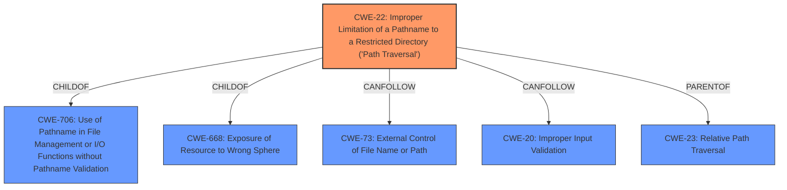

# Analysis for CVE-2022-25371

# Summary
| CWE ID | CWE Name | Confidence | CWE Abstraction Level | CWE Vulnerability Mapping Label | CWE-Vulnerability Mapping Notes |
|---|---|---|---|---|---|
| CWE-22 | Improper Limitation of a Pathname to a Restricted Directory ('Path Traversal') | 1.0 | Base | Primary | Allowed |

## Evidence and Confidence

*   **Confidence Score:** 1.0
*   **Evidence Strength:** HIGH

## Relationship Analysis
The primary CWE identified is CWE-22, which is a Base level CWE. It describes the **improper limitation of a pathname to a restricted directory ('Path Traversal')**. There are several relationships that are relevant:

*   CWE-22 is a ChildOf CWE-706 (Use of Pathname in File Management or I/O Functions without Pathname Validation)
*   CWE-22 is a ChildOf CWE-668 (Exposure of Resource to Wrong Sphere)
*   CWE-22 can be followed by CWE-73 (External Control of File Name or Path) and CWE-20 (Improper Input Validation)
*   CWE-22 is a ParentOf CWE-23 (Relative Path Traversal)

This indicates that CWE-22 is a specific type of vulnerability related to pathname handling and that it can lead to other vulnerabilities.

## Vulnerability Chain
The vulnerability chain starts with the **bug in Birt**, which leads to an unauthenticated path traversal. This allows an attacker to access files outside of the intended directory, potentially leading to the exposure of sensitive information or arbitrary file modification. The chain is:

1.  **Bug in Birt** (Root Cause)
2.  CWE-22: Improper Limitation of a Pathname to a Restricted Directory ('Path Traversal')
3.  Information Disclosure or Arbitrary File Modification (Impact)

## Summary of Analysis
The vulnerability description clearly points to a path traversal issue within the Birt component of Apache OFBiz. The CVE Reference Links Content Summary explicitly mentions an "Unauthenticated Path Traversal vulnerability" and the ability to "access files outside of the intended directory." This aligns directly with the description of CWE-22: Improper Limitation of a Pathname to a Restricted Directory ('Path Traversal').

The Retriever Results also strongly support this classification, with CWE-22 being the top-ranked CWE with a high similarity score. The fact that the attack is unauthenticated further reinforces the severity of the issue.

The evidence from the "CVE Reference Links Content Summary" states: "Root Cause: A path traversal vulnerability exists in the Birt viewer version 4.5.0, which is a component used by Apache OFBiz." and "Weaknesses/Vulnerabilities: Unauthenticated Path Traversal vulnerability. This allows an attacker to access files outside of the intended directory."

While other CWEs like CWE-434 (Unrestricted Upload of File with Dangerous Type) and CWE-79 (Improper Neutralization of Input During Web Page Generation ('Cross-site Scripting')) were considered, they do not accurately represent the **root cause** of this vulnerability, which is the **improper limitation of a pathname**.

CWE-22 is the optimal level of specificity because it directly describes the weakness that allows attackers to access unauthorized files due to insufficient path validation.