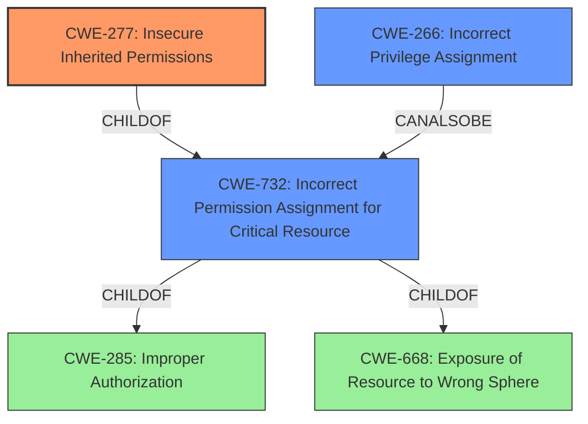

# Analysis for CVE-2022-25372

# Summary
| CWE ID  | CWE Name                                                        | Confidence | CWE Abstraction Level | CWE Vulnerability Mapping Label | CWE-Vulnerability Mapping Notes |
| :------- | :-------------------------------------------------------------- | :--------- | :---------------------- | :------------------------------ | :------------------------------ |
| CWE-277 | Insecure Inherited Permissions                               | 0.85       | Variant                 | Allowed                         | Primary CWE                     |
| CWE-732 | Incorrect Permission Assignment for Critical Resource | 0.75       | Class                   | Allowed-with-Review           | Secondary Candidate             |
| CWE-266 | Incorrect Privilege Assignment                               | 0.65       | Base                   | Allowed           | Secondary Candidate             |

## Evidence and Confidence

*   **Confidence Score:** 0.80
*   **Evidence Strength:** HIGH

## Relationship Analysis
The primary CWE, CWE-277 (Insecure Inherited Permissions), is a Variant of CWE-732 (Incorrect Permission Assignment for Critical Resource), indicating a more specific instance of the general permission assignment issue. CWE-732 itself is a child of CWE-285 (Improper Authorization) and CWE-668 (Exposure of Resource to Wrong Sphere), revealing a broader context of authorization and resource exposure problems. CWE-266 (Incorrect Privilege Assignment) is related as it describes the incorrect assignment of a privilege, and it CanAlsoBe related to CWE-286 (Incorrect User Management).

## Vulnerability Chain
The vulnerability chain involves the following sequence:
1.  **Root Cause:** Insecure permissions, specifically an **ACL entry for CREATOR OWNER**, are set on the `C:\ProgramData\Pritunl` directory, allowing any user to write to it. This is further elaborated as Pritunl VPN client for Windows having **insecure directory permissions**.
2.  **Weakness:** The Pritunl service, running as SYSTEM, writes OpenVPN configuration files to this insecure directory and executes `ipconfig.exe` without a full path. This leads to **Arbitrary File Write** and **Unspecified Executable Path**.
3.  **Impact:** A low-privileged user can escalate privileges to SYSTEM by manipulating the OpenVPN configuration files and hijacking the `ipconfig.exe` execution. The final result is **Local Privilege Escalation**.

## Summary of Analysis
The initial assessment, based on the vulnerability description, points to issues related to incorrect permission assignments. The primary weakness is rooted in the **ACL entry for CREATOR OWNER**, which grants unintended write access to low-privileged users. This allows the attacker to write malicious OpenVPN profiles, which the Pritunl service then executes with SYSTEM privileges, thus achieving privilege escalation.

The analysis heavily relies on the "CVE Reference Links Content Summary," which provides a detailed breakdown of the vulnerability's root cause, weaknesses, and impact. For instance, the summary explicitly states, "The Pritunl VPN client for Windows had insecure directory permissions on the `C:\ProgramData\Pritunl` folder, allowing any user to create new files and subfolders within this directory."

The selection of CWE-277 (Insecure Inherited Permissions) as the primary CWE is based on the fact that it is a Variant that more precisely describes how the insecure permissions are being applied. CWE-732 (Incorrect Permission Assignment for Critical Resource) is also relevant but represents a broader class of permission assignment issues. The final selection of CWE-277 provides the optimal level of specificity. The additional CWE of CWE-266 is being added to account for the privilege escalation.

Relevant CWE Information:

# Enhanced Context (25 CWEs)
The following CWEs were identified as potentially relevant to this vulnerability:

## CWE-404: Improper Resource Shutdown or Release
**Abstraction Level**: Class
**Similarity Score**: 0.78

## CWE-664: Improper Control of a Resource Through its Lifetime
**Abstraction Level**: Pillar
**Similarity Score**: 0.77

## CWE-274: Improper Handling of Insufficient Privileges
**Abstraction Level**: Base
**Similarity Score**: 0.75

## CWE-280: Improper Handling of Insufficient Permissions or Privileges 
**Abstraction Level**: Base
**Similarity Score**: 0.74

## CWE-653: Improper Isolation or Compartmentalization
**Abstraction Level**: Class
**Similarity Score**: 0.74

## CWE-226: Sensitive Information in Resource Not Removed Before Reuse
**Abstraction Level**: Base
**Similarity Score**: 0.73

## CWE-668: Exposure of Resource to Wrong Sphere
**Abstraction Level**: Class
**Similarity Score**: 0.73

## CWE-667: Improper Locking
**Abstraction Level**: Class
**Similarity Score**: 0.73

## CWE-691: Insufficient Control Flow Management
**Abstraction Level**: Pillar
**Similarity Score**: 0.73

## CWE-281: Improper Preservation of Permissions
**Abstraction Level**: Base
**Similarity Score**: 0.72

## CWE-427: Uncontrolled Search Path Element
**Abstraction Level**: Base
**Similarity Score**: 7553.38

## CWE-732: Incorrect Permission Assignment for Critical Resource
**Abstraction Level**: Class
**Similarity Score**: 6621.39

## CWE-863: Incorrect Authorization
**Abstraction Level**: Class
**Similarity Score**: 6587.60

## CWE-285: Improper Authorization
**Abstraction Level**: Class
**Similarity Score**: 6497.40

## CWE-59: Improper Link Resolution Before File Access ('Link Following')
**Abstraction Level**: Base
**Similarity Score**: 6445.26

## CWE-619: Dangling Database Cursor ('Cursor Injection')
**Abstraction Level**: base
**Similarity Score**: 4.33

## CWE-426: Untrusted Search Path
**Abstraction Level**: base
**Similarity Score**: 3.64

## CWE-178: Improper Handling of Case Sensitivity
**Abstraction Level**: base
**Similarity Score**: 3.64

## CWE-1289: Improper Validation of Unsafe Equivalence in Input
**Abstraction Level**: base
**Similarity Score**: 3.64

## CWE-386: Symbolic Name not Mapping to Correct Object
**Abstraction Level**: base
**Similarity Score**: 2.90

## CWE-322: Key Exchange without Entity Authentication
**Abstraction Level**: base
**Similarity Score**: 2.87

## CWE-911: Improper Update of Reference Count
**Abstraction Level**: base
**Similarity Score**: 2.87

## CWE-289: Authentication Bypass by Alternate Name
**Abstraction Level**: base
**Similarity Score**: 2.87

## CWE-252: Unchecked Return Value
**Abstraction Level**: base
**Similarity Score**: 2.82

## CWE-98: Improper Control of Filename for Include/Require Statement in PHP Program ('PHP Remote File Inclusion')
**Abstraction Level**: variant
**Similarity Score**: 2.79