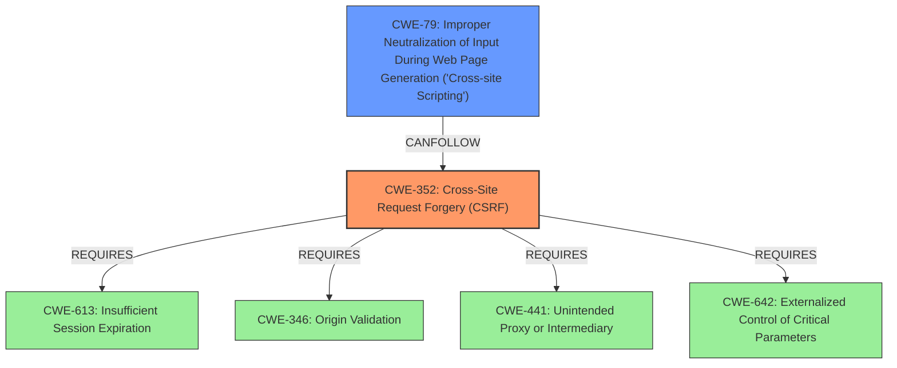

# Analysis for CVE-2022-2542

# Summary
| CWE ID | CWE Name | Confidence | CWE Abstraction Level | CWE Vulnerability Mapping Label | CWE-Vulnerability Mapping Notes |
|---|---|---|---|---|---|
| CWE-352 | Cross-Site Request Forgery (CSRF) | 1.0 | Compound | Allowed | Primary CWE |
| CWE-79 | Improper Neutralization of Input During Web Page Generation ('Cross-site Scripting') | 0.9 | Base | Allowed | Secondary CWE |

## Evidence and Confidence

*   **Confidence Score:** 0.95
*   **Evidence Strength:** HIGH

## Relationship Analysis
The primary weakness is CWE-352, Cross-Site Request Forgery. The evidence clearly points to **missing nonce validation**, which is a key characteristic of CSRF vulnerabilities. CWE-79, Improper Neutralization of Input During Web Page Generation ('Cross-site Scripting'), is included as a secondary weakness because the CSRF vulnerability allows for the injection of malicious web scripts, leading to XSS. CWE-352 requires other weaknesses (CWE-346, CWE-441, CWE-642, CWE-613). CWE-79 can be a consequence of successful CSRF exploitation.

## Vulnerability Chain
The vulnerability chain starts with the **missing nonce validation** (CWE-352), which allows an attacker to forge requests. If the attacker can trick an administrator into clicking a malicious link, they can modify the plugin's settings and inject malicious web scripts (CWE-79).

## Summary of Analysis
The primary weakness is clearly CWE-352, Cross-Site Request Forgery, due to the **missing nonce validation**. The vulnerability description states, "This is due to **missing nonce validation** in the ~/app/sites/ajax/actions/keyword_save.php file that is called via the doAjax() function." The CVE Reference Links Content Summary also confirms this, stating, "The root cause is the **missing nonce validation** in the `~/app/sites/ajax/actions/keyword_save.php` file."

The secondary weakness is CWE-79, Improper Neutralization of Input During Web Page Generation ('Cross-site Scripting'). The vulnerability description notes that successful exploitation of the CSRF vulnerability allows attackers to "modify the plugins settings and **inject malicious web scripts** via a forged request."

The retriever results support this assessment, with CWE-352 having the highest combined score.

Other CWEs considered:

*   CWE-862 (Missing Authorization): While the **missing nonce validation** can be seen as a form of missing authorization, CWE-352 is more specific to the context of CSRF.
*   CWE-138 (Improper Neutralization of Special Elements): This is a more general CWE and not as directly applicable as CWE-79 in this case.
*   CWE-89 (Improper Neutralization of Special Elements used in an SQL Command ('SQL Injection')): This is not applicable since there is no mention of SQL injection in the vulnerability description.

Based on the evidence, relationship analysis, and mapping guidance, CWE-352 and CWE-79 are the most appropriate CWEs for this vulnerability description. They are at the appropriate level of specificity.