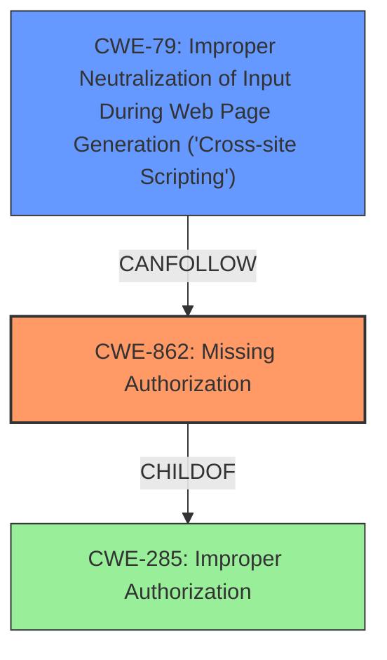

# Enhanced Analysis for CVE-2022-2543

# Summary
| CWE ID | CWE Name | Confidence | CWE Abstraction Level | CWE Vulnerability Mapping Label | CWE-Vulnerability Mapping Notes |
|---|---|---|---|---|---|
| CWE-862 | Missing Authorization | 1.0 | Class | Primary | Allowed-with-Review |
| CWE-79 | Improper Neutralization of Input During Web Page Generation ('Cross-site Scripting') | 0.7 | Base | Secondary | Allowed |

## Evidence and Confidence

*   **Confidence Score:** 0.85
*   **Evidence Strength:** HIGH

## Relationship Analysis
The primary relationship that influenced the decision was the ChildOf relationship between CWE-862 **[CWE-862: Missing Authorization]** and its parent CWE-285 **[CWE-285: Improper Authorization]**. While CWE-285 is a more general classification, the specific nature of the vulnerability—the complete absence of authorization checks—made CWE-862 **[CWE-862: Missing Authorization]** the more appropriate choice. Additionally, the exploitation of this missing authorization to inject CSS code led to the inclusion of CWE-79 **[CWE-79: Improper Neutralization of Input During Web Page Generation ('Cross-site Scripting')]**.



## Vulnerability Chain
The vulnerability chain begins with the **missing authorization** (CWE-862 **[CWE-862: Missing Authorization]**) in the REST endpoints, which allows unauthenticated users to inject arbitrary CSS. This injected CSS can then be used to deface the website, conduct phishing attacks, distribute malware, or cause a denial of service. The chain is as follows:

1.  **Missing Authorization** (CWE-862 **[CWE-862: Missing Authorization]**) - Root Cause
2.  Improper Neutralization of Input During Web Page Generation ('Cross-site Scripting') (CWE-79 **[CWE-79: Improper Neutralization of Input During Web Page Generation ('Cross-site Scripting')]**) - Impact

## Summary of Analysis
The initial analysis correctly identified the **lack of proper authorization checks** as the primary issue. The vulnerability description clearly states that the plugin "**does not have proper authorisation checks** in some of its REST endpoints, allowing unauthenticated users to call them and inject arbitrary CSS in arbitrary saved layouts." This directly aligns with the definition of CWE-862 **[CWE-862: Missing Authorization]**, which describes a product that "does not perform an authorization check when an actor attempts to access a resource or perform an action."

The "CVE Reference Links Content Summary" section reinforces this by stating, "The primary weakness is the absence of authorization checks in specific REST API endpoints. This allows any user, even those not logged in, to access and modify plugin settings."

The selection of CWE-862 **[CWE-862: Missing Authorization]** is further supported by the retriever results, which list it as a relevant CWE with a high score. While CWE-862 **[CWE-862: Missing Authorization]** is a Class-level CWE, the evidence strongly supports that the authorization check is missing, not just incorrect. Therefore, a more specific Base-level CWE is not applicable here.

CWE-79 **[CWE-79: Improper Neutralization of Input During Web Page Generation ('Cross-site Scripting')]** is included as a secondary CWE because the **missing authorization** directly leads to the ability to inject arbitrary CSS, which is a form of cross-site scripting. This aligns with CWE-79 **[CWE-79: Improper Neutralization of Input During Web Page Generation ('Cross-site Scripting')]**'s description of improper neutralization of input during web page generation.

Other CWEs were considered but not selected. CWE-285 **[CWE-285: Improper Authorization]** was considered but deemed too general, as the issue is not an incorrect authorization, but a complete **lack of authorization**. CWE-352 **[CWE-352: Cross-Site Request Forgery (CSRF)]** was also considered, but the vulnerability doesn't require tricking a user into making a request; unauthenticated users can directly inject CSS.

Ultimately, the selected CWEs provide the most accurate and specific representation of the vulnerability based on the available evidence and the CWE specifications.

Relevant CWE Information:


## CWE Relationship Analysis

Current CWEs represent these abstraction levels: .


### Vulnerability Chain Analysis

**Chain starting from CWE-862:**
- 862 (Missing Authorization) - ROOT


**Chain starting from CWE-352:**
- 352 (Cross-Site Request Forgery (CSRF)) - ROOT


### CWE Relationship Diagram

```mermaid
graph TD
    classDef primary fill:#f96,stroke:#333,stroke-width:2px
    classDef secondary fill:#69f,stroke:#333
    classDef tertiary fill:#9e9,stroke:#333
```