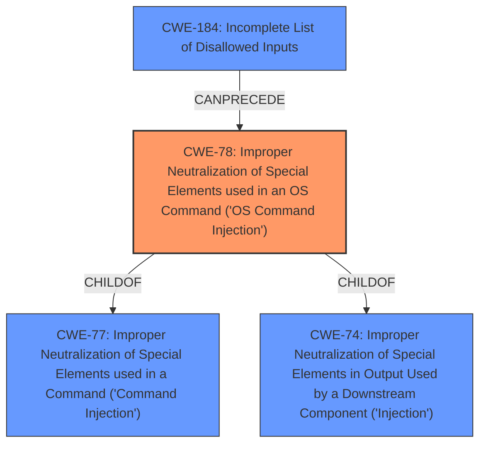

# Analysis Report for CVE-2022-25438

# Vulnerability Analysis Report: CVE-2022-25438

## Description


## Analysis (with Relationship Data)

# Summary
| CWE ID | CWE Name | Confidence | CWE Abstraction Level | CWE Vulnerability Mapping Label | CWE-Vulnerability Mapping Notes |
|---|---|---|---|---|---|
| CWE-78 | Improper Neutralization of Special Elements used in an OS Command ('OS Command Injection') | 1.0 | Base | Allowed | Primary CWE |

## Evidence and Confidence

*   **Confidence Score:** 1.0
*   **Evidence Strength:** HIGH

## Relationship Analysis
The primary relationship influencing the decision is the ChildOf relationship between CWE-78 and CWE-77, with CWE-78 being more specific. The analysis also considered that CWE-78 can be preceded by CWE-184 (Incomplete List of Disallowed Inputs), which might be relevant if the command injection stems from an incomplete input validation. The base level of CWE-78 aligns well with the detail in the description, making it a good fit.



## Vulnerability Chain
The vulnerability chain starts with the **improper neutralization** of special elements within the `SetIPTVCfg` function, leading to **OS Command Injection**, and culminating in **remote code execution (RCE)**. The missing piece to this is what input is not neutralized.

## Summary of Analysis
The initial assessment, supported by retriever results, points to CWE-78 as the most appropriate classification. The vulnerability description explicitly mentions "remote command execution (RCE) vulnerability via the SetIPTVCfg function," which aligns perfectly with the nature of CWE-78, where the **improper neutralization** of special elements in an OS command leads to the execution of unintended commands.

The decision is primarily based on the vulnerability description, which states "Tenda AC9 v15.03.2.21 was discovered to contain a remote command execution (RCE) vulnerability via the SetIPTVCfg function." This statement provides direct evidence of the root cause leading to command execution.

CWE-78 is selected because it is at the optimal level of specificity, representing the direct cause of the vulnerability. While CWE-77 (Improper Neutralization of Special Elements used in a Command) is a parent of CWE-78, it's a more general class. CWE-78 specifically refers to OS commands, which aligns with the technical details provided in the vulnerability description.

Relevant CWE Information:
- **CWE-78: Improper Neutralization of Special Elements used in an OS Command ('OS Command Injection')**
  - The product constructs all or part of an OS command using externally-influenced input from an upstream component, but it does not neutralize or incorrectly neutralizes special elements that could modify the intended OS command when it is sent to a downstream component.

# Enhanced Context (25 CWEs)
The following CWEs were identified as potentially relevant to this vulnerability:

## CWE-131: Incorrect Calculation of Buffer Size
**Abstraction Level**: Base
**Similarity Score**: 0.76

## CWE-119: Improper Restriction of Operations within the Bounds of a Memory Buffer
**Abstraction Level**: Class
**Similarity Score**: 0.76

## CWE-74: Improper Neutralization of Special Elements in Output Used by a Downstream Component ('Injection')
**Abstraction Level**: Class
**Similarity Score**: 0.75

## CWE-184: Incomplete List of Disallowed Inputs
**Abstraction Level**: Base
**Similarity Score**: 0.75

## CWE-191: Integer Underflow (Wrap or Wraparound)
**Abstraction Level**: Base
**Similarity Score**: 0.75

## CWE-805: Buffer Access with Incorrect Length Value
**Abstraction Level**: Base
**Similarity Score**: 0.75

## CWE-125: Out-of-bounds Read
**Abstraction Level**: Base
**Similarity Score**: 0.75

## CWE-126: Buffer Over-read
**Abstraction Level**: Variant
**Similarity Score**: 0.75

## CWE-653: Improper Isolation or Compartmentalization
**Abstraction Level**: Class
**Similarity Score**: 0.75

## CWE-252: Unchecked Return Value
**Abstraction Level**: Base
**Similarity Score**: 0.75

## CWE-184: Incomplete List of Disallowed Inputs
**Abstraction Level**: Base
**Similarity Score**: 5736.55

## CWE-95: Improper Neutralization of Directives in Dynamically Evaluated Code ('Eval Injection')
**Abstraction Level**: Variant
**Similarity Score**: 5613.92

## CWE-88: Improper Neutralization of Argument Delimiters in a Command ('Argument Injection')
**Abstraction Level**: Base
**Similarity Score**: 5563.64

## CWE-119: Improper Restriction of Operations within the Bounds of a Memory Buffer
**Abstraction Level**: Class
**Similarity Score**: 5444.01

## CWE-125: Out-of-bounds Read
**Abstraction Level**: Base
**Similarity Score**: 5431.70

## CWE-78: Improper Neutralization of Special Elements used in an OS Command ('OS Command Injection')
**Abstraction Level**: base
**Similarity Score**: 5.03

## CWE-22: Improper Limitation of a Pathname to a Restricted Directory ('Path Traversal')
**Abstraction Level**: base
**Similarity Score**: 4.33

## CWE-434: Unrestricted Upload of File with Dangerous Type
**Abstraction Level**: base
**Similarity Score**: 4.33

## CWE-79: Improper Neutralization of Input During Web Page Generation ('Cross-site Scripting')
**Abstraction Level**: base
**Similarity Score**: 4.33

## CWE-94: Improper Control of Generation of Code ('Code Injection')
**Abstraction Level**: base
**Similarity Score**: 4.33

## CWE-98: Improper Control of Filename for Include/Require Statement in PHP Program ('PHP Remote File Inclusion')
**Abstraction Level**: variant
**Similarity Score**: 3.89

## CWE-113: Improper Neutralization of CRLF Sequences in HTTP Headers ('HTTP Request/Response Splitting')
**Abstraction Level**: variant
**Similarity Score**: 3.88

## CWE-88: Improper Neutralization of Argument Delimiters in a Command ('Argument Injection')
**Abstraction Level**: base
**Similarity Score**: 3.64

## CWE-625: Permissive Regular Expression
**Abstraction Level**: base
**Similarity Score**: 3.64

## CWE-426: Untrusted Search Path
**Abstraction Level**: base
**Similarity Score**: 3.64


## CWE Relationship Analysis

Current CWEs represent these abstraction levels: .


### Vulnerability Chain Analysis

**Chain starting from CWE-78:**
- 78 (Improper Neutralization of Special Elements used in an OS Command ('OS Command Injection')) - ROOT


**Chain starting from CWE-119:**
- 119 (Improper Restriction of Operations within the Bounds of a Memory Buffer) - ROOT


### CWE Relationship Diagram

```mermaid
graph TD
    classDef primary fill:#f96,stroke:#333,stroke-width:2px
    classDef secondary fill:#69f,stroke:#333
    classDef tertiary fill:#9e9,stroke:#333
```


*Report generated on 2025-03-30 16:38:31*
