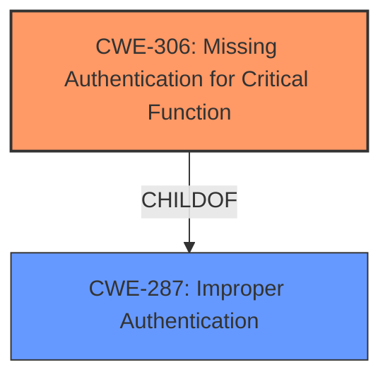

# Analysis for CVE-2022-2553

# Summary
| CWE ID | CWE Name | Confidence | CWE Abstraction Level | CWE Vulnerability Mapping Label | CWE-Vulnerability Mapping Notes |
|---|---|---|---|---|---|
| CWE-306 | Missing Authentication for Critical Function | 0.9 | Base | Primary | Allowed |
| CWE-287 | Improper Authentication | 0.7 | Class | Secondary | Allowed-with-Review |

## Evidence and Confidence

*   **Confidence Score:** 0.9
*   **Evidence Strength:** HIGH

## Relationship Analysis
The primary CWE selected is CWE-306, which is a Base level CWE. This is a child of CWE-287, Improper Authentication. The vulnerability description clearly indicates a **missing** authentication mechanism for a critical function, justifying the selection of CWE-306.

## Vulnerability Chain
The vulnerability chain starts with the **authfile directive being ignored**, leading to **missing authentication** for intra-node communication. This results in nodes without the correct authentication key being able to communicate with other nodes in the cluster. The root cause is the **ignored authfile directive**, and the direct consequence is **missing authentication**.

## Summary of Analysis
The analysis is based on the detailed description of the vulnerability and the supporting evidence from the CVE Reference Links Content Summary. The **root cause** is the **authfile directive being ignored**, leading to the **lack of proper authentication**. This allows unauthorized nodes to communicate within the cluster.

The selection of CWE-306 is strongly supported by the evidence:
*   "The authfile directive in the booth config file is ignored, preventing use of authentication in communications from node to node."
*   "As a result, nodes that do not have the correct authentication key are not prevented from communicating with other nodes in the cluster."
*   "The vulnerability stems from Booth's failure to properly restrict intra-node communication when the `authfile` configuration directive is used."

CWE-306 (Missing Authentication for Critical Function) accurately captures this **lack of authentication** for a critical function (intra-node communication). The retriever results also list CWE-306 as a relevant candidate.

CWE-287 (Improper Authentication) was considered but is too general. While the vulnerability involves authentication, the core issue is the **absence** of authentication, rather than an improperly implemented authentication mechanism. Therefore, CWE-306 is a more precise and appropriate mapping.

Relevant CWE Information:

# Enhanced Context (25 CWEs)

## CWE-303: Incorrect Implementation of Authentication Algorithm
**Abstraction Level**: Base
**Similarity Score**: 0.79
**Source**: dense

**Description**:
The requirements for the product dictate the use of an established authentication algorithm, but the implementation of the algorithm is incorrect.
**NOT USED:** This CWE implies that an authentication algorithm was implemented incorrectly, but the vulnerability states that the **authfile directive was ignored** which resulted in **missing authentication**.

## CWE-1391: Use of Weak Credentials
**Abstraction Level**: Class
**Similarity Score**: 0.78
**Source**: dense

**Description**:
The product uses weak credentials (such as a default key or hard-coded password) that can be calculated, derived, reused, or guessed by an attacker.
**NOT USED:** The vulnerability doesn't mention anything about weak credentials being used, but rather the **authfile directive was ignored** which resulted in **missing authentication**.

## CWE-807: Reliance on Untrusted Inputs in a Security Decision
**Abstraction Level**: Base
**Similarity Score**: 0.78
**Source**: dense

**Description**:
The product uses a protection mechanism that relies on the existence or values of an input, but the input can be modified by an untrusted actor in a way that bypasses the protection mechanism.
**NOT USED:** The vulnerability description does not indicate the use of protection mechanisms that rely on inputs that can be modified by untrusted actors. The issue here is that the **authfile directive was ignored** which resulted in **missing authentication**.

## CWE-345: Insufficient Verification of Data Authenticity
**Abstraction Level**: Class
**Similarity Score**: 0.78
**Source**: dense

**Description**:
The product does not sufficiently verify the origin or authenticity of data, in a way that causes it to accept invalid data.
**NOT USED:** The vulnerability doesn't mention anything about data authenticity being verified insufficiently. The issue here is that the **authfile directive was ignored** which resulted in **missing authentication**.

## CWE-1390: Weak Authentication
**Abstraction Level**: Class
**Similarity Score**: 0.77
**Source**: dense

**Description**:
The product uses an authentication mechanism to restrict access to specific users or identities, but the mechanism does not sufficiently prove that the claimed identity is correct.
**NOT USED:** This vulnerability is due to **missing authentication** not from a weak authentication mechanism.

## CWE-319: Cleartext Transmission of Sensitive Information
**Abstraction Level**: Base
**Similarity Score**: 0.77
**Source**: dense

**Description**:
The product transmits sensitive or security-critical data in cleartext in a communication channel that can be sniffed by unauthorized actors.
**NOT USED:** This CWE is not applicable because the vulnerability does not describe cleartext transmission of sensitive information. The issue here is that the **authfile directive was ignored** which resulted in **missing authentication**.

## CWE-294: Authentication Bypass by Capture-replay
**Abstraction Level**: Base
**Similarity Score**: 0.77
**Source**: dense

**Description**:
A capture-replay flaw exists when the design of the product makes it possible for a malicious user to sniff network traffic and bypass authentication by replaying it to the server in question to the same effect as the original message (or with minor changes).
**NOT USED:** This CWE is not applicable because the vulnerability does not describe capture-replay. The issue here is that the **authfile directive was ignored** which resulted in **missing authentication**.

## CWE-798: Use of Hard-coded Credentials
**Abstraction Level**: Base
**Similarity Score**: 0.76
**Source**: dense

**Description**:
The product contains hard-coded credentials, such as a password or cryptographic key.
**NOT USED:** The vulnerability doesn't mention anything about hard-coded credentials being used. The issue here is that the **authfile directive was ignored** which resulted in **missing authentication**.

## CWE-288: Authentication Bypass Using an Alternate Path or Channel
**Abstraction Level**: Base
**Similarity Score**: 0.76
**Source**: dense

**Description**:
The product requires authentication, but the product has an alternate path or channel that does not require authentication.
**NOT USED:** This vulnerability is due to **missing authentication**, not the use of an alternate path to bypass authentication.

## CWE-330: Use of Insufficiently Random Values
**Abstraction Level**: Class
**Similarity Score**: 0.76
**Source**: dense

**Description**:
The product uses insufficiently random numbers or values in a security context that depends on unpredictable numbers.
**NOT USED:** The vulnerability description does not describe the use of random numbers or identifiers. The issue here is that the **authfile directive was ignored** which resulted in **missing authentication**.

## CWE-322: Key Exchange without Entity Authentication
**Abstraction Level**: base
**Similarity Score**: 5.03
**Source**: graph

**Description**:
CWE-322: Key Exchange without Entity Authentication
**NOT USED:** This CWE is not applicable because the vulnerability does not describe key exchange. The issue here is that the **authfile directive was ignored** which resulted in **missing authentication**.

## CWE-295: Improper Certificate Validation
**Abstraction Level**: base
**Similarity Score**: 3.64
**Source**: graph

**Description**:
CWE-295: Improper Certificate Validation
**NOT USED:** This CWE is not applicable because the vulnerability does not describe certificate validation. The issue here is that the **authfile directive was ignored** which resulted in **missing authentication**.

## CWE-209: Generation of Error Message Containing Sensitive Information
**Abstraction Level**: base
**Similarity Score**: 3.64
**Source**: graph

**Description**:
CWE-209: Generation of Error Message Containing Sensitive Information
**NOT USED:** This CWE is not applicable because the vulnerability does not describe error messages with sensitive data. The issue here is that the **authfile directive was ignored** which resulted in **missing authentication**.

## CWE-201: Insertion of Sensitive Information Into Sent Data
**Abstraction Level**: base
**Similarity Score**: 3.64
**Source**: graph

**Description**:
CWE-201: Insertion of Sensitive Information Into Sent Data
**NOT USED:** This CWE is not applicable because the vulnerability does not describe the insertion of