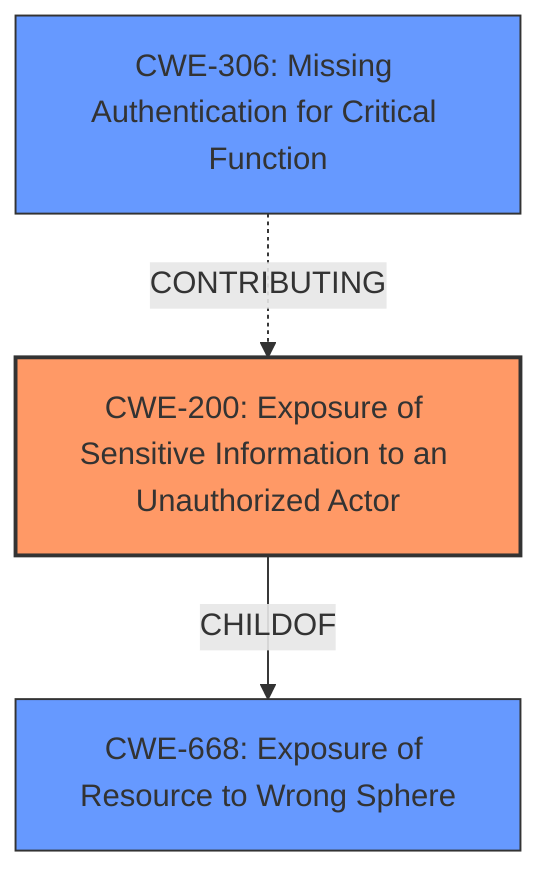

# Raw Analyzer Response for CVE-2022-25568

# Summary
| CWE ID | CWE Name | Confidence | CWE Abstraction Level | CWE Vulnerability Mapping Label | CWE-Vulnerability Mapping Notes |
|---|---|---|---|---|---|
| CWE-200 | Exposure of Sensitive Information to an Unauthorized Actor | 0.9 | Class | Primary | Discouraged, but selected due to the clear root cause being information exposure and lack of a more specific fit. |
| CWE-306 | Missing Authentication for Critical Function | 0.7 | Base | Secondary | Allowed, contributes to the vulnerability by not requiring authentication for a sensitive function. |

## Evidence and Confidence

*   **Confidence Score:** 0.8
*   **Evidence Strength:** HIGH

## Relationship Analysis
The primary relationship that influenced the CWE selection is the parent-child relationship between CWE-668 (Exposure of Resource to Wrong Sphere) and CWE-200 (Exposure of Sensitive Information to an Unauthorized Actor). CWE-200 is a child of CWE-668, and the vulnerability clearly involves exposing sensitive information. CWE-306 (Missing Authentication for Critical Function) acts as a contributing factor, allowing unauthorized access to the resource containing the sensitive information. While CWE-200 is generally discouraged, it accurately represents the core issue in this case, with CWE-306 providing context.

## Vulnerability Chain
The chain of events for this vulnerability is as follows:
1.  **Root Cause:** **Insufficient Access Control** on the `/config/list` endpoint due to a missing authentication check for a critical function (CWE-306).
2.  **Weakness:** Configuration file (`/config/list`) becomes world-readable when a "user" password is not set.
3.  **Impact:** **Exposure of Sensitive Information** (usernames, passwords, internal infrastructure details, etc.) to unauthorized actors (CWE-200).

## Summary of Analysis
The initial analysis identified several potential CWEs, including CWE-200, CWE-306, and CWE-522. The final decision focused on CWE-200 as the primary weakness because the core issue is the exposure of sensitive information. The vulnerability description and CVE reference clearly state that the configuration file contains sensitive data, and the lack of authentication on the `/config/list` endpoint allows unauthorized access to this data.

*   The assessment relies heavily on the "CVE Reference Links Content Summary," which provides detailed information about the root cause, weaknesses, and impact of the vulnerability. Specifically, the summary states: "The vulnerability stems from the fact that if a 'user' password is not set in MotionEye, the configuration file (`/config/list`) becomes world-readable... This is due to **insufficient access control** on the `/config/list` endpoint, which does not require authentication to view."
*   The graph relationships influenced the selection by highlighting the connection between CWE-200 and its parent, CWE-668. While CWE-668 is more general, CWE-200 accurately reflects the specific type of resource exposure (sensitive information).
*   CWE-200 is selected despite the discouraged usage because the detailed analysis of the root cause identifies that there isn't a more appropriate fit given the information.
*   CWE-306 is a secondary CWE because it is a contributing factor to the vulnerability. The missing authentication on the `/config/list` endpoint allows unauthorized access to the sensitive information.

Relevant CWE Information:

# Enhanced Context (25 CWEs)
The following CWEs were identified as potentially relevant to this vulnerability:

## CWE-538: Insertion of Sensitive Information into Externally-Accessible File or Directory
**Abstraction Level**: Base
**Similarity Score**: 0.79
**Source**: dense

**Description**:
The product places sensitive information into files or directories that are accessible to actors who are allowed to have access to the files, but not to the sensitive information.

**Mapping Guidance**:
- Usage: Allowed
- Rationale: This CWE entry is at the Base level of abstraction, which is a preferred level of abstraction for mapping to the root causes of vulnerabilities.

## CWE-312: Cleartext Storage of Sensitive Information
**Abstraction Level**: Base
**Similarity Score**: 0.79
**Source**: dense

**Description**:
The product stores sensitive information in cleartext within a resource that might be accessible to another control sphere.

**Mapping Guidance**:
- Usage: Allowed
- Rationale: This CWE entry is at the Base level of abstraction, which is a preferred level of abstraction for mapping to the root causes of vulnerabilities.

## CWE-226: Sensitive Information in Resource Not Removed Before Reuse
**Abstraction Level**: Base
**Similarity Score**: 0.79
**Source**: dense

**Description**:
The product releases a resource such as memory or a file so that it can be made available for reuse, but it does not clear or "zeroize" the information contained in the resource before the product performs a critical state transition or makes the resource available for reuse by other entities.

**Mapping Guidance**:
- Usage: Allowed
- Rationale: This CWE entry is at the Base level of abstraction, which is a preferred level of abstraction for mapping to the root causes of vulnerabilities.

## CWE-319: Cleartext Transmission of Sensitive Information
**Abstraction Level**: Base
**Similarity Score**: 0.78
**Source**: dense

**Description**:
The product transmits sensitive or security-critical data in cleartext in a communication channel that can be sniffed by unauthorized actors.

**Mapping Guidance**:
- Usage: Allowed
- Rationale: This CWE entry is at the Base level of abstraction, which is a preferred level of abstraction for mapping to the root causes of vulnerabilities.

## CWE-213: Exposure of Sensitive Information Due to Incompatible Policies
**Abstraction Level**: Base
**Similarity Score**: 0.77
**Source**: dense

**Description**:
The product's intended functionality exposes information to certain actors in accordance with the developer's security policy, but this information is regarded as sensitive according to the intended security policies of other stakeholders such as the product's administrator, users, or others whose information is being processed.

**Mapping Guidance**:
- Usage: Allowed
- Rationale: This CWE entry is at the Base level of abstraction, which is a preferred level of abstraction for mapping to the root causes of vulnerabilities.

## CWE-497: Exposure of Sensitive System Information to an Unauthorized Control Sphere
**Abstraction Level**: Base
**Similarity Score**: 0.77
**Source**: dense

**Description**:
The product does not properly prevent sensitive system-level information from being accessed by unauthorized actors who do not have the same level of access to the underlying system as the product does.

**Mapping Guidance**:
- Usage: Allowed
- Rationale: This CWE entry is at the Base level of abstraction, which is a preferred level of abstraction for mapping to the root causes of vulnerabilities.

## CWE-212: Improper Removal of Sensitive Information Before Storage or Transfer
**Abstraction Level**: Base
**Similarity Score**: 0.77
**Source**: dense

**Description**:
The product stores, transfers, or shares a resource that contains sensitive information, but it does not properly remove that information before the product makes the resource available to unauthorized actors.

**Mapping Guidance**:
- Usage: Allowed
- Rationale: This CWE entry is at the Base level of abstraction, which is a preferred level of abstraction for mapping to the root causes of vulnerabilities.

## CWE-311: Missing Encryption of Sensitive Data
**Abstraction Level**: Class
**Similarity Score**: 0.76
**Source**: dense

**Description**:
The product does not encrypt sensitive or critical information before storage or transmission.

**Mapping Guidance**:
- Usage: Discouraged
- Rationale: CWE-311 is high-level with more precise children available. It is a level-1 Class (i.e., a child of a Pillar).

## CWE-200: Exposure of Sensitive Information to an Unauthorized Actor
**Abstraction Level**: Class
**Similarity Score**: 0.76
**Source**: dense

**Description**:
The product exposes sensitive information to an actor that is not explicitly authorized to have access to that information.

**Mapping Guidance**:
- Usage: Discouraged
- Rationale: CWE-200 is commonly misused to represent the loss of confidentiality in a vulnerability, but confidentiality loss is a technical impact - not a root cause error. As of CWE 4.9, over 400 CWE entries can lead to a loss of confidentiality. Other options are often available. [REF-1287].

## CWE-66