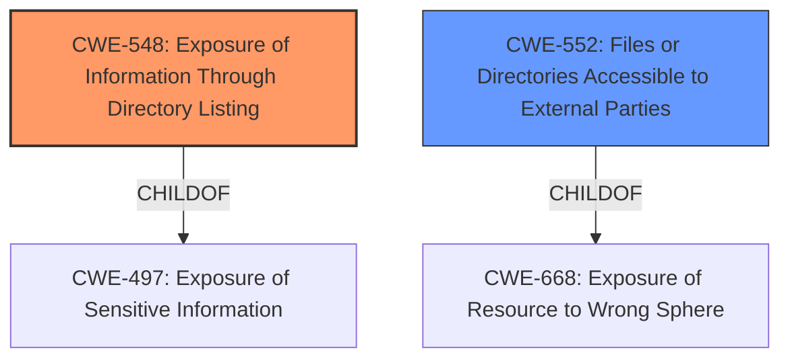

# Analysis Report for CVE-2022-2558

# Vulnerability Analysis Report: CVE-2022-2558

## Description


## Analysis (with Relationship Data)

# Summary
| CWE ID | CWE Name | Confidence | CWE Abstraction Level | CWE Vulnerability Mapping Label | CWE-Vulnerability Mapping Notes |
|---|---|---|---|---|---|
| CWE-548 | Exposure of Information Through Directory Listing | 1.0 | Variant | Allowed | Primary CWE |
| CWE-552 | Files or Directories Accessible to External Parties | 0.7 | Base | Allowed | Secondary Candidate |

## Evidence and Confidence

*   **Confidence Score:** 0.9
*   **Evidence Strength:** HIGH

## Relationship Analysis
The primary CWE, CWE-548 (Exposure of Information Through Directory Listing), is a Variant of CWE-497 (Exposure of Sensitive Information). This hierarchical relationship indicates that CWE-548 is a more specific type of information exposure. CWE-552 (Files or Directories Accessible to External Parties) is a broader base CWE. Choosing CWE-548 provides a more precise characterization of the **directory listing** vulnerability.



## Vulnerability Chain
The vulnerability chain is straightforward:
1.  **Root Cause:** **Directory Listing** enabled on the server for the uploaded resumes directory.
2.  **Weakness:** Public accessibility of uploaded resumes.
3.  **Impact:** Exposure of sensitive personal information contained in the resumes.

## Summary of Analysis
The primary CWE is CWE-548 (Exposure of Information Through Directory Listing). This is based on the vulnerability description, which explicitly mentions a **"Directory Listing"**. The "CVE Reference Links Content Summary" confirms that the plugin allows public access to the directory where uploaded resumes are stored. This aligns directly with the description of CWE-548, which states that "A directory listing is inappropriately exposed, yielding potentially sensitive information to attackers."

CWE-552 (Files or Directories Accessible to External Parties) was considered as a secondary candidate, as the **directory listing** makes the files within that directory accessible to external parties.

The choice of CWE-548 is at the optimal level of specificity because it directly addresses the **directory listing** issue, whereas CWE-552 is a broader category. The evidence strongly supports this classification, with a confidence score of 0.9.

Relevant CWE Information:

# Enhanced Context (25 CWEs)

## CWE-548: Exposure of Information Through Directory Listing
**Abstraction:** Variant
**Status:** Draft

### Description
A directory listing is inappropriately exposed, yielding potentially sensitive information to attackers.

### Extended Description
A directory listing provides an attacker with the complete index of all the resources located inside of the directory. The specific risks and consequences vary depending on which files are listed and accessible.

### Alternative Terms
None

### Relationships
ChildOf -> CWE-497

### Mapping Guidance
**Usage:** Allowed
**Rationale:** This CWE entry is at the Variant level of abstraction, which is a preferred level of abstraction for mapping to the root causes of vulnerabilities.
**Comments:** Carefully read both the name and description to ensure that this mapping is an appropriate fit. Do not try to 'force' a mapping to a lower-level Base/Variant simply to comply with this preferred level of abstraction.
**Reasons:**
- Acceptable-Use

## CWE-552: Files or Directories Accessible to External Parties
**Abstraction:** Base
**Status:** Draft

### Description
The product makes files or directories accessible to unauthorized actors, even though they should not be.

### Extended Description


Web servers, FTP servers, and similar servers may store a set of files underneath a "root" directory that is accessible to the server's users. Applications may store sensitive files underneath this root without also using access control to limit which users may request those files, if any. Alternately, an application might package multiple files or directories into an archive file (e.g., ZIP or tar), but the application might not exclude sensitive files that are underneath those directories.

### Alternative Terms
None

### Relationships
ChildOf -> CWE-668
ChildOf -> CWE-285

### Mapping Guidance
**Usage:** Allowed
**Rationale:** This CWE entry is at the Base level of abstraction, which is a preferred level of abstraction for mapping to the root causes of vulnerabilities.
**Comments:** Carefully read both the name and description to ensure that this mapping is an appropriate fit. Do not try to 'force' a mapping to a lower-level Base/Variant simply to comply with this preferred level of abstraction.
**Reasons:**
- Acceptable-Use


## CWE Relationship Analysis

Current CWEs represent these abstraction levels: .


### Vulnerability Chain Analysis

**Chain starting from CWE-552:**
- 552 (Files or Directories Accessible to External Parties) - ROOT


**Chain starting from CWE-668:**
- 668 (Exposure of Resource to Wrong Sphere) - ROOT


### CWE Relationship Diagram

```mermaid
graph TD
    classDef primary fill:#f96,stroke:#333,stroke-width:2px
    classDef secondary fill:#69f,stroke:#333
    classDef tertiary fill:#9e9,stroke:#333
```


*Report generated on 2025-03-31 07:42:59*
