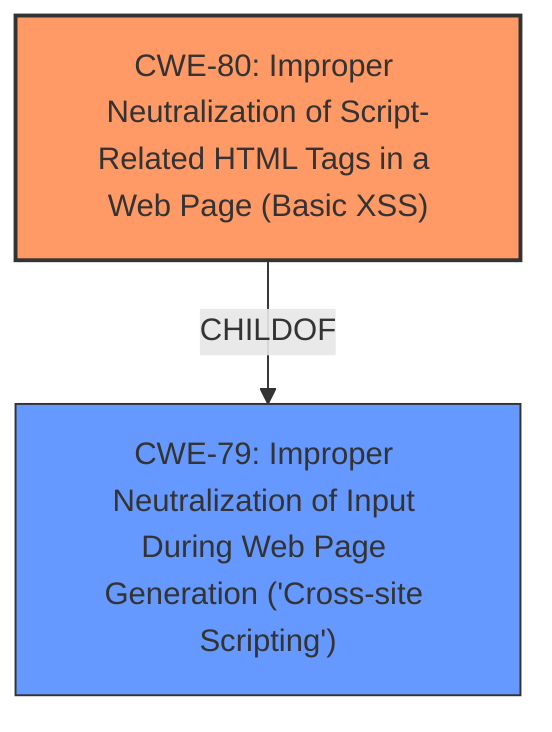

# Enhanced Analysis for CVE-2022-25620

# Summary
| CWE ID | CWE Name | Confidence | CWE Abstraction Level | CWE Vulnerability Mapping Label | CWE-Vulnerability Mapping Notes |
|---|---|---|---|---|---|
| CWE-80 | Improper Neutralization of Script-Related HTML Tags in a Web Page (Basic XSS) | 1.0 | Variant | Allowed | Primary CWE |
| CWE-79 | Improper Neutralization of Input During Web Page Generation ('Cross-site Scripting') | 0.75 | Base | Allowed | Secondary Candidate |

## Evidence and Confidence

*   **Confidence Score:** 0.9
*   **Evidence Strength:** HIGH

## Relationship Analysis
The primary CWE is CWE-80, which is a variant of CWE-79. This means CWE-80 is a more specific case of CWE-79. The vulnerability description clearly states "**Improper Neutralization of Script-Related HTML Tags in a Web Page (Basic XSS)**" as the **rootcause**, making CWE-80 a direct and specific match. The close relationship between CWE-80 and CWE-79 supports the selection of CWE-80 as the primary, more specific weakness, while CWE-79 is a broader class that encompasses CWE-80.



## Vulnerability Chain
The vulnerability chain is relatively straightforward:
1.  The **root cause** is **Improper Neutralization of Script-Related HTML Tags in a Web Page (Basic XSS)** (CWE-80).
2.  The **impact** is the ability to execute arbitrary codes on the vulnerable server.

## Summary of Analysis
The initial analysis strongly suggested CWE-80 as the primary weakness due to the explicit mention of "**Improper Neutralization of Script-Related HTML Tags in a Web Page (Basic XSS)**" in the vulnerability description key phrases as the **rootcause**. The retriever results also listed CWE-80 as a strong candidate.

The relationship analysis further solidified this choice, as CWE-80 is a variant (more specific) of CWE-79, aligning with the principle of selecting the most specific CWE.

The evidence from the vulnerability description is strong: "**Improper Neutralization of Script-Related HTML Tags in a Web Page (Basic XSS)** vulnerability".

The selected CWE is at the optimal level of specificity because it directly reflects the stated **rootcause** of the vulnerability. CWE-80 accurately captures the **improper neutralization** of specific HTML tags, leading to the possibility of cross-site scripting, and aligns well with the vulnerability's stated impact of allowing an authenticated user to execute arbitrary code on the server.

Relevant CWE Information:

# Enhanced Context (25 CWEs)

## CWE-80: Improper Neutralization of Script-Related HTML Tags in a Web Page (Basic XSS)
**Abstraction Level**: Variant
**Similarity Score**: 0.80
**Source**: dense

**Description**:
The product receives input from an upstream component, but it does not neutralize or incorrectly neutralizes special characters such as "<", ">", and "&" that could be interpreted as web-scripting elements when they are sent to a downstream component that processes web pages.

**Mapping Guidance**:
- Usage: Allowed
- Rationale: This CWE entry is at the Variant level of abstraction, which is a preferred level of abstraction for mapping to the root causes of vulnerabilities.

## CWE-79: Improper Neutralization of Input During Web Page Generation ('Cross-site Scripting')
**Abstraction Level**: Base
**Similarity Score**: 0.73
**Source**: dense

**Description**:
The product does not neutralize or incorrectly neutralizes user-controllable input before it is placed in output that is used as a web page that is served to other users.

**Mapping Guidance**:
- Usage: Allowed
- Rationale: This CWE entry is at the Base level of abstraction, which is a preferred level of abstraction for mapping to the root causes of vulnerabilities.

### CWE Considerations:
*   CWE-74: Improper Neutralization of Special Elements in Output Used by a Downstream Component ('Injection') - This is a class-level CWE and is too general. The vulnerability is more specifically related to XSS.
*   CWE-1336: Improper Neutralization of Special Elements Used in a Template Engine - This CWE is relevant to template engines, but the description doesn't specifically mention a template engine being used.
*   CWE-917: Improper Neutralization of Special Elements used in an Expression Language Statement ('Expression Language Injection') - Similar to CWE-1336, this is related to expression languages, which is not explicitly mentioned in the vulnerability description.
*   CWE-184: Incomplete List of Disallowed Inputs - While a denylist could be involved, the primary issue is the **improper neutralization**, not necessarily an incomplete list.
*   CWE-116: Improper Encoding or Escaping of Output - This is a more general class of weakness. CWE-80 is a more specific variant that directly addresses the **improper neutralization** of script-related HTML tags.
*   CWE-611: Improper Restriction of XML External Entity Reference - This is specific to XML entities and is not relevant to the described vulnerability.
*   CWE-78: Improper Neutralization of Special Elements used in an OS Command ('OS Command Injection') - This is specific to OS command injection and is not relevant to the described vulnerability.
*   CWE-494: Download of Code Without Integrity Check - This is not relevant to the described vulnerability.
*   CWE-434: Unrestricted Upload of File with Dangerous Type - This is not relevant to the described vulnerability.
*   CWE-94: Improper Control of Generation of Code ('Code Injection') - This is too broad and not directly related to the **improper neutralization** of HTML tags.
*   CWE-22: Improper Limitation of a Pathname to a Restricted Directory ('Path Traversal') - This is not relevant to the described vulnerability.
*   CWE-613: Insufficient Session Expiration - This is not relevant to the described vulnerability.
*   CWE-98: Improper Control of Filename for Include/Require Statement in PHP Program ('PHP Remote File Inclusion') - This is not relevant to the described vulnerability.
*   CWE-89: Improper Neutralization of Special Elements used in an SQL Command ('SQL Injection') - This is specific to SQL injection and is not relevant to the described vulnerability.
*   CWE-426: Untrusted Search Path - This is not relevant to the described vulnerability.
*   CWE-352: Cross-Site Request Forgery (CSRF) - This is a different type of vulnerability and is not relevant to the described vulnerability.


## CWE Relationship Analysis

Current CWEs represent these abstraction levels: .


### Vulnerability Chain Analysis

**Chain starting from CWE-79:**
- 79 (Improper Neutralization of Input During Web Page Generation ('Cross-site Scripting')) - ROOT


**Chain starting from CWE-89:**
- 89 (Improper Neutralization of Special Elements used in an SQL Command ('SQL Injection')) - ROOT


### CWE Relationship Diagram

```mermaid
graph TD
    classDef primary fill:#f96,stroke:#333,stroke-width:2px
    classDef secondary fill:#69f,stroke:#333
    classDef tertiary fill:#9e9,stroke:#333
```