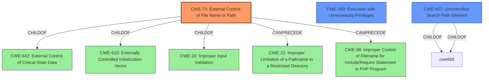

# Raw Analyzer Response for CVE-2022-25643

# Summary
| CWE ID | CWE Name | Confidence | CWE Abstraction Level | CWE Vulnerability Mapping Label | CWE-Vulnerability Mapping Notes |
|---|---|---|---|---|---|
| CWE-73 | External Control of File Name or Path | 1.0 | Base | Allowed | Primary CWE |
| CWE-250 | Execution with Unnecessary Privileges | 0.7 | Base | Allowed | Secondary Candidate |
| CWE-427 | Uncontrolled Search Path Element | 0.6 | Base | Allowed | Secondary Candidate |

## Evidence and Confidence

*   **Confidence Score:** 0.8
*   **Evidence Strength:** HIGH

## Relationship Analysis
The primary CWE is CWE-73, which focuses on external control of file names or paths. This is related to other file-related weaknesses such as path traversal (CWE-22) and file inclusion (CWE-98). CWE-250 (Execution with Unnecessary Privileges) and CWE-427 (Uncontrolled Search Path Element) are secondary candidates because the **setuid root** aspect amplifies the impact of CWE-73.

## Vulnerability Chain
The vulnerability chain starts with a user-supplied socket pathname (external control), leading to arbitrary file deletion due to the **setuid root** privileges.
  - **Root Cause:** User-supplied socket pathname without proper validation (CWE-73) + **setuid root** (CWE-250)
  - **Weakness:** Allows removing files with escalated privileges.
  - **Impact:** Arbitrary file deletion, potentially leading to denial of service.

## Summary of Analysis
The primary vulnerability is CWE-73 (External Control of File Name or Path), as the root cause is the **uncontrolled file path** stemming from the user-supplied socket pathname. The `seatd-launch` utility **fails to restrict the socket path**, enabling an attacker to specify any path for unlinking, as supported by the following evidence from "CVE Reference Links Content Summary":
> **Uncontrolled file path:** The primary vulnerability is the lack of restriction on the socket path that `seatd-launch` would unlink. This enabled an attacker to specify any path on the filesystem.

The **setuid root** aspect is a contributing factor, amplifying the impact, which aligns with CWE-250 (Execution with Unnecessary Privileges). The "CVE Reference Links Content Summary" supports this:
> **SUID bit abuse:** If `seatd-launch` had the SUID bit set (meaning it runs with the privileges of its owner, usually root), a regular user could exploit the uncontrolled unlink to delete files with elevated privileges.

CWE-427 (Uncontrolled Search Path Element) is considered because the socket path could be seen as a resource that the application searches for, but it's less direct than CWE-73.

The selected CWEs are at the optimal level of specificity, with CWE-73 being the primary root cause and CWE-250 highlighting the privilege escalation aspect.

Relevant CWE Information:

# Enhanced Context (25 CWEs)
The following CWEs were identified as potentially relevant to this vulnerability:

## CWE-366: Race Condition within a Thread
**Abstraction Level**: Base
**Similarity Score**: 0.77
**Source**: dense

**Description**:
If two threads of execution use a resource simultaneously, there exists the possibility that resources may be used while invalid, in turn making the state of execution undefined.

**Mapping Guidance**:
- Usage: Allowed
- Rationale: This CWE entry is at the Base level of abstraction, which is a preferred level of abstraction for mapping to the root causes of vulnerabilities.

## CWE-362: Concurrent Execution using Shared Resource with Improper Synchronization ('Race Condition')
**Abstraction Level**: Class
**Similarity Score**: 0.76
**Source**: dense

**Description**:
The product contains a concurrent code sequence that requires temporary, exclusive access to a shared resource, but a timing window exists in which the shared resource can be modified by another code sequence operating concurrently.

**Mapping Guidance**:
- Usage: Allowed-with-Review
- Rationale: This CWE entry is a Class and might have Base-level children that would be more appropriate

## CWE-367: Time-of-check Time-of-use (TOCTOU) Race Condition
**Abstraction Level**: Base
**Similarity Score**: 0.76
**Source**: dense

**Description**:
The product checks the state of a resource before using that resource, but the resource's state can change between the check and the use in a way that invalidates the results of the check. This can cause the product to perform invalid actions when the resource is in an unexpected state.

**Mapping Guidance**:
- Usage: Allowed
- Rationale: This CWE entry is at the Base level of abstraction, which is a preferred level of abstraction for mapping to the root causes of vulnerabilities.

## CWE-662: Improper Synchronization
**Abstraction Level**: Class
**Similarity Score**: 0.75
**Source**: dense

**Description**:
The product utilizes multiple threads or processes to allow temporary access to a shared resource that can only be exclusive to one process at a time, but it does not properly synchronize these actions, which might cause simultaneous accesses of this resource by multiple threads or processes.

**Mapping Guidance**:
- Usage: Discouraged
- Rationale: This CWE entry is a level-1 Class (i.e., a child of a Pillar). It might have lower-level children that would be more appropriate

## CWE-667: Improper Locking
**Abstraction Level**: Class
**Similarity Score**: 0.75
**Source**: dense

**Description**:
The product does not properly acquire or release a lock on a resource, leading to unexpected resource state changes and behaviors.

**Mapping Guidance**:
- Usage: Allowed-with-Review
- Rationale: This CWE entry is a Class and might have Base-level children that would be more appropriate

## CWE-404: Improper Resource Shutdown or Release
**Abstraction Level**: Class
**Similarity Score**: 0.73
**Source**: dense

**Description**:
The product does not release or incorrectly releases a resource before it is made available for re-use.

**Mapping Guidance**:
- Usage: Allowed-with-Review
- Rationale: This CWE entry is a Class and might have Base-level children that would be more appropriate

## CWE-73: External Control of File Name or Path
**Abstraction Level**: Base
**Similarity Score**: 0.73
**Source**: dense

**Description**:
The product allows user input to control or influence paths or file names that are used in filesystem operations.

**Mapping Guidance**:
- Usage: Allowed
- Rationale: This CWE entry is at the Base level of abstraction, which is a preferred level of abstraction for mapping to the root causes of vulnerabilities.

## CWE-59: Improper Link Resolution Before File Access ('Link Following')
**Abstraction Level**: Base
**Similarity Score**: 0.73
**Source**: dense

**Description**:
The product attempts to access a file based on the filename, but it does not properly prevent that filename from identifying a link or shortcut that resolves to an unintended resource.

**Mapping Guidance**:
- Usage: Allowed
- Rationale: This CWE entry is at the Base level of abstraction, which is a preferred level of abstraction for mapping to the root causes of vulnerabilities.

## CWE-1289: Improper Validation of Unsafe Equivalence in Input
**Abstraction Level**: Base
**Similarity Score