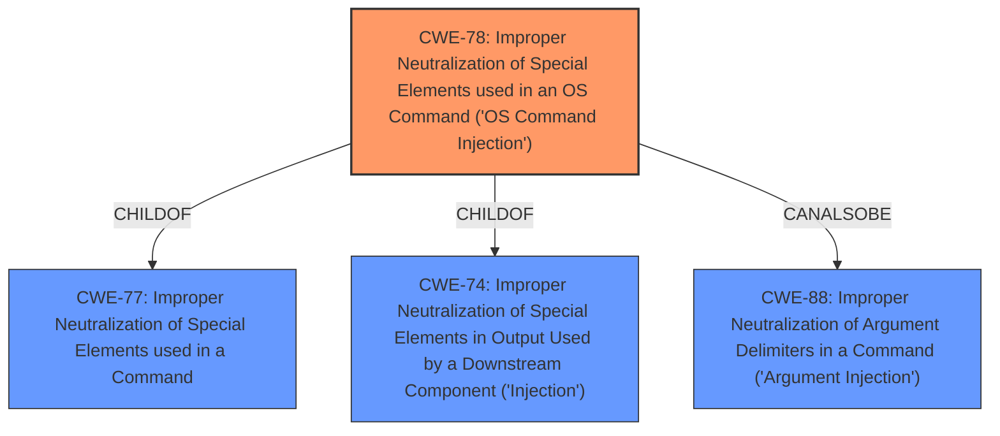

# Enhanced Analysis for CVE-2022-25644

# Summary

| CWE ID | CWE Name | Confidence | CWE Abstraction Level | CWE Vulnerability Mapping Label | CWE-Vulnerability Mapping Notes |
|---|---|---|---|---|---|
| CWE-78 | Improper Neutralization of Special Elements used in an OS Command ('OS Command Injection') | 1.0 | Base | Allowed | Primary CWE |

## Evidence and Confidence

*   **Confidence Score:** 1.0
*   **Evidence Strength:** HIGH

## Relationship Analysis
The primary CWE is CWE-78, which is a base-level CWE. It's a child of CWE-77 (Improper Neutralization of Special Elements used in a Command) and CWE-74 (Improper Neutralization of Special Elements in Output Used by a Downstream Component ('Injection')). There are also peer relationships to CWE-88 (Improper Neutralization of Argument Delimiters in a Command ('Argument Injection')).



## Vulnerability Chain
The chain of events starts with **improper sanitization** of the `getProcessByName` function, leading to OS Command Injection, and finally resulting in arbitrary code execution.

## Summary of Analysis
The analysis is based on the provided vulnerability description and CVE reference content summary. The key phrase "improper sanitization" and the resulting "arbitrary code execution" point towards a command injection vulnerability.

The evidence from the "CVE Reference Links Content Summary" section states:

*   "The vulnerability stems from the **lack of proper sanitization** in the `getProcessByName` function of the `@pendo324/get-process-by-name` npm package. This allows for the injection of arbitrary commands within the function's execution context."
*   "The primary vulnerability is that user-supplied input to the `getProcessByName` function is **not properly sanitized**, which allows for the execution of arbitrary code through command injection."
*   "By injecting shell commands within the process name argument, an attacker can execute arbitrary code on the system running the vulnerable application."

This evidence directly supports the selection of CWE-78 (Improper Neutralization of Special Elements used in an OS Command ('OS Command Injection')).

CWE-94 (Improper Control of Generation of Code ('Code Injection')) was considered because the impact is arbitrary code execution. However, CWE-78 is more specific because the root cause is the **improper sanitization** of input leading to OS command injection, which then allows for arbitrary code execution. CWE-94 is also listed as "Allowed-with-Review" which indicates it can be misused.

CWE-79 (Improper Neutralization of Input During Web Page Generation ('Cross-site Scripting')) was considered because of the **improper sanitization** of input. However, this vulnerability doesn't involve web page generation.

CWE-78 is at the Base level of abstraction, which is the preferred level, and it accurately represents the vulnerability. The MITRE mapping guidance for CWE-78 states "This CWE entry is at the Base level of abstraction, which is a preferred level of abstraction for mapping to the root causes of vulnerabilities."


## CWE Relationship Analysis

Current CWEs represent these abstraction levels: .


### Vulnerability Chain Analysis

**Chain starting from CWE-78:**
- 78 (Improper Neutralization of Special Elements used in an OS Command ('OS Command Injection')) - ROOT


**Chain starting from CWE-94:**
- 94 (Improper Control of Generation of Code ('Code Injection')) - ROOT


### CWE Relationship Diagram

```mermaid
graph TD
    classDef primary fill:#f96,stroke:#333,stroke-width:2px
    classDef secondary fill:#69f,stroke:#333
    classDef tertiary fill:#9e9,stroke:#333
```