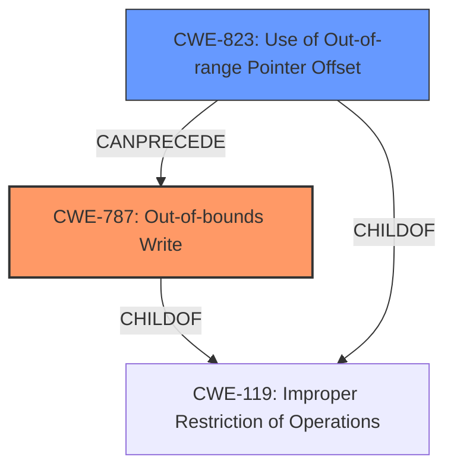

# Raw Analyzer Response for CVE-2022-25658

# Summary
| CWE ID | CWE Name | Confidence | CWE Abstraction Level | CWE Vulnerability Mapping Label | CWE-Vulnerability Mapping Notes |
|---|---|---|---|---|---|
| CWE-787 | Out-of-bounds Write | 1.0 | Base | Allowed | Primary CWE |
| CWE-823 | Use of Out-of-range Pointer Offset | 0.7 | Base | Allowed | Secondary Candidate |

## Evidence and Confidence

*   **Confidence Score:** 0.85
*   **Evidence Strength:** HIGH

## Relationship Analysis
The primary CWE is CWE-787, which represents the **memory corruption** due to an out-of-bounds write. This is supported by the vulnerability description. CWE-823 is a related CWE, representing the **incorrect pointer arithmetic** leading to an out-of-range pointer offset.

## Vulnerability Chain
The chain of events is as follows:
1.  **Root Cause:** **Incorrect pointer arithmetic** (potentially leading to CWE-823, Use of Out-of-range Pointer Offset)
2.  **Weakness:** **Memory corruption** (CWE-787, Out-of-bounds Write)

The **incorrect pointer arithmetic** leads to an out-of-range pointer, which is then used to write data outside the intended buffer, resulting in **memory corruption**.

## Summary of Analysis
The vulnerability description clearly states "**Memory corruption** due to **incorrect pointer arithmetic**". The retriever results also indicate that CWE-787 (Out-of-bounds Write) is the top candidate CWE.
CWE-787 directly addresses the **memory corruption** aspect, while CWE-823 relates to the **incorrect pointer arithmetic** that caused it. The evidence directly supports the selection of CWE-787 as the primary CWE.

The graph relationships show that CWE-823 can precede CWE-787.
The selection of CWE-787 is at the Base level of abstraction, which is the preferred level.

CWEs considered but not used:

*   CWE-822 (Untrusted Pointer Dereference): This CWE was considered because **incorrect pointer arithmetic** could lead to dereferencing an untrusted pointer. However, the description does not explicitly mention the pointer coming from an untrusted source, so this CWE was not selected.
*   CWE-126 (Buffer Over-read) and CWE-124 (Buffer Underwrite): These CWEs are related to out-of-bounds access, but the description specifically mentions **memory corruption**, indicating an out-of-bounds write rather than a read or underwrite.
*   CWE-1285 (Improper Validation of Specified Index, Position, or Offset in Input) and CWE-129 (Improper Validation of Array Index): These CWEs were considered, but the root cause is specifically **incorrect pointer arithmetic**, not the lack of validation of an index.

Relevant CWE Information:

## Enhanced Context (25 CWEs)
The following CWEs were identified as potentially relevant to this vulnerability:

### CWE-787: Out-of-bounds Write
**Abstraction Level**: Base
**Similarity Score**: 1.00

**Description**:
The product writes data past the end, or before the beginning, of the intended buffer.

**Mapping Guidance**:
- Usage: Allowed
- Rationale: This CWE entry is at the Base level of abstraction, which is a preferred level of abstraction for mapping to the root causes of vulnerabilities.

### CWE-823: Use of Out-of-range Pointer Offset
**Abstraction Level**: Base
**Similarity Score**: 0.491

**Description**:
The product performs pointer arithmetic on a valid pointer, but it uses an offset that can point outside of the intended range of valid memory locations for the resulting pointer.

**Mapping Guidance**:
- Usage: Allowed
- Rationale: This CWE entry is at the Base level of abstraction, which is a preferred level of abstraction for mapping to the root causes of vulnerabilities.