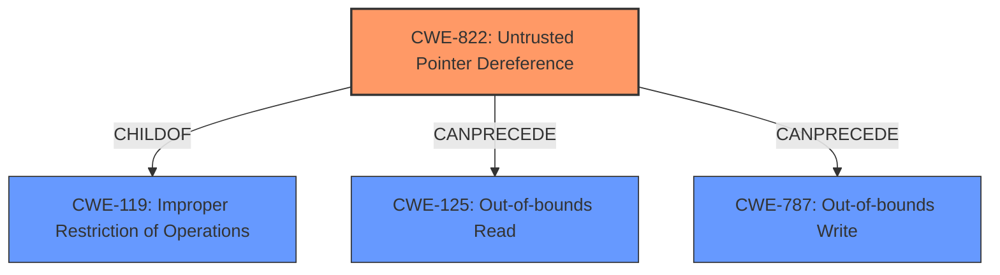

# Raw Analyzer Response for CVE-2022-25661

# Summary
| CWE ID | CWE Name | Confidence | CWE Abstraction Level | CWE Vulnerability Mapping Label | CWE-Vulnerability Mapping Notes |
|---|---|---|---|---|---|
| CWE-822 | Untrusted Pointer Dereference | 1.0 | Base | Allowed | Primary CWE |

## Evidence and Confidence

*   **Confidence Score:** 1.0
*   **Evidence Strength:** HIGH

## Relationship Analysis
The primary relationship that impacted my decision was the direct match of the vulnerability description to the CWE-822 description. There are ChildOf relationships to CWE-119 and CanPrecede relationships to CWE-125 and CWE-787. The abstraction level of Base is appropriate for this root cause.

## Vulnerability Chain
The vulnerability chain starts with the **untrusted pointer dereference** (CWE-822) which leads to memory corruption.

## Summary of Analysis
The vulnerability description clearly states the **rootcause** as **untrusted pointer dereference** which leads to memory corruption.

The most relevant CWE based on the provided information is CWE-822 (Untrusted Pointer Dereference).

The "Vulnerability Description Key Phrases" section explicitly identifies "**untrusted pointer dereference**" as the **rootcause**. This aligns directly with the CWE-822 description: "The product obtains a value from an untrusted source, converts this value to a pointer, and dereferences the resulting pointer."

The retriever results also list CWE-822 as the top candidate.

Therefore, CWE-822 is the optimal choice due to its direct relevance to the stated **rootcause**.

Other CWEs considered but not used:

*   CWE-823 (Use of Out-of-range Pointer Offset): While related to pointer issues, this CWE focuses on incorrect offsets rather than the fundamental problem of using an untrusted pointer in the first place. The description indicates dereferencing an untrusted pointer, not necessarily using an out-of-range offset with a valid pointer.
*   CWE-415 (Double Free) and CWE-416 (Use After Free): These are memory management errors, but the description does not indicate that memory is being freed incorrectly. It points to memory corruption due to using an untrusted pointer.
*   CWE-126 (Buffer Over-read): The description focuses on memory corruption in general and doesn't suggest a specific out-of-bounds read.
*   CWE-252 (Unchecked Return Value): Not relevant as the vulnerability isn't explicitly linked to a function/method's return value not being checked.
*   CWE-1285 (Improper Validation of Specified Index, Position, or Offset in Input): While related to input validation, this is not the primary issue. The core problem is using a pointer derived from untrusted data, not validating an index, position or offset.