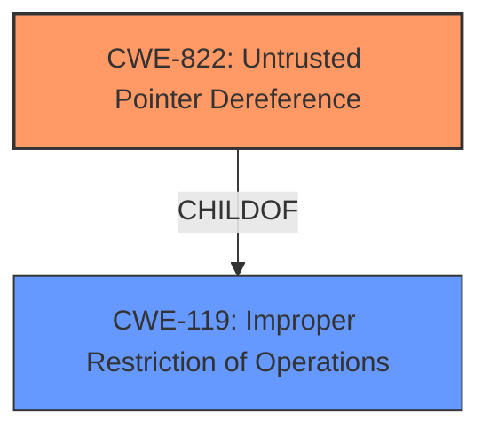

# Analysis Report for CVE-2022-25662

# Vulnerability Analysis Report: CVE-2022-25662

## Description


## Analysis (with Relationship Data)

# Summary
| CWE ID | CWE Name | Confidence | CWE Abstraction Level | CWE Vulnerability Mapping Label | CWE-Vulnerability Mapping Notes |
|---|---|---|---|---|---|
| CWE-822 | Untrusted Pointer Dereference | 1.0 | Base | Allowed | Primary CWE |

## Evidence and Confidence

*   **Confidence Score:** 1.0
*   **Evidence Strength:** HIGH

## Relationship Analysis
The primary CWE is CWE-822 **Untrusted Pointer Dereference**, which is a Base level CWE. This CWE has parent relationships to CWE-119 **Improper Restriction of Operations within the Bounds of a Memory Buffer**. The vulnerability description directly states the **rootcause** is **untrusted pointer dereference**, making CWE-822 the most appropriate choice.



## Vulnerability Chain
The vulnerability chain is straightforward:
1.  The **rootcause** is an **untrusted pointer dereference** (CWE-822).
2.  The impact is information disclosure.

## Summary of Analysis
The initial assessment identifies the **rootcause** as **untrusted pointer dereference**, which directly maps to CWE-822. The vulnerability description key phrases clearly state this. The "Retriever Results" also lists CWE-822 as the top combined result.

The evidence from the "Vulnerability Description Key Phrases" is:
- **rootcause:** **untrusted pointer dereference**

The analysis is based on the provided evidence, and the graph relationships confirm that CWE-822 is the most specific and appropriate choice. The selection of CWE-822 is at the optimal level of specificity (Base).

Relevant CWE Information:

# Enhanced Context (25 CWEs)

## CWE-822: Untrusted Pointer Dereference
**Abstraction:** Base
**Status:** Incomplete

### Description
The product obtains a value from an untrusted source, converts this value to a pointer, and dereferences the resulting pointer.

### Extended Description


An attacker can supply a pointer for memory locations that the product is not expecting. If the pointer is dereferenced for a write operation, the attack might allow modification of critical state variables, cause a crash, or execute code. If the dereferencing operation is for a read, then the attack might allow reading of sensitive data, cause a crash, or set a variable to an unexpected value (since the value will be read from an unexpected memory location).

### Mapping Guidance
**Usage:** Allowed
**Rationale:** This CWE entry is at the Base level of abstraction, which is a preferred level of abstraction for mapping to the root causes of vulnerabilities.

## CWE-823: Use of Out-of-range Pointer Offset
CWE-823 was considered as a possible option. However, the vulnerability description does not explicitly mention pointer arithmetic or offsets. It only states **untrusted pointer dereference**. Therefore, CWE-823 is not selected.

## CWE-126: Buffer Over-read
CWE-126 was considered as a possible option. However, the vulnerability description does not explicitly mention reading past the end of the buffer, instead only that there is an **untrusted pointer dereference**. Therefore, CWE-126 is not selected.

## CWE-1314: Missing Write Protection for Parametric Data Values
CWE-1314 was considered as a possible option. However, the vulnerability description does not explicitly mention parametric data values, instead only that there is an **untrusted pointer dereference**. Therefore, CWE-1314 is not selected.

## CWE-415: Double Free
CWE-415 was considered as a possible option. However, the vulnerability description does not explicitly mention any double free condition, instead only that there is an **untrusted pointer dereference**. Therefore, CWE-415 is not selected.


## CWE Relationship Analysis

Current CWEs represent these abstraction levels: .


### Vulnerability Chain Analysis

**Chain starting from CWE-823:**
- 823 (Use of Out-of-range Pointer Offset) - ROOT


**Chain starting from CWE-822:**
- 822 (Untrusted Pointer Dereference) - ROOT


### CWE Relationship Diagram

```mermaid
graph TD
    classDef primary fill:#f96,stroke:#333,stroke-width:2px
    classDef secondary fill:#69f,stroke:#333
    classDef tertiary fill:#9e9,stroke:#333
```


*Report generated on 2025-03-31 00:37:01*
