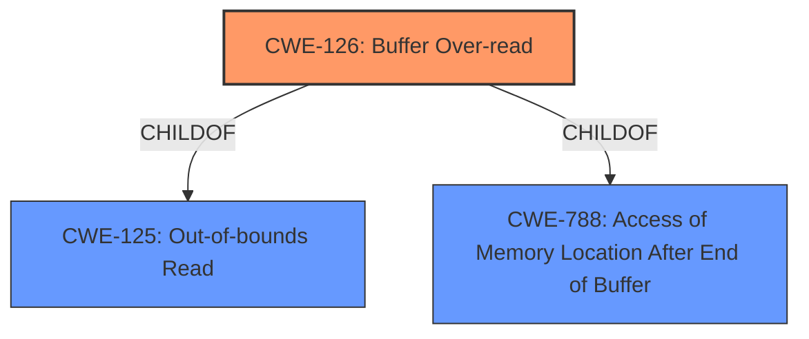

# Analysis Report for CVE-2022-25676

# Vulnerability Analysis Report: CVE-2022-25676

## Description


## Analysis (with Relationship Data)

# Summary
| CWE ID | CWE Name | Confidence | CWE Abstraction Level | CWE Vulnerability Mapping Label | CWE-Vulnerability Mapping Notes |
|---|---|---|---|---|---|
| CWE-126 | Buffer Over-read | 1.0 | Variant | Allowed | Primary CWE |

## Evidence and Confidence

*   **Confidence Score:** 1.0
*   **Evidence Strength:** HIGH

## Relationship Analysis
The primary relationship influencing the CWE selection is the ChildOf relationship between CWE-126 and its parent CWEs (CWE-125 and CWE-788). CWE-126 is a variant of the more general "Out-of-bounds Read" (CWE-125), specifying that the read occurs after the targeted buffer.



## Vulnerability Chain
The vulnerability chain involves a **buffer over-read** while parsing avi files, leading to information disclosure.

## Summary of Analysis
The vulnerability description explicitly states "**buffer over-read**", which directly corresponds to CWE-126. The description mentions parsing avi files as the vector, and the impact is information disclosure.

The selection of CWE-126 is based on the explicit mention of "**buffer over-read**" in the vulnerability description key phrases. The "**rootcause**" is identified as "**buffer over-read**".

CWE-126: Buffer Over-read is the most appropriate CWE because it accurately describes the vulnerability. It is a variant of "Out-of-bounds Read" (CWE-125), indicating that the read occurs beyond the intended buffer boundaries. The confidence level is high (1.0) due to the direct match between the vulnerability description and the CWE definition.

Relevant CWE Information:

# Enhanced Context (25 CWEs)

## CWE-126: Buffer Over-read
**Abstraction:** Variant
**Status:** Draft

### Description
The product reads from a buffer using buffer access mechanisms such as indexes or pointers that reference memory locations after the targeted buffer.

### Extended Description
This typically occurs when the pointer or its index is incremented to a position beyond the bounds of the buffer or when pointer arithmetic results in a position outside of the valid memory location to name a few. This may result in exposure of sensitive information or possibly a crash.

### Observed Examples
- **CVE-2022-1733:** Text editor has out-of-bounds read past end of line while indenting C code
- **CVE-2014-0160:** Chain: "Heartbleed" bug receives an inconsistent length parameter (CWE-130) enabling an out-of-bounds read (CWE-126), returning memory that could include private cryptographic keys and other sensitive data.

I considered other CWEs such as CWE-125 (Out-of-bounds Read), CWE-822 (Untrusted Pointer Dereference), and CWE-823 (Use of Out-of-range Pointer Offset). However, CWE-126 is the most specific and accurate representation of the vulnerability because the description explicitly mentions "**buffer over-read**."


## CWE Relationship Analysis

Current CWEs represent these abstraction levels: .


### Vulnerability Chain Analysis

**Chain starting from CWE-823:**
- 823 (Use of Out-of-range Pointer Offset) - ROOT


**Chain starting from CWE-822:**
- 822 (Untrusted Pointer Dereference) - ROOT


### CWE Relationship Diagram

```mermaid
graph TD
    classDef primary fill:#f96,stroke:#333,stroke-width:2px
    classDef secondary fill:#69f,stroke:#333
    classDef tertiary fill:#9e9,stroke:#333
```


*Report generated on 2025-03-30 11:58:22*
