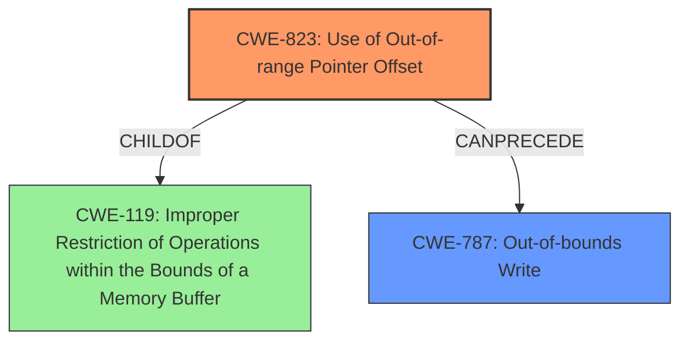

# Analysis for CVE-2022-25694

# Summary
| CWE ID | CWE Name | Confidence | CWE Abstraction Level | CWE Vulnerability Mapping Label | CWE-Vulnerability Mapping Notes |
|---|---|---|---|---|---|
| CWE-823 | Use of Out-of-range Pointer Offset | 1.0 | Base | Allowed | Primary CWE |
| CWE-787 | Out-of-bounds Write | 0.7 | Base | Allowed | Secondary CWE |

## Evidence and Confidence

*   **Confidence Score:** 0.9
*   **Evidence Strength:** HIGH

## Relationship Analysis
The primary relationship that influenced the decision was the direct match of the vulnerability description to CWE-823, which describes the **usage of an out-of-range pointer offset**. CWE-823 is a child of CWE-119 (Improper Restriction of Operations within the Bounds of a Memory Buffer), indicating it's a specific type of memory boundary error. CWE-787 (Out-of-bounds Write) can be a consequence of CWE-823, suggesting a potential vulnerability chain where an out-of-range offset leads to writing data outside the intended buffer.

## Vulnerability Chain
The vulnerability chain starts with the **usage of an out-of-range pointer offset** (CWE-823), which can then lead to an out-of-bounds write (CWE-787), resulting in memory corruption.

## Summary of Analysis
The initial analysis focused on identifying the root cause of the memory corruption. The vulnerability description clearly states "**usage of Out-of-range pointer offset** in UIM," which directly corresponds to CWE-823. The retriever results also list CWE-823 as the top candidate. The relationship analysis confirms that CWE-823 is a specific type of memory boundary error (child of CWE-119), and it can lead to out-of-bounds writes (CWE-787).

The decision to classify the vulnerability as CWE-823 is based on the explicit mention of "**usage of Out-of-range pointer offset**" in the vulnerability description and its alignment with the CWE's definition. The selection of CWE-823 is at the optimal level of specificity because it directly describes the **root cause** of the vulnerability. CWE-787 is included as a secondary CWE because it represents a potential consequence of the out-of-range pointer offset.

Relevant CWE Information:

# Enhanced Context (25 CWEs)

## CWE-823: Use of Out-of-range Pointer Offset
**Abstraction Level**: Base
**Similarity Score**: 0.80
**Source**: dense

**Description**:
The product performs pointer arithmetic on a valid pointer, but it uses an offset that can point outside of the intended range of valid memory locations for the resulting pointer.

**Mapping Guidance**:
- Usage: Allowed
- Rationale: This CWE entry is at the Base level of abstraction, which is a preferred level of abstraction for mapping to the root causes of vulnerabilities.

## CWE-787: Out-of-bounds Write
**Abstraction Level**: base
**Similarity Score**: 4.33
**Source**: graph

**Description**:
CWE-787: Out-of-bounds Write

**Mapping Guidance**:
- Usage: Allowed
- Rationale: This CWE entry is at the Base level of abstraction, which is a preferred level of abstraction for mapping to the root causes of vulnerabilities.

### CWE-823: Use of Out-of-range Pointer Offset
*   **Technical Explanation:** The vulnerability description explicitly states "**usage of Out-of-range pointer offset**," which directly aligns with CWE-823's description: "The product performs pointer arithmetic on a valid pointer, but it uses an offset that can point outside of the intended range of valid memory locations for the resulting pointer."
*   **Security Implications:** Using an out-of-range pointer offset can lead to reading from or writing to unintended memory locations, potentially causing data corruption, denial of service, or arbitrary code execution.
*   **Relationship Analysis:** CWE-823 is a child of CWE-119 (Improper Restriction of Operations within the Bounds of a Memory Buffer), indicating that it's a specific type of memory boundary error. It can also precede CWE-787 (Out-of-bounds Write).
*   **Mapping Guidance Influence:** The MITRE mapping guidance allows the use of CWE-823 because it's at the Base level of abstraction and directly represents the **root cause** of the vulnerability.
*   **Primary/Secondary:** Primary. This is the **root cause** of the vulnerability.
*   **Confidence:** 1.0

### CWE-787: Out-of-bounds Write
*   **Technical Explanation:** While the vulnerability description focuses on the out-of-range pointer offset, it also mentions that this leads to "Memory corruption," which is a common consequence of out-of-bounds writes. CWE-787 describes this consequence: "The product writes data past the end, or before the beginning, of the intended buffer."
*   **Security Implications:** An out-of-bounds write can overwrite critical data structures, leading to denial of service, privilege escalation, or arbitrary code execution.
*   **Relationship Analysis:** CWE-787 is a child of CWE-119 and can be a consequence of CWE-823.
*   **Mapping Guidance Influence:** The MITRE mapping guidance allows the use of CWE-787 because it's at the Base level of abstraction.
*   **Primary/Secondary:** Secondary. This is a potential consequence of the primary weakness (CWE-823).
*   **Confidence:** 0.7

### CWEs Considered But Not Used
*   CWE-824 (Access of Uninitialized Pointer), CWE-825 (Expired Pointer Dereference), CWE-476 (NULL Pointer Dereference), and CWE-822 (Untrusted Pointer Dereference): These CWEs were considered because they are related to pointer issues. However, the vulnerability description explicitly mentions "**usage of Out-of-range pointer offset**," which doesn't directly align with the descriptions of these CWEs. These are related to uninitialized, expired, NULL, or untrusted pointers.
*   CWE-1285 (Improper Validation of Specified Index, Position, or Offset in Input) and CWE-129 (Improper Validation of Array Index): These CWEs are related to improper validation of indices or offsets. However, the vulnerability description focuses on the **usage** of an out-of-range offset, not the lack of validation.