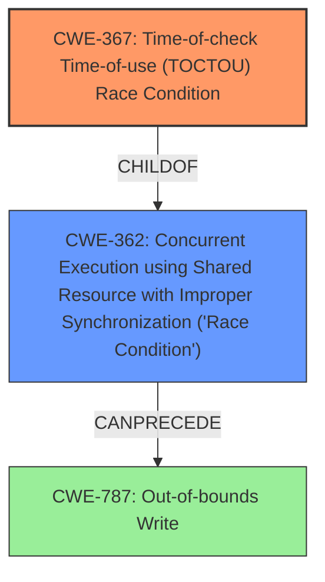

# Analysis Report for CVE-2022-25696

# Vulnerability Analysis Report: CVE-2022-25696

## Description


## Analysis (with Relationship Data)

# Summary
| CWE ID | CWE Name | Confidence | CWE Abstraction Level | CWE Vulnerability Mapping Label | CWE-Vulnerability Mapping Notes |
|---|---|---|---|---|---|
| CWE-367 | Time-of-check Time-of-use (TOCTOU) Race Condition | 1.0 | Base | Primary | Allowed |
| CWE-362 | Concurrent Execution using Shared Resource with Improper Synchronization ('Race Condition') | 0.8 | Class | Secondary | Allowed-with-Review |

## Evidence and Confidence

*   **Confidence Score:** 1.0
*   **Evidence Strength:** HIGH

## Relationship Analysis
The primary relationship influencing the CWE selection is the parent-child relationship between CWE-362 and CWE-367. CWE-367 is a specific type of race condition, making it a more precise fit than its parent, CWE-362. Since the vulnerability description explicitly mentions a "time-of-check time-of-use race condition", it directly aligns with CWE-367's definition.



## Vulnerability Chain
The vulnerability chain starts with a **time-of-check time-of-use race condition** (CWE-367), which leads to memory corruption. The full chain is:

1.  CWE-367: Time-of-check Time-of-use (TOCTOU) Race Condition
2.  CWE-N/A: Missing link - Improper Memory Access
3.  CWE-N/A: Missing link - Write to Memory Location
4.  CWE-N/A: Missing link - Memory Corrupted
5.  CWE-N/A: Missing link - Impact on System

The provided description focuses primarily on the race condition and its direct impact of memory corruption but lacks detail on the exact mechanism of exploitation or further impacts, creating missing links in the chain.

## Summary of Analysis
The initial assessment heavily relied on the explicit mention of "**time-of-check time-of-use race condition**" in the vulnerability description. This immediately pointed towards CWE-367 as the most appropriate classification. The retriever results also supported this, listing CWE-367 and CWE-362 (its parent) as top candidates.

The final decision was based on the following:

*   **Direct Evidence:** The vulnerability description explicitly states "**time-of-check time-of-use race condition**", which is the defining characteristic of CWE-367.
*   **Relationship Analysis:** CWE-367 is a child of CWE-362, providing a hierarchical context and confirming that it is a specific type of race condition.
*   **Mapping Guidance:** CWE-367 is a Base level CWE with an "Allowed" usage, making it an appropriate choice.

The selected CWEs are at the optimal level of specificity because CWE-367 directly captures the **root cause** described in the vulnerability, while CWE-362 provides a broader context.

Relevant CWE Information:

# Enhanced Context (25 CWEs)

## CWE-404: Improper Resource Shutdown or Release
**Abstraction Level**: Class
**Similarity Score**: 0.79
**Source**: dense

**Description**:
The product does not release or incorrectly releases a resource before it is made available for re-use.

**Mapping Guidance**:
- Usage: Allowed-with-Review
- Rationale: This CWE entry is a Class and might have Base-level children that would be more appropriate

*Not Selected:* Although memory is a resource, the **root cause** isn't about failing to release it, but the **race condition** itself.

## CWE-226: Sensitive Information in Resource Not Removed Before Reuse
**Abstraction Level**: Base
**Similarity Score**: 0.79
**Source**: dense

**Description**:
The product releases a resource such as memory or a file so that it can be made available for reuse, but it does not clear or "zeroize" the information contained in the resource before the product performs a critical state transition or makes the resource available for reuse by other entities.

**Mapping Guidance**:
- Usage: Allowed
- Rationale: This CWE entry is at the Base level of abstraction, which is a preferred level of abstraction for mapping to the root causes of vulnerabilities.

*Not Selected:* This CWE is related to information leakage during resource reuse, but the vulnerability description focuses on a **race condition**, not information exposure.

## CWE-667: Improper Locking
**Abstraction Level**: Class
**Similarity Score**: 0.78
**Source**: dense

**Description**:
The product does not properly acquire or release a lock on a resource, leading to unexpected resource state changes and behaviors.

**Mapping Guidance**:
- Usage: Allowed-with-Review
- Rationale: This CWE entry is a Class and might have Base-level children that would be more appropriate

*Not Selected:* Improper locking could lead to a **race condition**, but the description identifies the **race condition** itself, not the locking mechanism.

## CWE-459: Incomplete Cleanup
**Abstraction Level**: Base
**Similarity Score**: 0.78
**Source**: dense

**Description**:
The product does not properly "clean up" and remove temporary or supporting resources after they have been used.

**Mapping Guidance**:
- Usage: Allowed
- Rationale: This CWE entry is at the Base level of abstraction, which is a preferred level of abstraction for mapping to the root causes of vulnerabilities.

*Not Selected:* Cleanup issues aren't the focus; the **root cause** is a **race condition**.

## CWE-362: Concurrent Execution using Shared Resource with Improper Synchronization ('Race Condition')
**Abstraction Level**: Class
**Similarity Score**: 0.76
**Source**: dense

**Description**:
The product contains a concurrent code sequence that requires temporary, exclusive access to a shared resource, but a timing window exists in which the shared resource can be modified by another code sequence operating concurrently.

**Mapping Guidance**:
- Usage: Allowed-with-Review
- Rationale: This CWE entry is a Class and might have Base-level children that would be more appropriate

*Selected as Secondary:* While CWE-367 is more specific, CWE-362 captures the general concept of a **race condition**.

## CWE-754: Improper Check for Unusual or Exceptional Conditions
**Abstraction Level**: Class
**Similarity Score**: 0.76
**Source**: dense

**Description**:
The product does not check or incorrectly checks for unusual or exceptional conditions that are not expected to occur frequently during day to day operation of the product.

**Mapping Guidance**:
- Usage: Allowed-with-Review
- Rationale: This CWE entry is a Class and might have Base-level children that would be more appropriate

*Not Selected:* This is a broad category, but the vulnerability is more precisely identified as a **TOCTOU race condition**.

## CWE-367: Time-of-check Time-of-use (TOCTOU) Race Condition
**Abstraction Level**: Base
**Similarity Score**: 0.76
**Source**: dense

**Description**:
The product checks the state of a resource before using that resource, but the resource's state can change between the check and the use in a way that invalidates the results of the check. This can cause the product to perform invalid actions when the resource is in an unexpected state.

**Mapping Guidance**:
- Usage: Allowed
- Rationale: This CWE entry is at the Base level of abstraction, which is a preferred level of abstraction for mapping to the root causes of vulnerabilities.

*Selected as Primary:* This aligns directly with the "**time-of-check time-of-use race condition**" described.

## CWE-366: Race Condition within a Thread
**Abstraction Level**: Base
**Similarity Score**: 0.76
**Source**: dense

**Description**:
If two threads of execution use a resource simultaneously, there exists the possibility that resources may be used while invalid, in turn making the state of execution undefined.

**Mapping Guidance**:
- Usage: Allowed
- Rationale: This CWE entry is at the Base level of abstraction, which is a preferred level of abstraction for mapping to the root causes of vulnerabilities.

*Not Selected:* While a **race condition** within a thread is possible, the description doesn't specify that it's limited to a single thread. CWE-367 is a better fit.

## CWE-131: Incorrect Calculation


## CWE Relationship Analysis

Current CWEs represent these abstraction levels: .


### Vulnerability Chain Analysis

**Chain starting from CWE-131:**
- 131 (Incorrect Calculation of Buffer Size) - ROOT


**Chain starting from CWE-459:**
- 459 (Incomplete Cleanup) - ROOT


### CWE Relationship Diagram

```mermaid
graph TD
    classDef primary fill:#f96,stroke:#333,stroke-width:2px
    classDef secondary fill:#69f,stroke:#333
    classDef tertiary fill:#9e9,stroke:#333
```


*Report generated on 2025-03-30 23:31:20*
