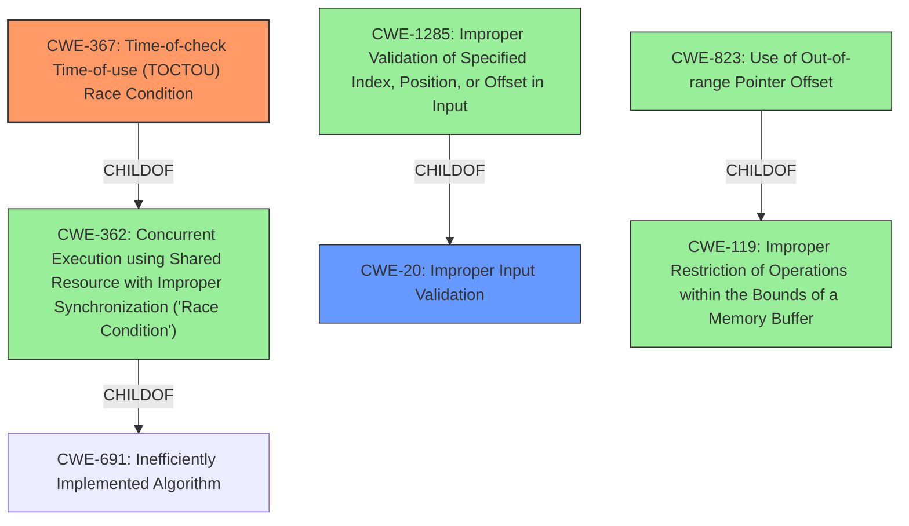

# Analysis Report for CVE-2022-25697

# Vulnerability Analysis Report: CVE-2022-25697

## Description


## Analysis (with Relationship Data)

# Summary
| CWE ID | CWE Name | Confidence | CWE Abstraction Level | CWE Vulnerability Mapping Label | CWE-Vulnerability Mapping Notes |
|---|---|---|---|---|---|
| CWE-367 | Time-of-check Time-of-use (TOCTOU) Race Condition | 0.9 | Base | Allowed | Primary CWE |
| CWE-20 | Improper Input Validation | 0.7 | Class | Allowed | Secondary Candidate |

## Evidence and Confidence

*   **Confidence Score:** 0.8
*   **Evidence Strength:** MEDIUM

## Relationship Analysis
The primary CWE is CWE-367, which is a child of CWE-362 (Concurrent Execution using Shared Resource with Improper Synchronization ('Race Condition')). CWE-367 is more specific because it involves a check and a subsequent use of a resource, where the resource's state can change in between. CWE-20 is a high-level weakness, and CWE-1285, a child of CWE-20, describes issues related to index, position, or offset, and this is also related to CWE-823 that describes use of out-of-range pointer offset.



## Vulnerability Chain
The vulnerability starts with **improper input validation** (CWE-20), which leads to a **time-of-check time-of-use (TOCTOU) race condition** (CWE-367). The race condition then results in memory corruption.

## Summary of Analysis
The vulnerability description clearly indicates **improper input validation** as a root cause and a **time-of-check time-of-use (TOCTOU) race condition** as a weakness. The description states: "Memory corruption in i2c buses due to **improper input validation** while reading address configuration from i2c driver in Snapdragon Mobile, Snapdragon Wearables." and the key phrases also confirm these elements.
Given this information, CWE-367 is the most accurate primary classification, with CWE-20 as a secondary consideration. The graph relationships emphasize the chain from input validation to race condition. The selection of CWE-367 is at the optimal level of specificity, as it is a Base CWE that directly reflects the TOCTOU nature of the race condition.

Relevant CWE Information:

# Enhanced Context (25 CWEs)
The following CWEs were identified as potentially relevant to this vulnerability:

## CWE-191: Integer Underflow (Wrap or Wraparound)
**Abstraction Level**: Base
**Similarity Score**: 0.80
**Source**: dense
## CWE-197: Numeric Truncation Error
**Abstraction Level**: Base
**Similarity Score**: 0.77
**Source**: dense
## CWE-680: Integer Overflow to Buffer Overflow
**Abstraction Level**: Compound
**Similarity Score**: 0.77
**Source**: dense
## CWE-823: Use of Out-of-range Pointer Offset
**Abstraction Level**: Base
**Similarity Score**: 0.77
**Source**: dense
## CWE-190: Integer Overflow or Wraparound
**Abstraction Level**: Base
**Similarity Score**: 0.77
**Source**: dense
## CWE-681: Incorrect Conversion between Numeric Types
**Abstraction Level**: Base
**Similarity Score**: 0.77
**Source**: dense
## CWE-131: Incorrect Calculation of Buffer Size
**Abstraction Level**: Base
**Similarity Score**: 0.77
**Source**: dense
## CWE-124: Buffer Underwrite ('Buffer Underflow')
**Abstraction Level**: Base
**Similarity Score**: 0.76
**Source**: dense
## CWE-667: Improper Locking
**Abstraction Level**: Class
**Similarity Score**: 0.75
**Source**: dense
## CWE-125: Out-of-bounds Read
**Abstraction Level**: Base
**Similarity Score**: 0.75
**Source**: dense
## CWE-823: Use of Out-of-range Pointer Offset
**Abstraction Level**: Base
**Similarity Score**: 6842.91
**Source**: sparse
## CWE-190: Integer Overflow or Wraparound
**Abstraction Level**: Base
**Similarity Score**: 6770.66
**Source**: sparse
## CWE-367: Time-of-check Time-of-use (TOCTOU) Race Condition
**Abstraction Level**: Base
**Similarity Score**: 6534.00
**Source**: sparse
## CWE-125: Out-of-bounds Read
**Abstraction Level**: Base
**Similarity Score**: 6483.50
**Source**: sparse
## CWE-362: Concurrent Execution using Shared Resource with Improper Synchronization ('Race Condition')
**Abstraction Level**: Class
**Similarity Score**: 6376.47
**Source**: sparse
## CWE-123: Write-what-where Condition
**Abstraction Level**: base
**Similarity Score**: 5.03
**Source**: graph
## CWE-416: Use After Free
**Abstraction Level**: variant
**Similarity Score**: 4.53
**Source**: graph
## CWE-476: NULL Pointer Dereference
**Abstraction Level**: base
**Similarity Score**: 4.33
**Source**: graph
## CWE-825: Expired Pointer Dereference
**Abstraction Level**: base
**Similarity Score**: 4.33
**Source**: graph
## CWE-787: Out-of-bounds Write
**Abstraction Level**: base
**Similarity Score**: 4.33
**Source**: graph
## CWE-1341: Multiple Releases of Same Resource or Handle
**Abstraction Level**: base
**Similarity Score**: 4.33
**Source**: graph
## CWE-1284: Improper Validation of Specified Quantity in Input
**Abstraction Level**: base
**Similarity Score**: 4.33
**Source**: graph
## CWE-415: Double Free
**Abstraction Level**: variant
**Similarity Score**: 4.12
**Source**: graph
## CWE-781: Improper Address Validation in IOCTL with METHOD_NEITHER I/O Control Code
**Abstraction Level**: variant
**Similarity Score**: 3.88
**Source**: graph
## CWE-170: Improper Null Termination
**Abstraction Level**: base
**Similarity Score**: 3.57
**Source**: graph

### CWE-367: Time-of-check Time-of-use (TOCTOU) Race Condition
The vulnerability description explicitly mentions a **time-of-check time-of-use (TOCTOU) race condition**. This aligns directly with the description of CWE-367, which states: "The product checks the state of a resource before using that resource, but the resource's state can change between the check and the use in a way that invalidates the results of the check."
The security implication is that an attacker can potentially manipulate the state of the i2c bus between the time it is checked and the time it is used, leading to memory corruption. CWE-367 is a child of CWE-362 (Concurrent Execution using Shared Resource with Improper Synchronization ('Race Condition')), indicating a more general class of concurrency issues. It is a base level weakness.
The MITRE mapping guidance allows for the use of CWE-367.

### CWE-20: Improper Input Validation
The vulnerability description indicates **improper input validation** as a root cause. This is a broad class of vulnerabilities, but in this context, it means the system is not properly validating the address configuration read from the i2c driver.
The security implication is that an attacker could supply malicious input that is not properly


## CWE Relationship Analysis

Current CWEs represent these abstraction levels: .


### Vulnerability Chain Analysis

**Chain starting from CWE-823:**
- 823 (Use of Out-of-range Pointer Offset) - ROOT


**Chain starting from CWE-119:**
- 119 (Improper Restriction of Operations within the Bounds of a Memory Buffer) - ROOT


### CWE Relationship Diagram

```mermaid
graph TD
    classDef primary fill:#f96,stroke:#333,stroke-width:2px
    classDef secondary fill:#69f,stroke:#333
    classDef tertiary fill:#9e9,stroke:#333
```


*Report generated on 2025-03-31 07:36:30*
