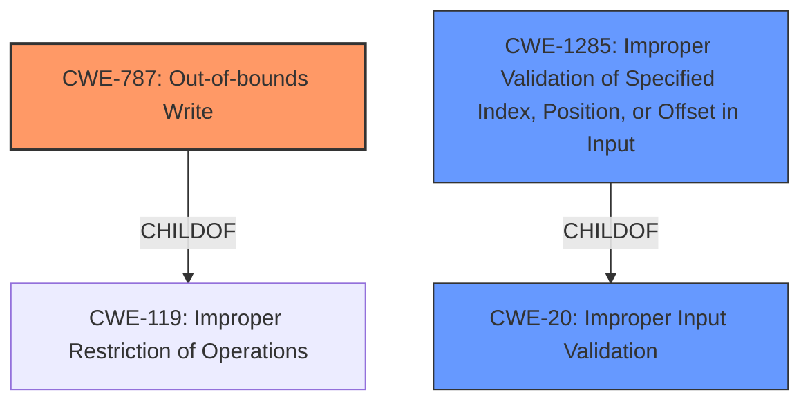

# Analysis Report for CVE-2022-25698

# Vulnerability Analysis Report: CVE-2022-25698

## Description


## Analysis (with Relationship Data)

# Summary
| CWE ID | CWE Name | Confidence | CWE Abstraction Level | CWE Vulnerability Mapping Label | CWE-Vulnerability Mapping Notes |
|---|---|---|---|---|---|
| CWE-787 | Out-of-bounds Write | 0.9 | Base | Allowed | Primary CWE |
| CWE-1285 | Improper Validation of Specified Index, Position, or Offset in Input | 0.7 | Base | Allowed | Secondary Candidate |
| CWE-20 | Improper Input Validation | 0.4 | Class | Discouraged | Secondary Candidate |

## Evidence and Confidence

*   **Confidence Score:** 0.8
*   **Evidence Strength:** MEDIUM

## Relationship Analysis
The primary CWE is CWE-787, which is a base-level CWE. The vulnerability description mentions memory corruption due to improper input validation. CWE-787 is a child of CWE-119 (Improper Restriction of Operations within the Bounds of a Memory Buffer). CWE-1285 (Improper Validation of Specified Index, Position, or Offset in Input) is a child of CWE-20 (Improper Input Validation). CWE-787 can follow CWE-823 (Use of Out-of-range Pointer Offset).



## Vulnerability Chain
The chain starts with **improper input validation**, which leads to **memory corruption**, specifically an out-of-bounds write. The chain is: Improper Input Validation -> Out-of-bounds Write.

## Summary of Analysis
The vulnerability description states: "Memory corruption in SPI buses due to **improper input validation** while reading address configuration from spi buses in Snapdragon Mobile, Snapdragon Wearables".

The key phrases are:
- **rootcause:** **improper input validation**
- **weakness:** **memory corruption**

The primary weakness is **memory corruption**, and the root cause is **improper input validation**.

CWE-787 (Out-of-bounds Write) aligns with the **memory corruption** aspect of the vulnerability. The description of CWE-787 states: "The product writes data past the end, or before the beginning, of the intended buffer." Given the **memory corruption** mentioned in the description, CWE-787 is a good fit.

CWE-1285 (Improper Validation of Specified Index, Position, or Offset in Input) aligns with the **improper input validation** aspect, especially since it involves reading address configuration. The description for CWE-1285 states: "The product receives input that is expected to specify an index, position, or offset into an indexable resource such as a buffer or file, but it does not validate or incorrectly validates that the specified index/position/offset has the required properties."

CWE-20 (Improper Input Validation) is a more general weakness. While **improper input validation** is the root cause, CWE-1285 is a more specific base-level CWE that describes the specific type of **improper input validation** that led to the vulnerability. Therefore, I will include CWE-20 as a secondary candidate but not the primary CWE.

I am selecting CWE-787 as the primary CWE as the description states that the root cause leads to **memory corruption** so there is evidence to make that mapping with high confidence.

Relevant CWE Information:

# Enhanced Context (25 CWEs)

## CWE-704: Incorrect Type Conversion or Cast
**Abstraction Level**: Class
**Similarity Score**: 0.77

**Description**:
The product does not correctly convert an object, resource, or structure from one type to a different type.

**Mapping Guidance**:
- Usage: Allowed-with-Review
- Rationale: This CWE entry is a Class and might have Base-level children that would be more appropriate

*Reason not selected*: This vulnerability doesn't seem to have anything to do with type conversion.

## CWE-1289: Improper Validation of Unsafe Equivalence in Input
**Abstraction Level**: Base
**Similarity Score**: 0.76

**Description**:
The product receives an input value that is used as a resource identifier or other type of reference, but it does not validate or incorrectly validates that the input is equivalent to a potentially-unsafe value.

**Mapping Guidance**:
- Usage: Allowed
- Rationale: This CWE entry is at the Base level of abstraction, which is a preferred level of abstraction for mapping to the root causes of vulnerabilities.

*Reason not selected*: The description does not indicate that the validation is about equivalence of unsafe values.

## CWE-681: Incorrect Conversion between Numeric Types
**Abstraction Level**: Base
**Similarity Score**: 0.76

**Description**:
When converting from one data type to another, such as long to integer, data can be omitted or translated in a way that produces unexpected values. If the resulting values are used in a sensitive context, then dangerous behaviors may occur.

**Mapping Guidance**:
- Usage: Allowed
- Rationale: This CWE entry is at the Base level of abstraction, which is a preferred level of abstraction for mapping to the root causes of vulnerabilities.

*Reason not selected*: This vulnerability doesn't seem to have anything to do with numeric type conversion.

## CWE-197: Numeric Truncation Error
**Abstraction Level**: Base
**Similarity Score**: 0.73

**Description**:
Truncation errors occur when a primitive is cast to a primitive of a smaller size and data is lost in the conversion.

**Mapping Guidance**:
- Usage: Allowed
- Rationale: This CWE entry is at the Base level of abstraction, which is a preferred level of abstraction for mapping to the root causes of vulnerabilities.

*Reason not selected*: This vulnerability doesn't seem to have anything to do with numeric truncation.

## CWE-195: Signed to Unsigned Conversion Error
**Abstraction Level**: Variant
**Similarity Score**: 0.72

**Description**:
The product uses a signed primitive and performs a cast to an unsigned primitive, which can produce an unexpected value if the value of the signed primitive can not be represented using an unsigned primitive.

**Mapping Guidance**:
- Usage: Allowed
- Rationale: This CWE entry is at the Variant level of abstraction, which is a preferred level of abstraction for mapping to the root causes of vulnerabilities.

*Reason not selected*: This vulnerability doesn't seem to have anything to do with signed to unsigned conversion.

## CWE-843: Access of Resource Using Incompatible Type ('Type Confusion')
**Abstraction Level**: Base
**Similarity Score**: 0.72

**Description**:
The product allocates or initializes a resource such as a pointer, object, or variable using one type, but it later accesses that resource using a type that is incompatible with the original type.

**Mapping Guidance**:
- Usage: Allowed
- Rationale: This CWE entry is at the Base level of abstraction, which is a preferred level of abstraction for mapping to the root causes of vulnerabilities.

*Reason not selected*: This vulnerability doesn't seem to have anything to do with type confusion.

## CWE-1288: Improper Validation of Consistency within Input
**Abstraction Level**: Base
**Similarity Score**: 0.71

**Description**:
The product receives a complex input with multiple elements or fields that must be consistent with each other, but it does not validate or incorrectly validates that the input is actually consistent.

**Mapping Guidance**:
- Usage: Allowed
- Rationale: This CWE entry is at the Base level of abstraction, which is a preferred level of abstraction for mapping to the root causes of vulnerabilities.

*Reason not selected*: The description doesn't indicate that the input is complex or needs consistency validation.

## CWE-115: Misinterpretation of Input
**Abstraction Level**: Base
**Similarity Score**: 0.71

**Description**:
The product misinterprets an input, whether from an attacker or another product, in a security-relevant fashion.

**Mapping Guidance**:
- Usage: Allowed
- Rationale: This CWE entry is at the Base level of abstraction, which is a preferred level of abstraction for mapping to the root causes of vulnerabilities.

*Reason not selected*: While input misinterpretation could be a factor, the description highlights lack of validation which makes other CWEs more suitable.

## CWE-682: Incorrect Calculation
**Abstraction Level**: Pillar
**Similarity Score**: 0.71

**Description**:
The product performs a calculation that generates incorrect or unintended results that are later used in security-critical decisions or resource management.

**Mapping Guidance**:
- Usage: Discouraged
- Rationale:


## CWE Relationship Analysis

Current CWEs represent these abstraction levels: .


### Vulnerability Chain Analysis

**Chain starting from CWE-704:**
- 704 (Incorrect Type Conversion or Cast) - ROOT


**Chain starting from CWE-115:**
- 115 (Misinterpretation of Input) - ROOT


### CWE Relationship Diagram

```mermaid
graph TD
    classDef primary fill:#f96,stroke:#333,stroke-width:2px
    classDef secondary fill:#69f,stroke:#333
    classDef tertiary fill:#9e9,stroke:#333
```


*Report generated on 2025-03-31 04:43:55*
