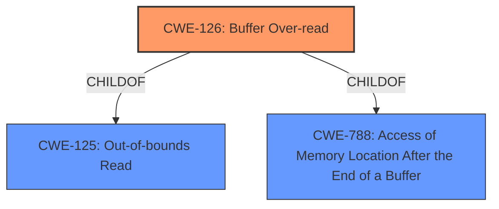

# Enhanced Analysis for CVE-2022-25706

# Summary
| CWE ID | CWE Name | Confidence | CWE Abstraction Level | CWE Vulnerability Mapping Label | CWE-Vulnerability Mapping Notes |
|---|---|---|---|---|---|
| CWE-126 | Buffer Over-read | 1.0 | Variant | Allowed | Primary CWE |

## Evidence and Confidence

*   **Confidence Score:** 1.0
*   **Evidence Strength:** HIGH

## Relationship Analysis
The primary relationship that influenced the decision was the ChildOf relationship between CWE-126 and CWE-125 (Out-of-bounds Read). CWE-126 is a variant of CWE-125 that specifically describes over-reading, making it a more precise fit for the vulnerability. The tool's retriever score also supported CWE-126 as the top match.



## Vulnerability Chain
The vulnerability chain consists of a **buffer over-read** (**root cause**) leading to information disclosure (**impact**) in the Bluetooth driver.

## Summary of Analysis
The vulnerability description explicitly mentions "**buffer over-read**" as the root cause. The description states: "Information disclosure in Bluetooth driver due to **buffer over-read** while reading l2cap length".
The primary CWE selected, CWE-126 (Buffer Over-read), directly reflects this **root cause**. It is a Variant-level CWE, providing a more specific classification than its parent, CWE-125 (Out-of-bounds Read). The retriever tool identified CWE-126 as the top combined result with a score of 0.466, which further supports this selection. The mapping guidance for CWE-126 recommends its usage and rationale confirms that it is at the Variant level of abstraction, which is a preferred level of abstraction for mapping to the **root causes** of vulnerabilities.

Several other CWEs were considered but ultimately not selected as the primary CWE:

*   CWE-822 (Untrusted Pointer Dereference) and CWE-823 (Use of Out-of-range Pointer Offset): While these CWEs relate to pointer issues, the provided description doesn't indicate any untrusted pointers or offsets being the explicit **root cause** of the vulnerability.

*   CWE-805 (Buffer Access with Incorrect Length Value): This is similar to CWE-126, but the description explicitly states "**buffer over-read**", indicating that the access is happening outside the buffer bounds instead of simply using an incorrect length.

*   CWE-125 (Out-of-bounds Read): While this is a parent of CWE-126, the explicit mention of "over-read" makes CWE-126 a more specific and appropriate choice.
*   CWE-1284 (Improper Validation of Specified Quantity in Input): This is related to length validation, however, the description focuses on the over-read condition.

I am confident in selecting CWE-126 as the primary CWE as it aligns directly with the provided vulnerability description and the identified **root cause**. The selection is also supported by the retriever results and MITRE's mapping guidance.


## CWE Relationship Analysis

Current CWEs represent these abstraction levels: .


### Vulnerability Chain Analysis

**Chain starting from CWE-805:**
- 805 (Buffer Access with Incorrect Length Value) - ROOT


**Chain starting from CWE-823:**
- 823 (Use of Out-of-range Pointer Offset) - ROOT


### CWE Relationship Diagram

```mermaid
graph TD
    classDef primary fill:#f96,stroke:#333,stroke-width:2px
    classDef secondary fill:#69f,stroke:#333
    classDef tertiary fill:#9e9,stroke:#333
```