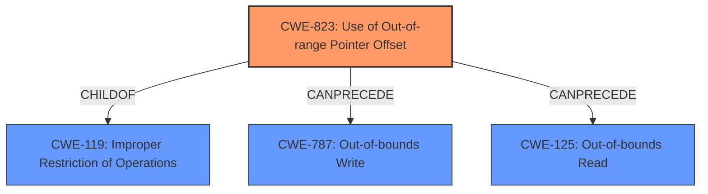

# Enhanced Analysis for CVE-2022-25709

# Summary
| CWE ID | CWE Name | Confidence | CWE Abstraction Level | CWE Vulnerability Mapping Label | CWE-Vulnerability Mapping Notes |
|---|---|---|---|---|---|
| CWE-823 | Use of Out-of-range Pointer Offset | 1.0 | Base | Allowed | Primary CWE. The description matches the weakness. |
| CWE-787 | Out-of-bounds Write | 0.5 | Base | Allowed | Secondary CWE. This is a possible impact of the primary weakness. |

## Evidence and Confidence

*   **Confidence Score:** 0.9
*   **Evidence Strength:** HIGH

## Relationship Analysis
The primary CWE is CWE-823, which is a Base level CWE. CWE-823 is a child of CWE-119 (Improper Restriction of Operations within the Bounds of a Memory Buffer). CWE-823 can precede CWE-787 (Out-of-bounds Write) and CWE-125 (Out-of-bounds Read). These relationships suggest a potential vulnerability chain starting with an out-of-range pointer offset, potentially leading to an out-of-bounds read or write.



## Vulnerability Chain
The vulnerability chain starts with the **use of out of range pointer offset** (CWE-823), which leads to memory corruption. The memory corruption could manifest as an out-of-bounds write (CWE-787).

## Summary of Analysis
The vulnerability description clearly states "**use of out of range pointer offset** while processing qmi msg" which directly aligns with CWE-823 (Use of Out-of-range Pointer Offset). The description for CWE-823 states: "The product performs pointer arithmetic on a valid pointer, but it uses an offset that can point outside of the intended range of valid memory locations for the resulting pointer."

The memory corruption mentioned in the description is a potential consequence of this out-of-range offset, which can be further classified as CWE-787 (Out-of-bounds Write). While the description doesn't explicitly mention a write, memory corruption strongly suggests that a write operation outside the intended buffer could be occurring.

CWE-823 is chosen as the primary CWE due to the explicit mention of the out-of-range pointer offset. The relationship graph also confirms this, with CWE-823 potentially leading to CWE-787.

Other CWEs were considered but not selected:

*   CWE-824 (Access of Uninitialized Pointer), CWE-822 (Untrusted Pointer Dereference), and CWE-825 (Expired Pointer Dereference): These were not selected because the description specifically mentions an "out of range pointer offset," not an uninitialized, untrusted, or expired pointer.
*   CWE-1285 (Improper Validation of Specified Index, Position, or Offset in Input) and CWE-129 (Improper Validation of Array Index): These were not selected because the description focuses on the use of an out-of-range offset, not the validation of the offset itself. While there might be a lack of validation, the primary issue is the usage.
*   CWE-188 (Reliance on Data/Memory Layout): This was not selected because while memory layout might be a contributing factor, the core issue is the use of an out-of-range offset.
*   CWE-476 (NULL Pointer Dereference): This was not selected because it's not related to pointer arithmetic or offsets.
*   CWE-843 (Access of Resource Using Incompatible Type ('Type Confusion')): This was not selected as there is no evidence of type confusion in the description.
*   CWE-787 (Out-of-bounds Write): This was considered as a secondary impact.
*   CWE-125 (Out-of-bounds Read): This was not selected as the description did not mention a read, though it could be a theoretical impact.
Relevant CWE Information:


## CWE Relationship Analysis

Current CWEs represent these abstraction levels: .


### Vulnerability Chain Analysis

**Chain starting from CWE-188:**
- 188 (Reliance on Data/Memory Layout) - ROOT


**Chain starting from CWE-825:**
- 825 (Expired Pointer Dereference) - ROOT


### CWE Relationship Diagram

```mermaid
graph TD
    classDef primary fill:#f96,stroke:#333,stroke-width:2px
    classDef secondary fill:#69f,stroke:#333
    classDef tertiary fill:#9e9,stroke:#333
```