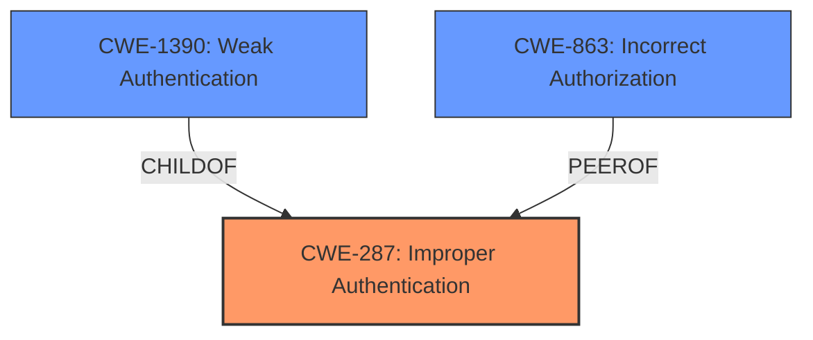

# Analysis Report for CVE-2022-2572

# Vulnerability Analysis Report: CVE-2022-2572

## Description


## Analysis (with Relationship Data)

# Summary
| CWE ID | CWE Name | Confidence | CWE Abstraction Level | CWE Vulnerability Mapping Label | CWE-Vulnerability Mapping Notes |
|---|---|---|---|---|---|
| CWE-287 | Improper Authentication | 0.8 | Class | Primary CWE | Allowed-with-Review |
| CWE-863 | Incorrect Authorization | 0.7 | Class | Secondary Candidate | Allowed-with-Review |
| CWE-1390 | Weak Authentication | 0.7 | Class | Secondary Candidate | Allowed-with-Review |

## Evidence and Confidence

*   **Confidence Score:** 0.8
*   **Evidence Strength:** HIGH

## Relationship Analysis
The primary relationship influencing the decision is that CWE-287 **Improper Authentication** is a parent Class of CWE-1390 **Weak Authentication**. The vulnerability involves a failure to invalidate API keys after a user's access has been revoked through an external provider, which points to a broader authentication issue rather than a specifically weak authentication mechanism. While CWE-1390 is relevant, CWE-287 better encompasses the overall problem. CWE-863 **Incorrect Authorization** is a peer Class that was considered, but the core issue seems to be authentication rather than a failure in the authorization process itself. The abstraction levels were considered, and while base-level CWEs are generally preferred, the Class level seems most appropriate here because the specific mechanism of the authentication failure isn't detailed enough to warrant a base-level classification.



## Vulnerability Chain
The vulnerability chain starts with the **root cause**: a **failure to properly invalidate API keys** when a user's access is revoked via an external authentication provider. This leads to the **weakness**: **API keys of disabled/deleted users remaining valid**. The final impact is that an attacker can still use the old API key to access the system, bypassing the intended access revocation.

## Summary of Analysis
The initial analysis focused on identifying the **root cause** and the resulting impact. The "Vulnerability Description Key Phrases" pointed to a **weakness** where "**API key/keys of a disabled/deleted user were still valid**," even after access was revoked. The "CVE Reference Links Content Summary" confirmed the "**failure to properly invalidate API keys**" as the root cause, leading to "**Broken Access Control**."

The Retriever Results suggested CWE-1390 **Weak Authentication**, CWE-287 **Improper Authentication**, and CWE-863 **Incorrect Authorization** as potential candidates. After carefully reviewing the CWE specifications, CWE-287 **Improper Authentication** was selected as the primary CWE because it best represents the general failure in the authentication process. Although the API keys being valid after revocation could be seen as a form of "weak" authentication (CWE-1390), the core issue is the **improper** handling of access revocation, making CWE-287 more fitting.

CWE-863 **Incorrect Authorization** was considered because the problem allows unauthorized access. However, the initial problem is in authentication (verifying the user's identity), not authorization (determining what the user can do). The system **fails to properly invalidate the user's credentials (API key) upon revocation**, which is an authentication flaw.

The MITRE mapping guidance for CWE-287 discourages its use, recommending children like CWE-1390. However, in this case, the overall nature of the vulnerability as a failure to properly revoke access (and thus authenticate) justifies the use of the higher-level Class.

The confidence in the mapping is high (0.8) because the evidence clearly points to a failure in the authentication process related to API key invalidation. The selected CWE is at the optimal level of specificity because it captures the general authentication failure without focusing on a specific weak mechanism or authorization flaw.

Relevant CWE Information:

# Enhanced Context (25 CWEs)
The following CWEs were identified as potentially relevant to this vulnerability:

## CWE-1391: Use of Weak Credentials
**Abstraction Level**: Class
**Similarity Score**: 0.78
**Source**: dense

**Description**:
The product uses weak credentials (such as a default key or hard-coded password) that can be calculated, derived, reused, or guessed by an attacker.

**Mapping Guidance**:
- Usage: Allowed-with-Review
- Rationale: This CWE entry is a Class and might have Base-level children that would be more appropriate

## CWE-345: Insufficient Verification of Data Authenticity
**Abstraction Level**: Class
**Similarity Score**: 0.77
**Source**: dense

**Description**:
The product does not sufficiently verify the origin or authenticity of data, in a way that causes it to accept invalid data.

**Mapping Guidance**:
- Usage: Discouraged
- Rationale: This CWE entry is a level-1 Class (i.e., a child of a Pillar). It might have lower-level children that would be more appropriate

## CWE-212: Improper Removal of Sensitive Information Before Storage or Transfer
**Abstraction Level**: Base
**Similarity Score**: 0.77
**Source**: dense

**Description**:
The product stores, transfers, or shares a resource that contains sensitive information, but it does not properly remove that information before the product makes the resource available to unauthorized actors.

**Mapping Guidance**:
- Usage: Allowed
- Rationale: This CWE entry is at the Base level of abstraction, which is a preferred level of abstraction for mapping to the root causes of vulnerabilities.

## CWE-303: Incorrect Implementation of Authentication Algorithm
**Abstraction Level**: Base
**Similarity Score**: 0.77
**Source**: dense

**Description**:
The requirements for the product dictate the use of an established authentication algorithm, but the implementation of the algorithm is incorrect.

**Mapping Guidance**:
- Usage: Allowed
- Rationale: This CWE entry is at the Base level of abstraction, which is a preferred level of abstraction for mapping to the root causes of vulnerabilities.

## CWE-1390: Weak Authentication
**Abstraction Level**: Class
**Similarity Score**: 0.77
**Source**: dense

**Description**:
The product uses an authentication mechanism to restrict access to specific users or identities, but the mechanism does not sufficiently prove that the claimed identity is correct.

**Mapping Guidance**:
- Usage: Allowed-with-Review
- Rationale: This CWE entry is a Class and might have Base-level children that would be more appropriate

## CWE-538: Insertion of Sensitive Information into Externally-Accessible File or Directory
**Abstraction Level**: Base
**Similarity Score**: 0.77
**Source**: dense

**Description**:
The product places sensitive information into files or directories that are accessible to actors who are allowed to have access to the files, but not to the sensitive information.

**Mapping Guidance**:
- Usage: Allowed
- Rationale: This CWE entry is at the Base level of abstraction, which is a preferred level of abstraction for mapping to the root causes of vulnerabilities.

## CWE-319: Cleartext Transmission of Sensitive Information
**Abstraction Level**: Base
**Similarity Score**: 0.76
**Source**: dense

**Description**:
The product transmits sensitive or security-critical data in cleartext in a communication channel that can be sniffed by unauthorized actors.

**Mapping Guidance**:
- Usage: Allowed
- Rationale: This CWE entry is at the Base level of abstraction, which is a preferred level of abstraction for mapping to the root causes of vulnerabilities.

## CWE-798: Use of Hard-coded Credentials
**Abstraction Level**: Base
**Similarity Score**: 0.76
**Source**: dense

**Description**:
The product contains hard-coded credentials, such as a password or cryptographic key.

**Mapping Guidance**:
- Usage: Allowed
- Rationale: This CWE entry is at the Base level of abstraction, which is a preferred level of abstraction for mapping to the root causes of vulnerabilities.

## CWE-668: Exposure of Resource to Wrong Sphere
**Abstraction Level**: Class
**Similarity Score**: 0.76
**Source**: dense

**Description**:
The product exposes a resource to the wrong control sphere, providing unintended actors with inappropriate access to the resource.

**Mapping Guidance**:
- Usage: Discouraged
- Rationale: CWE-668 is high-level and is often misused as a catch-all when lower-level CWE IDs might be applicable. It is sometimes used for low-information vulnerability reports [REF-1287]. It is a level-1 Class (i.e., a child of a Pillar). It is not useful for trend analysis.


## CWE Relationship Analysis

Current CWEs represent these abstraction levels: .


### Vulnerability Chain Analysis

**Chain starting from CWE-538:**
- 538 (Insertion of Sensitive Information into Externally-Accessible File or Directory) - ROOT


**Chain starting from CWE-319:**
- 319 (Cleartext Transmission of Sensitive Information) - ROOT


### CWE Relationship Diagram

```mermaid
graph TD
    classDef primary fill:#f96,stroke:#333,stroke-width:2px
    classDef secondary fill:#69f,stroke:#333
    classDef tertiary fill:#9e9,stroke:#333
```


*Report generated on 2025-03-30 15:27:40*
