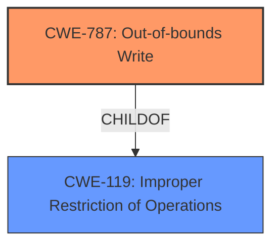

# Analysis Report for CVE-2022-25727

# Vulnerability Analysis Report: CVE-2022-25727

## Description


## Analysis (with Relationship Data)

# Summary
| CWE ID | CWE Name | Confidence | CWE Abstraction Level | CWE Vulnerability Mapping Label | CWE-Vulnerability Mapping Notes |
|---|---|---|---|---|---|
| CWE-787 | Out-of-bounds Write | 1.0 | Base | Allowed | Primary CWE |

## Evidence and Confidence

*   **Confidence Score:** 1.0
*   **Evidence Strength:** HIGH

## Relationship Analysis
The primary CWE, CWE-787, is a base-level CWE that describes writing data past the end or before the beginning of an intended buffer. It is a child of CWE-119 (Improper Restriction of Operations within the Bounds of a Memory Buffer).



## Vulnerability Chain
The vulnerability chain starts with an **improper length check** which leads to **memory corruption** due to an out-of-bounds write.

## Summary of Analysis
The vulnerability description clearly states that the root cause is an **improper length check while copying into memory**, leading to **memory corruption**.

The Retriever Results list CWE-787 (Out-of-bounds Write) as the top match with a score of 1.0. The description of CWE-787 aligns perfectly with the vulnerability, as it involves writing data past the end or before the beginning of the intended buffer due to the **improper length check**. The "Alternative Terms" for CWE-787 includes "Memory Corruption", which is mentioned in the vulnerability description.

CWE-1284 (Improper Validation of Specified Quantity in Input) was considered but not selected as the root cause is more directly an out-of-bounds write than an improper quantity.

CWE-787 is at the Base level of abstraction, which is the preferred level. The mapping guidance for CWE-787 states that its usage is "Allowed" and it is at a preferred level of abstraction.

Therefore, based on the evidence, the relationship analysis, and the mapping guidance, the most appropriate CWE is CWE-787 (Out-of-bounds Write).


## CWE Relationship Analysis

Current CWEs represent these abstraction levels: .


### Vulnerability Chain Analysis

**Chain starting from CWE-1284:**
- 1284 (Improper Validation of Specified Quantity in Input) - ROOT


**Chain starting from CWE-787:**
- 787 (Out-of-bounds Write) - ROOT


### CWE Relationship Diagram

```mermaid
graph TD
    classDef primary fill:#f96,stroke:#333,stroke-width:2px
    classDef secondary fill:#69f,stroke:#333
    classDef tertiary fill:#9e9,stroke:#333
```


*Report generated on 2025-03-30 12:12:43*
