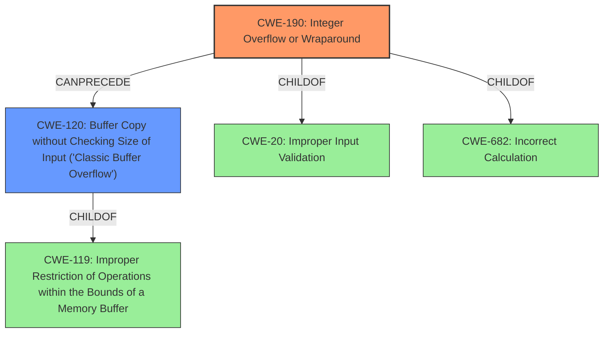

# Enhanced Analysis for CVE-2022-25748

# Summary
| CWE ID | CWE Name | Confidence | CWE Abstraction Level | CWE Vulnerability Mapping Label | CWE-Vulnerability Mapping Notes |
|---|---|---|---|---|---|
| CWE-190 | Integer Overflow or Wraparound | 1.0 | Base | Allowed | Primary CWE |
| CWE-120 | Buffer Copy without Checking Size of Input ('Classic Buffer Overflow') | 0.7 | Base | Allowed-with-Review | Secondary CWE |

## Evidence and Confidence

*   **Confidence Score:** 0.85
*   **Evidence Strength:** HIGH

## Relationship Analysis
The primary weakness is CWE-190, Integer Overflow or Wraparound, which can lead to CWE-120, Buffer Copy without Checking Size of Input ('Classic Buffer Overflow'). CWE-190 is a child of CWE-20 (Improper Input Validation) and CWE-682 (Incorrect Calculation). CWE-120 is a child of CWE-119 (Improper Restriction of Operations within the Bounds of a Memory Buffer). The relationship shows that the integer overflow leads to a buffer overflow.



## Vulnerability Chain
The vulnerability chain starts with an **integer overflow** (CWE-190), which then leads to a **buffer overflow** (CWE-120), resulting in memory corruption.

## Summary of Analysis
The analysis indicates that the vulnerability is due to an **integer overflow** that leads to a **buffer overflow**. This is based on the **rootcause** identified in the vulnerability description key phrases: "**integer overflow to buffer overflow**".

CWE-190 (Integer Overflow or Wraparound) is selected as the primary CWE because the **integer overflow** is the initial cause of the vulnerability. The description of CWE-190 states, "The product performs a calculation that can produce an integer overflow or wraparound when the logic assumes that the resulting value will always be larger than the original value." This aligns with the vulnerability description.

CWE-120 (Buffer Copy without Checking Size of Input ('Classic Buffer Overflow')) is selected as a secondary CWE because the **integer overflow** leads to a **buffer overflow**. The description of CWE-120 states, "The product copies an input buffer to an output buffer without verifying that the size of the input buffer is less than the size of the output buffer, leading to a buffer overflow." The mapping guidance for CWE-120 suggests review because it is often misused. However, in this case, it is appropriate since the integer overflow leads to an unchecked buffer copy.

Other CWEs considered but not used:

*   CWE-119 (Improper Restriction of Operations within the Bounds of a Memory Buffer): This is a more general class, and CWE-120 is a more specific instance of a buffer overflow. Also, CWE-119 is discouraged.
*   CWE-126 (Buffer Over-read) and CWE-124 (Buffer Underwrite): The vulnerability description does not indicate a read or write outside the bounds of the buffer directly, but rather a buffer overflow due to an integer overflow.
*   CWE-1284 (Improper Validation of Specified Quantity in Input): This is related to input validation, but the primary cause is the **integer overflow**, not just a lack of validation.
*   CWE-415 (Double Free): This is not relevant to the vulnerability description.

The selected CWEs are at the appropriate level of specificity, with CWE-190 being the root cause and CWE-120 being the resulting buffer overflow. The relationships between these CWEs clarify the progression of the vulnerability.


## CWE Relationship Analysis

Current CWEs represent these abstraction levels: .


### Vulnerability Chain Analysis

**Chain starting from CWE-190:**
- 190 (Integer Overflow or Wraparound) - ROOT


**Chain starting from CWE-20:**
- 20 (Improper Input Validation) - ROOT


### CWE Relationship Diagram

```mermaid
graph TD
    classDef primary fill:#f96,stroke:#333,stroke-width:2px
    classDef secondary fill:#69f,stroke:#333
    classDef tertiary fill:#9e9,stroke:#333
```