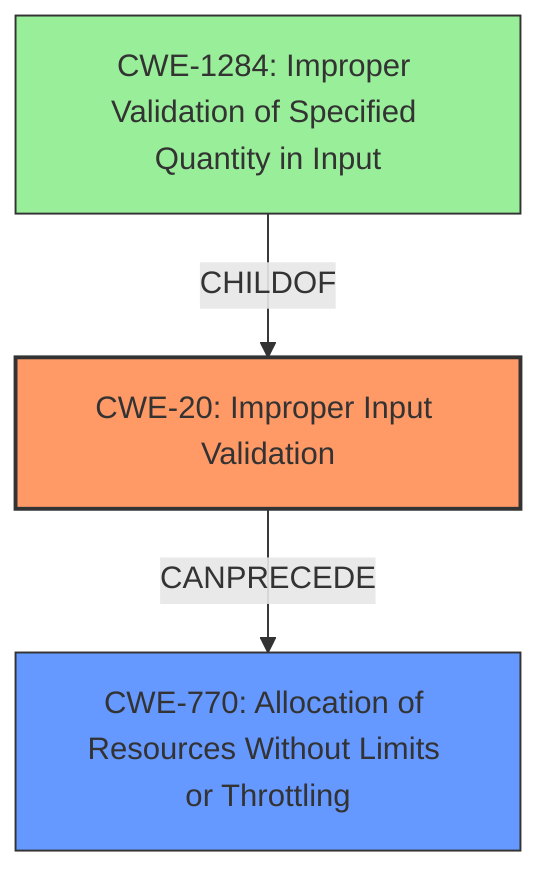

# Raw Analyzer Response for CVE-2022-25751

# Summary
| CWE ID | CWE Name | Confidence | CWE Abstraction Level | CWE Vulnerability Mapping Label | CWE-Vulnerability Mapping Notes |
|---|---|---|---|---|---|
| CWE-20 | Improper Input Validation | 0.8 | Class | Primary | Discouraged |
| CWE-770 | Allocation of Resources Without Limits or Throttling | 0.6 | Base | Secondary | Allowed |

## Evidence and Confidence

*   **Confidence Score:** 0.7
*   **Evidence Strength:** MEDIUM

## Relationship Analysis
The primary CWE is CWE-20, "Improper Input Validation." This is a Class-level CWE. While normally discouraged, it is appropriate here because the vulnerability stems from the device's failure to adequately validate HTTP headers. The secondary CWE considered is CWE-770, "Allocation of Resources Without Limits or Throttling," which is a Base-level CWE, and a contributing factor due to the lack of proper input validation leading to potential resource exhaustion. CWE-20 is a parent of CWE-1284 (Improper Validation of Specified Quantity in Input). CWE-770 can follow CWE-20, as improper input validation can lead to uncontrolled resource allocation.

## Vulnerability Chain
The vulnerability chain starts with the **improper input validation** (CWE-20) of HTTP headers. This lack of validation can lead to an attacker sending crafted requests that cause the device to allocate resources without limits or throttling (CWE-770), ultimately resulting in a crash due to resource exhaustion, leading to a denial of service.

## Summary of Analysis
Initially, the analysis focused on the **root cause** of the vulnerability, which is the **failure to properly validate HTTP headers**. The **Vulnerability Description Key Phrases** section clearly states the **rootcause:** "**do not properly validate the HTTP headers of incoming requests**." The **CVE Reference Links Content Summary** confirms this by stating, "The affected devices **do not properly validate the HTTP headers of incoming requests**."

The Retriever Results and "CWE for similar CVE Descriptions" suggested considering CWE-120 (Buffer Copy without Checking Size) and CWE-787 (Out-of-bounds Write), but these are more specific and less directly supported by the evidence. While a buffer overflow *could* be a consequence of the **improper validation**, the description focuses on the lack of validation itself as the primary weakness.

CWE-20, "Improper Input Validation," is a suitable primary classification because it directly addresses the identified **root cause**. Although CWE-20 is a Class-level CWE and generally discouraged, in this case, the provided evidence does not go into further detail. CWE-770 is a secondary classification as the allocation of resources without limits is a consequence of the **improper input validation** allowing an attacker to potentially exhaust device resources.

The selected CWEs are at an appropriate level of specificity given the available information. More specific CWEs might be applicable if further details were available about the validation mechanisms that were missing or incorrect. The final decision is based on the evidence that the device "**do not properly validate the HTTP headers of incoming requests**," which directly aligns with CWE-20 and can lead to CWE-770.

Relevant CWE Information:

# Enhanced Context (25 CWEs)
The following CWEs were identified as potentially relevant to this vulnerability:

## CWE-1289: Improper Validation of Unsafe Equivalence in Input
**Abstraction Level**: Base
**Similarity Score**: 0.73
**Source**: dense

**Description**:
The product receives an input value that is used as a resource identifier or other type of reference, but it does not validate or incorrectly validates that the input is equivalent to a potentially-unsafe value.

**Mapping Guidance**:
- Usage: Allowed
- Rationale: This CWE entry is at the Base level of abstraction, which is a preferred level of abstraction for mapping to the root causes of vulnerabilities.

## CWE-807: Reliance on Untrusted Inputs in a Security Decision
**Abstraction Level**: Base
**Similarity Score**: 0.72
**Source**: dense

**Description**:
The product uses a protection mechanism that relies on the existence or values of an input, but the input can be modified by an untrusted actor in a way that bypasses the protection mechanism.

**Mapping Guidance**:
- Usage: Allowed
- Rationale: This CWE entry is at the Base level of abstraction, which is a preferred level of abstraction for mapping to the root causes of vulnerabilities.

## CWE-915: Improperly Controlled Modification of Dynamically-Determined Object Attributes
**Abstraction Level**: Base
**Similarity Score**: 0.72
**Source**: dense

**Description**:
The product receives input from an upstream component that specifies multiple attributes, properties, or fields that are to be initialized or updated in an object, but it does not properly control which attributes can be modified.

**Mapping Guidance**:
- Usage: Allowed
- Rationale: This CWE entry is at the Base level of abstraction, which is a preferred level of abstraction for mapping to the root causes of vulnerabilities.

## CWE-829: Inclusion of Functionality from Untrusted Control Sphere
**Abstraction Level**: Base
**Similarity Score**: 0.71
**Source**: dense

**Description**:
The product imports, requires, or includes executable functionality (such as a library) from a source that is outside of the intended control sphere.

**Mapping Guidance**:
- Usage: Allowed
- Rationale: This CWE entry is at the Base level of abstraction, which is a preferred level of abstraction for mapping to the root causes of vulnerabilities.

## CWE-226: Sensitive Information in Resource Not Removed Before Reuse
**Abstraction Level**: Base
**Similarity Score**: 0.71
**Source**: dense

**Description**:
The product releases a resource such as memory or a file so that it can be made available for reuse, but it does not clear or "zeroize" the information contained in the resource before the product performs a critical state transition or makes the resource available for reuse by other entities.

**Mapping Guidance**:
- Usage: Allowed
- Rationale: This CWE entry is at the Base level of abstraction, which is a preferred level of abstraction for mapping to the root causes of vulnerabilities.

## CWE-115: Misinterpretation of Input
**Abstraction Level**: Base
**Similarity Score**: 0.71
**Source**: dense

**Description**:
The product misinterprets an input, whether from an attacker or another product, in a security-relevant fashion.

**Mapping Guidance**:
- Usage: Allowed
- Rationale: This CWE entry is at the Base level of abstraction, which is a preferred level of abstraction for mapping to the root causes of vulnerabilities.

## CWE-653: Improper Isolation or Compartmentalization
**Abstraction Level**: Class
**Similarity Score**: 0.70
**Source**: dense

**Description**:
The product does not properly compartmentalize or isolate functionality, processes, or resources that require different privilege levels, rights, or permissions.

**Mapping Guidance**:
- Usage: Allowed
- Rationale: This CWE entry is at the Base level of abstraction, which is a preferred level of abstraction for mapping to the root causes of vulnerabilities.

## CWE-470: Use of Externally-Controlled Input to Select Classes or Code ('Unsafe Reflection')
**Abstraction Level**: Base
**Similarity Score**: 0.70
**Source**: dense

**Description**:
The product uses external input with reflection to select which classes or code to use, but it does not sufficiently prevent the input from selecting improper classes or code.

**Mapping Guidance**:
- Usage: Allowed
- Rationale: This CWE entry is at the Base level of abstraction, which is a preferred level of abstraction for mapping to the root causes of vulnerabilities.

## CWE-405: Asymmetric Resource Consumption (Amplification)
**Abstraction Level**: Class
**Similarity Score**: 0.70
**Source**: dense

**Description**:
The product does not properly control situations in which an adversary can cause the product to consume or produce excessive resources without requiring the adversary to invest equivalent work or otherwise prove authorization, i.e., the adversary's influence is "asymmetric."

**Mapping Guidance**:
- Usage: Allowed-with-Review
- Rationale: This CWE entry is a Class and might have Base-level children that would be more appropriate

## CWE-436: Interpretation Conflict
**Abstraction Level**: Class
**Similarity Score**: 0.70
**Source**: dense

**Description**:
Product A handles inputs or steps differently than Product B,