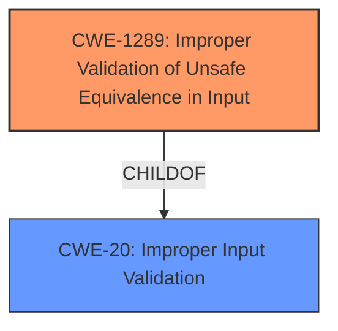

# Enhanced Analysis for CVE-2022-25757

# Summary
| CWE ID | CWE Name | Confidence | CWE Abstraction Level | CWE Vulnerability Mapping Label | CWE-Vulnerability Mapping Notes |
|---|---|---|---|---|---|
| **CWE-1289** | Improper Validation of Unsafe Equivalence in Input | 0.85 | Base | Primary | Allowed |
| CWE-20 | Improper Input Validation | 0.75 | Class | Secondary | Discouraged |

## Evidence and Confidence

*   **Confidence Score:** 0.80
*   **Evidence Strength:** HIGH

## Relationship Analysis
The primary CWE, CWE-1289, is a Base level CWE, which is preferred for mapping to root causes. CWE-20 is a Class level CWE and is often too general.



## Vulnerability Chain
The vulnerability chain starts with the **improper input validation** due to a discrepancy in how duplicate keys in JSON payloads are handled by the `request-validation` plugin (`lua-cjson`) in Apache APISIX versus how they are handled by upstream applications, potentially leading to a bypass of validation.

## Summary of Analysis
Initially, the vulnerability description points to an **improper input validation** issue. The `request-validation` plugin in Apache APISIX uses `lua-cjson` to parse JSON, which takes the *last* value in the case of duplicate keys. Upstream applications might use JSON libraries that take the *first* value. This difference in parsing can allow attackers to bypass validation.

The key phrase "**JSON with duplicate keys**" further refines the nature of the vulnerability. The "CVE Reference Links Content Summary" section confirms this by detailing how the inconsistency in handling duplicate JSON keys allows attackers to bypass validation.

The retriever results suggest CWE-20 (Improper Input Validation) as a possible match. However, CWE-20 is a Class-level CWE and is discouraged for use when more specific CWEs are available. The retriever also suggested CWE-1289 (Improper Validation of Unsafe Equivalence in Input), which is a Base-level CWE. CWE-1289 more accurately captures the specific vulnerability: the APISIX validator is treating JSON inputs with duplicate keys as equivalent when they are not, given the potential for different interpretations by the upstream application. This leads to a bypass of security checks.

Therefore, CWE-1289 is the most appropriate primary CWE.

Relevant CWE Information:

# Enhanced Context (25 CWEs)
The following CWEs were identified as potentially relevant to this vulnerability:

## CWE-1289: Improper Validation of Unsafe Equivalence in Input
**Abstraction Level**: Base
**Similarity Score**: 0.77
**Source**: dense

**Description**:
The product receives an input value that is used as a resource identifier or other type of reference, but it does not validate or incorrectly validates that the input is equivalent to a potentially-unsafe value.

**Mapping Guidance**:
- Usage: Allowed
- Rationale: This CWE entry is at the Base level of abstraction, which is a preferred level of abstraction for mapping to the root causes of vulnerabilities.

## CWE-20: Improper Input Validation
**Abstraction:** Class
**Status:** Stable

### Description
The product receives input or data, but it does
        not validate or incorrectly validates that the input has the
        properties that are required to process the data safely and
        correctly.

### Extended Description


Input validation is a frequently-used technique for checking potentially dangerous inputs in order to ensure that the inputs are safe for processing within the code, or when communicating with other components. When software does not validate input properly, an attacker is able to craft the input in a form that is not expected by the rest of the application. This will lead to parts of the system receiving unintended input, which may result in altered control flow, arbitrary control of a resource, or arbitrary code execution.


## CWE Relationship Analysis

Current CWEs represent these abstraction levels: .


### Vulnerability Chain Analysis

**Chain starting from CWE-1289:**
- 1289 (Improper Validation of Unsafe Equivalence in Input) - ROOT


**Chain starting from CWE-20:**
- 20 (Improper Input Validation) - ROOT


### CWE Relationship Diagram

```mermaid
graph TD
    classDef primary fill:#f96,stroke:#333,stroke-width:2px
    classDef secondary fill:#69f,stroke:#333
    classDef tertiary fill:#9e9,stroke:#333
```