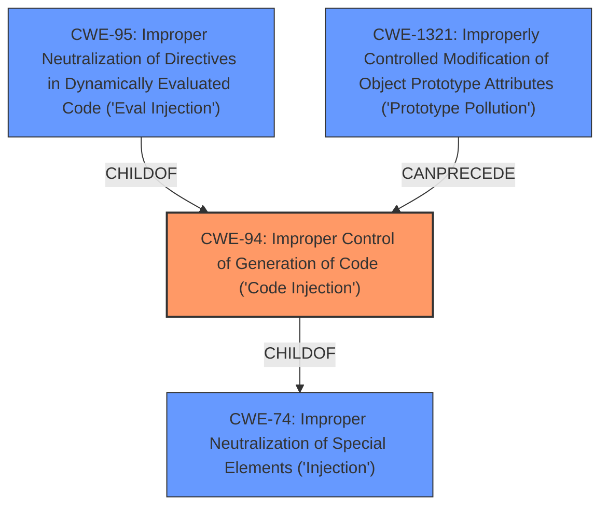

# Analysis Report for CVE-2022-25760

# Vulnerability Analysis Report: CVE-2022-25760

## Description


## Analysis (with Relationship Data)

# Summary
| CWE ID | CWE Name | Confidence | CWE Abstraction Level | CWE Vulnerability Mapping Label | CWE-Vulnerability Mapping Notes |
|---|---|---|---|---|---|
| CWE-94 | Improper Control of Generation of Code ('Code Injection') | 1.0 | Base | Allowed-with-Review | Primary CWE |

## Evidence and Confidence

*   **Confidence Score:** 1.0
*   **Evidence Strength:** HIGH

## Relationship Analysis
The primary relationship influencing the selection of CWE-94 is its association with code injection vulnerabilities. While other CWEs were considered, CWE-94 directly addresses the **improper control of code generation** using externally influenced input, aligning precisely with the vulnerability's root cause.



## Vulnerability Chain
The vulnerability chain starts with the **improper input sanitization** leading to **arbitrary code injection**, and culminating in the execution of arbitrary JavaScript code.
  - **Root Cause:** **Improper Input Sanitization**
  - **Weakness:** **Arbitrary Code Injection (CWE-94)**
  - **Impact:** Arbitrary JavaScript Code Execution

## Summary of Analysis
The initial assessment identified the vulnerability as an instance of **arbitrary code injection** due to **improper input sanitization**. The vulnerability description and CVE Reference Links Content Summary confirm that the `accesslog` package uses the `Function` constructor with user-supplied input, allowing for injection of malicious code.

The primary CWE match is CWE-94, as it directly addresses the **improper control of code generation**. This decision is supported by the vulnerability description, which explicitly mentions the lack of sanitization of the user-provided `format` string when constructing a function using `Function`. The CVE Reference Links Content Summary also highlights the **Arbitrary Code Injection (CWE-94)** as a key weakness.

The relationship analysis indicates that CWE-94 is a base-level CWE, providing a suitable level of specificity for this vulnerability. While CWE-74 is a parent class, CWE-94 offers a more precise classification. The mapping guidance for CWE-94 suggests that it is allowed with review, emphasizing the importance of confirming that the product intentionally constructs a code segment, which is the case here.

The final assessment concludes that CWE-94 is the most appropriate classification, as it accurately reflects the **root cause** and technical details of the vulnerability. This decision is based on the evidence from the vulnerability description, CVE Reference Links Content Summary, and relationship analysis.

Relevant CWE Information:

# Enhanced Context (25 CWEs)
The following CWEs were identified as potentially relevant to this vulnerability:

## CWE-80: Improper Neutralization of Script-Related HTML Tags in a Web Page (Basic XSS)
**Abstraction Level**: Variant
**Similarity Score**: 0.80
**Source**: dense

**Description**:
The product receives input from an upstream component, but it does not neutralize or incorrectly neutralizes special characters such as "<", ">", and "&" that could be interpreted as web-scripting elements when they are sent to a downstream component that processes web pages.

**Mapping Guidance**:
- Usage: Allowed
- Rationale: This CWE entry is at the Variant level of abstraction, which is a preferred level of abstraction for mapping to the root causes of vulnerabilities.

**Rationale for not selecting**: This CWE is focused on XSS, which involves injecting code into web pages. The vulnerability description doesn't focus on XSS, and the code injection happens server-side.

## CWE-74: Improper Neutralization of Special Elements in Output Used by a Downstream Component ('Injection')
**Abstraction Level**: Class
**Similarity Score**: 0.79
**Source**: dense

**Description**:
The product constructs all or part of a command, data structure, or record using externally-influenced input from an upstream component, but it does not neutralize or incorrectly neutralizes special elements that could modify how it is parsed or interpreted when it is sent to a downstream component.

**Mapping Guidance**:
- Usage: Discouraged
- Rationale: CWE-74 is high-level and often misused when lower-level weaknesses are more appropriate.

**Rationale for not selecting**: CWE-74 is too broad and is discouraged when lower-level weaknesses are more appropriate.

## CWE-138: Improper Neutralization of Special Elements
**Abstraction Level**: Class
**Similarity Score**: 0.78
**Source**: dense

**Description**:
The product receives input from an upstream component, but it does not neutralize or incorrectly neutralizes special elements that could be interpreted as control elements or syntactic markers when they are sent to a downstream component.

**Mapping Guidance**:
- Usage: Discouraged
- Rationale: This CWE entry is a level-1 Class (i.e., a child of a Pillar). It might have lower-level children that would be more appropriate

**Rationale for not selecting**: This CWE is too generic and higher-level.

## CWE-184: Incomplete List of Disallowed Inputs
**Abstraction Level**: Base
**Similarity Score**: 0.77
**Source**: dense

**Description**:
The product implements a protection mechanism that relies on a list of inputs (or properties of inputs) that are not allowed by policy or otherwise require other action to neutralize before additional processing takes place, but the list is incomplete.

**Mapping Guidance**:
- Usage: Allowed
- Rationale: This CWE entry is at the Base level of abstraction, which is a preferred level of abstraction for mapping to the root causes of vulnerabilities.

**Rationale for not selecting**: The vulnerability is due to **improper** sanitization, not an incomplete list of disallowed inputs. There may not even be a list.

## CWE-116: Improper Encoding or Escaping of Output
**Abstraction Level**: Class
**Similarity Score**: 0.77
**Source**: dense

**Description**:
The product prepares a structured message for communication with another component, but encoding or escaping of the data is either missing or done incorrectly. As a result, the intended structure of the message is not preserved.

**Mapping Guidance**:
- Usage: Allowed-with-Review
- Rationale: This CWE entry is a Class and might have Base-level children that would be more appropriate

**Rationale for not selecting**: The issue is not with encoding or escaping of output but with the **improper** use of the Function constructor.

## CWE-113: Improper Neutralization of CRLF Sequences in HTTP Headers ('HTTP Request/Response Splitting')
**Abstraction Level**: Variant
**Similarity Score**: 0.77
**Source**: dense

**Description**:
The product receives data from an HTTP agent/component (e.g., web server, proxy, browser, etc.), but it does not neutralize or incorrectly neutralizes CR and LF characters before the data is included in outgoing HTTP headers.

**Mapping Guidance**:
- Usage: Allowed
- Rationale: This CWE entry is at the Variant level of abstraction, which is a preferred level of abstraction for mapping to the root causes of vulnerabilities.

**Rationale for not selecting**: This CWE is specific to HTTP headers and CRLF sequences, which are not relevant to this vulnerability.

## CWE-134: Use of Externally-Controlled Format String
**Abstraction Level**: Base
**Similarity Score**: 0.77
**Source**: dense

**Description**:
The product uses a function that accepts a format string as an argument, but the format string originates from an external source.

**Mapping Guidance**:
- Usage: Allowed
- Rationale: This CWE entry is at the Base level of abstraction, which is a preferred level of abstraction for mapping to the root causes of vulnerabilities.

**Rationale for not selecting**: The vulnerability involves the `Function` constructor and not a format string vulnerability.

## CWE-472: External Control of Assumed-Immutable Web Parameter
**Abstraction Level**: Base
**Similarity Score**: 0.76
**Source**: dense

**Description**:
The web application does not sufficiently verify inputs that are assumed to be immutable but are actually externally controllable, such as hidden form fields.

**Mapping Guidance**:
- Usage: Allowed
- Rationale: This CWE entry is at the Base level of abstraction, which is a preferred level of abstraction for mapping to the root causes of vulnerabilities.

**Rationale for not selecting**: The vulnerability doesn't involve assumed-immutable parameters.

## CWE-


## CWE Relationship Analysis

Current CWEs represent these abstraction levels: .


### Vulnerability Chain Analysis

**Chain starting from CWE-80:**
- 80 (Improper Neutralization of Script-Related HTML Tags in a Web Page (Basic XSS)) - ROOT


**Chain starting from CWE-472:**
- 472 (External Control of Assumed-Immutable Web Parameter) - ROOT


### CWE Relationship Diagram

```mermaid
graph TD
    classDef primary fill:#f96,stroke:#333,stroke-width:2px
    classDef secondary fill:#69f,stroke:#333
    classDef tertiary fill:#9e9,stroke:#333
```


*Report generated on 2025-03-30 20:43:31*
