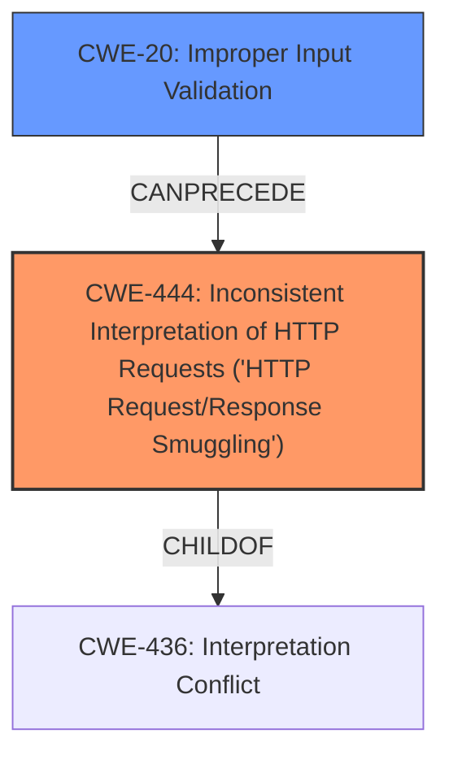

# Analysis for CVE-2022-25763

# Summary
| CWE ID  | CWE Name                                                                                | Confidence | CWE Abstraction Level | CWE Vulnerability Mapping Label | CWE-Vulnerability Mapping Notes |
| :-------- | :--------------------------------------------------------------------------------------- | :---------- | :----------------------- | :------------------------------ | :---------------------------------- |
| CWE-444 | Inconsistent Interpretation of HTTP Requests ('HTTP Request/Response Smuggling')          | 0.9         | Base                      | Primary CWE                     | Allowed                               |
| CWE-20  | Improper Input Validation                                                               | 0.7         | Class                      | Secondary Candidate             | Discouraged                           |

## Evidence and Confidence

*   **Confidence Score:** 0.8
*   **Evidence Strength:** HIGH

## Relationship Analysis
The primary CWE is CWE-444, which is a base-level CWE related to HTTP request smuggling. The secondary CWE is CWE-20, a class-level CWE representing improper input validation, a common root cause for many vulnerabilities, including request smuggling. CWE-444 is a `ChildOf` CWE-436, indicating a more specific type of vulnerability related to protocol handling. The relationship between CWE-20 and CWE-444 is that improper input validation can lead to inconsistent interpretation of HTTP requests.

## Vulnerability Chain
The vulnerability chain starts with **improper input validation** (CWE-20) in the HTTP/2 request validation of Apache Traffic Server. This leads to **inconsistent interpretation of HTTP requests** (CWE-444), which results in HTTP request smuggling or cache poisoning attacks.

## Summary of Analysis
The vulnerability description indicates that **improper input validation** in the HTTP/2 request validation leads to HTTP request smuggling and cache poisoning attacks. The "CVE Reference Links Content Summary" section explicitly mentions "**Improper input validation** in HTTP/2 request validation" as the root cause. This directly aligns with CWE-20 (Improper Input Validation). However, the resulting impact of smuggling or cache poisoning suggests that the **inconsistent interpretation of HTTP requests** (CWE-444) is a more precise characterization of the vulnerability's mechanism.

CWE-444 (Inconsistent Interpretation of HTTP Requests ('HTTP Request/Response Smuggling')) is selected as the primary CWE because the vulnerability ultimately manifests as an inconsistency in how HTTP requests are interpreted, leading to smuggling or cache poisoning. The "Retriever Results" also lists CWE-444 as the top candidate. CWE-20 is selected as a secondary CWE because **improper input validation** is the root cause that enables the inconsistent interpretation.

CWE-79 (Improper Neutralization of Input During Web Page Generation ('Cross-site Scripting')) and CWE-22 (Improper Limitation of a Pathname to a Restricted Directory ('Path Traversal')) were considered, but they are not directly relevant to the described vulnerability. The vulnerability is about HTTP request handling and not about web page generation or file path manipulation. CWE-90 (Improper Neutralization of Special Elements used in an LDAP Query ('LDAP Injection')) is also not relevant, as the vulnerability does not involve LDAP queries.
The selection of CWE-444 and CWE-20 provides an optimal level of specificity by capturing both the root cause and the mechanism of the vulnerability.

Relevant CWE Information:

# Enhanced Context (25 CWEs)
The following CWEs were identified as potentially relevant to this vulnerability:

## CWE-113: Improper Neutralization of CRLF Sequences in HTTP Headers ('HTTP Request/Response Splitting')
**Abstraction Level**: Variant
**Similarity Score**: 0.76
**Source**: dense

**Description**:
The product receives data from an HTTP agent/component (e.g., web server, proxy, browser, etc.), but it does not neutralize or incorrectly neutralizes CR and LF characters before the data is included in outgoing HTTP headers.

**Mapping Guidance**:
- Usage: Allowed
- Rationale: This CWE entry is at the Variant level of abstraction, which is a preferred level of abstraction for mapping to the root causes of vulnerabilities.

## CWE-74: Improper Neutralization of Special Elements in Output Used by a Downstream Component ('Injection')
**Abstraction Level**: Class
**Similarity Score**: 0.73
**Source**: dense

**Description**:
The product constructs all or part of a command, data structure, or record using externally-influenced input from an upstream component, but it does not neutralize or incorrectly neutralizes special elements that could modify how it is parsed or interpreted when it is sent to a downstream component.

**Mapping Guidance**:
- Usage: Discouraged
- Rationale: CWE-74 is high-level and often misused when lower-level weaknesses are more appropriate.

## CWE-1289: Improper Validation of Unsafe Equivalence in Input
**Abstraction Level**: Base
**Similarity Score**: 0.72
**Source**: dense

**Description**:
The product receives an input value that is used as a resource identifier or other type of reference, but it does not validate or incorrectly validates that the input is equivalent to a potentially-unsafe value.

**Mapping Guidance**:
- Usage: Allowed
- Rationale: This CWE entry is at the Base level of abstraction, which is a preferred level of abstraction for mapping to the root causes of vulnerabilities.

## CWE-184: Incomplete List of Disallowed Inputs
**Abstraction Level**: Base
**Similarity Score**: 0.71
**Source**: dense

**Description**:
The product implements a protection mechanism that relies on a list of inputs (or properties of inputs) that are not allowed by policy or otherwise require other action to neutralize before additional processing takes place, but the list is incomplete.

**Mapping Guidance**:
- Usage: Allowed
- Rationale: This CWE entry is at the Base level of abstraction, which is a preferred level of abstraction for mapping to the root causes of vulnerabilities.

## CWE-41: Improper Resolution of Path Equivalence
**Abstraction Level**: Base
**Similarity Score**: 0.71
**Source**: dense

**Description**:
The product is vulnerable to file system contents disclosure through path equivalence. Path equivalence involves the use of special characters in file and directory names. The associated manipulations are intended to generate multiple names for the same object.

**Mapping Guidance**:
- Usage: Allowed
- Rationale: This CWE entry is at the Base level of abstraction, which is a preferred level of abstraction for mapping to the root causes of vulnerabilities.

## CWE-138: Improper Neutralization of Special Elements
**Abstraction Level**: Class
**Similarity Score**: 0.71
**Source**: dense

**Description**:
The product receives input from an upstream component, but it does not neutralize or incorrectly neutralizes special elements that could be interpreted as control elements or syntactic markers when they are sent to a downstream component.

**Mapping Guidance**:
- Usage: Discouraged
- Rationale: This CWE entry is a level-1 Class (i.e., a child of a Pillar). It might have lower-level children that would be more appropriate

## CWE-93: Improper Neutralization of CRLF Sequences ('CRLF Injection')
**Abstraction Level**: Base
**Similarity Score**: 0.70
**Source**: dense

**Description**:
The product uses CRLF (carriage return line feeds) as a special element, e.g. to separate lines or records, but it does not neutralize or incorrectly neutralizes CRLF sequences from inputs.

**Mapping Guidance**:
- Usage: Allowed
- Rationale: This CWE entry is at the Base level of abstraction, which is a preferred level of abstraction for mapping to the root causes of vulnerabilities.

## CWE-162: Improper Neutralization of Trailing Special Elements
**Abstraction Level**: Variant
**Similarity Score**: 0.70
**Source**: dense

**Description**:
The product receives input from an upstream component, but it does not neutralize or incorrectly neutralizes trailing special elements that could be interpreted in unexpected ways when they are sent to a downstream component.

**Mapping Guidance**:
- Usage: Allowed
- Rationale: This CWE entry is at the Variant level of abstraction, which is a preferred level of abstraction for mapping to the root causes of vulnerabilities.

## CWE-444: Inconsistent Interpretation of HTTP Requests ('HTTP Request/Response Smuggling')
**Abstraction Level**: Base
**Similarity Score**: 0.70
**Source**: dense

**Description**:
The product acts as an intermediary HTTP agent
         (such as a proxy or firewall) in the data flow between two
         entities such as a client and server, but it does not
         interpret malformed HTTP requests or responses in ways that
         are