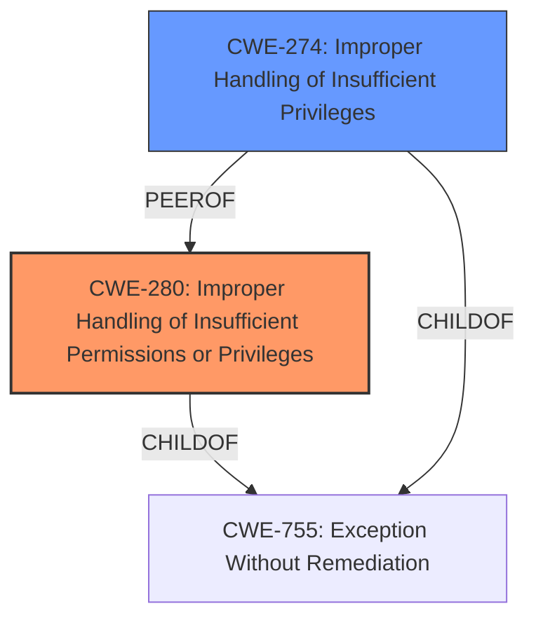

# Enhanced Analysis for CVE-2022-25782

# Summary
| CWE ID | CWE Name | Confidence | CWE Abstraction Level | CWE Vulnerability Mapping Label | CWE-Vulnerability Mapping Notes |
|---|---|---|---|---|---|
| CWE-280 | Improper Handling of Insufficient Permissions or Privileges | 1 | Base | Allowed | Primary CWE |
| CWE-274 | Improper Handling of Insufficient Privileges | 0.7 | Base | Discouraged | Secondary CWE |

## Evidence and Confidence

*   **Confidence Score:** 0.9
*   **Evidence Strength:** HIGH

## Relationship Analysis
The primary CWE is CWE-280, which describes the **improper handling of insufficient permissions or privileges**. CWE-274, **Improper Handling of Insufficient Privileges**, is a closely related peer and a potential alternative, but is discouraged for use due to potential deprecation. Both are at the Base level of abstraction.



## Vulnerability Chain
The chain begins with the **improper handling of insufficient privileges** (CWE-280), leading to a logged-in user being able to access and update privileged information.

## Summary of Analysis
The initial analysis strongly points to CWE-280, **Improper Handling of Insufficient Permissions or Privileges**, as the primary weakness. The vulnerability description states "**Improper Handling of Insufficient Privileges** vulnerability in Web UI of Secomea GateManager allows logged in user to access and update privileged information." This directly aligns with CWE-280, where the product doesn't handle or incorrectly handles situations where it lacks sufficient privileges.

The **Retriever Results** further support this, with CWE-280 having a high score and being identified by "dense" retriever. The suggested alternative, CWE-274, **Improper Handling of Insufficient Privileges**, is very similar, but the CWE specifications note that CWE-274 might be deprecated in the future and overlaps with CWE-280, making CWE-280 the preferred choice.

The relationship graph highlights the close relationship between CWE-280 and CWE-274, and both are children of CWE-755.

Given the direct match with the vulnerability description, the retriever results, and the mapping guidance, CWE-280 is the most appropriate and specific choice. The selection is at the Base level of abstraction, providing sufficient detail without being overly broad.

CWE-274 was considered but deemed less appropriate due to the potential for deprecation and overlap with CWE-280, as indicated in the CWE specifications.

**CWEs Considered But Not Used**

*   **CWE-274:** Similar to CWE-280, but discouraged due to potential deprecation.
*   **CWE-778 and CWE-779:** Insufficient or excessive logging could be secondary issues, but the primary concern is the privilege handling.
*   **CWE-598:** Use of GET for sensitive data is not the core issue; it's the **improper privilege handling** that allows access in the first place.
*   **CWE-20:** Too broad; the issue is more specific than general input validation.
*   **CWE-22:** Path Traversal is not mentioned in the description.
*   **CWE-287:** Improper Authentication; however, the vulnerability occurs after a user is logged in.
*   **CWE-326:** Inadequate Encryption; this is not mentioned in the description.
*   **CWE-284:** Improper Access Control; this is a Pillar level of abstraction, which is too high-level compared to CWE-280.

Relevant CWE Information:

# Enhanced Context (25 CWEs)
The following CWEs were identified as potentially relevant to this vulnerability:

## CWE-274: Improper Handling of Insufficient Privileges
**Abstraction Level**: Base
**Similarity Score**: 0.78
**Source**: dense

**Description**:
The product does not handle or incorrectly handles when it has insufficient privileges to perform an operation, leading to resultant weaknesses.

**Mapping Guidance**:
- Usage: Discouraged
- Rationale: This CWE entry could be deprecated in a future version of CWE.


## CWE-280: Improper Handling of Insufficient Permissions or Privileges 
**Abstraction Level**: Base
**Similarity Score**: 0.76
**Source**: dense

**Description**:
The product does not handle or incorrectly handles when it has insufficient privileges to access resources or functionality as specified by their permissions. This may cause it to follow unexpected code paths that may leave the product in an invalid state.

**Mapping Guidance**:
- Usage: Allowed
- Rationale: This CWE entry is at the Base level of abstraction, which is a preferred level of abstraction for mapping to the root causes of vulnerabilities.


## CWE-653: Improper Isolation or Compartmentalization
**Abstraction Level**: Class
**Similarity Score**: 0.76
**Source**: dense

**Description**:
The product does not properly compartmentalize or isolate functionality, processes, or resources that require different privilege levels, rights, or permissions.

**Mapping Guidance**:
- Usage: Allowed
- Rationale: This CWE entry is at the Base level of abstraction, which is a preferred level of abstraction for mapping to the root causes of vulnerabilities.


## CWE-807: Reliance on Untrusted Inputs in a Security Decision
**Abstraction Level**: Base
**Similarity Score**: 0.75
**Source**: dense

**Description**:
The product uses a protection mechanism that relies on the existence or values of an input, but the input can be modified by an untrusted actor in a way that bypasses the protection mechanism.

**Mapping Guidance**:
- Usage: Allowed
- Rationale: This CWE entry is at the Base level of abstraction, which is a preferred level of abstraction for mapping to the root causes of vulnerabilities.


## CWE-1289: Improper Validation of Unsafe Equivalence in Input
**Abstraction Level**: Base
**Similarity Score**: 0.75
**Source**: dense

**Description**:
The product receives an input value that is used as a resource identifier or other type of reference, but it does not validate or incorrectly validates that the input is equivalent to a potentially-unsafe value.

**Mapping Guidance**:
- Usage: Allowed
- Rationale: This CWE entry is at the Base level of abstraction, which is a preferred level of abstraction for mapping to the root causes of vulnerabilities.


## CWE-1220: Insufficient Granularity of Access Control
**Abstraction Level**: Base
**Similarity Score**: 0.75
**Source**: dense

**Description**:
The product implements access controls via a policy or other feature with the intention to disable or restrict accesses (reads and/or writes) to assets in a system from untrusted agents. However, implemented access controls lack required granularity, which renders the control policy too broad because it allows accesses from unauthorized agents to the security-sensitive assets.

**Mapping Guidance**:
- Usage: Allowed
- Rationale: This CWE entry is at the Base level of abstraction, which is a preferred level of abstraction for mapping to the root causes of vulnerabilities.


## CWE-639: Authorization Bypass Through User-Controlled Key
**Abstraction Level**: Base
**Similarity Score**: 0.74
**Source**: dense

**Description**:
The system's authorization functionality does not prevent one user from gaining access to another user's data or record by modifying the key value identifying the data.

**Mapping Guidance**:
- Usage: Allowed
- Rationale: This CWE entry is at the Base level of abstraction, which is a preferred level of abstraction for mapping to the root causes of vulnerabilities.


## CWE-424: Improper Protection of Alternate Path
**Abstraction Level**: Class
**Similarity Score**: 0.74
**Source**: dense

**Description**:
The product does not sufficiently protect all possible paths that a user can take to access restricted functionality or resources.

**Mapping Guidance**:
- Usage: Allowed-with-Review
- Rationale: This CWE entry is a Class and might have Base-level children that would be more appropriate


## CWE-657: Violation of Secure Design Principles
**Abstraction Level**: Class
**Similarity Score**: 0.74
**Source**: dense

**Description**:
The product violates well-established principles for secure design.

**Mapping Guidance**:
- Usage: Discouraged
- Rationale: This CWE entry is a level-1 Class (i.e., a child of a Pillar). It might have lower-level children that would be more appropriate


## CWE-691: Insufficient Control


## CWE Relationship Analysis

Current CWEs represent these abstraction levels: .


### Vulnerability Chain Analysis

**Chain starting from CWE-779:**
- 779 (Logging of Excessive Data) - ROOT


**Chain starting from CWE-807:**
- 807 (Reliance on Untrusted Inputs in a Security Decision) - ROOT


### CWE Relationship Diagram

```mermaid
graph TD
    classDef primary fill:#f96,stroke:#333,stroke-width:2px
    classDef secondary fill:#69f,stroke:#333
    classDef tertiary fill:#9e9,stroke:#333
```