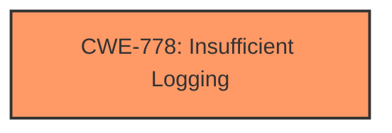

# Raw Analyzer Response for CVE-2022-25783

# Summary
| CWE ID | CWE Name | Confidence | CWE Abstraction Level | CWE Vulnerability Mapping Label | CWE-Vulnerability Mapping Notes |
|---|---|---|---|---|---|
| CWE-778 | Insufficient Logging | 1.0 | Base | Primary CWE | Allowed |

## Evidence and Confidence

*   **Confidence Score:** 1.0
*   **Evidence Strength:** HIGH

## Relationship Analysis
The primary relationship considered was the ChildOf relationship between CWE-778 (Insufficient Logging) and its parents. However, based on the description provided, CWE-778 at the Base level is the most accurate and specific representation of the vulnerability. No chain relationships are relevant in this case, as the description focuses solely on the **lack of logging**.

## Vulnerability Chain
The vulnerability chain is straightforward:

1.  **Root Cause:** **Insufficient Logging** (CWE-778)
2.  **Impact:** Logged in user can issue improper queries without logging.

## Summary of Analysis
The initial analysis identified CWE-778 as the most relevant based on the vulnerability description, which explicitly mentions "**Insufficient Logging**". The retriever results also listed CWE-778 as the top candidate.

The vulnerability description states: "**Insufficient Logging** vulnerability in web server of Secomea GateManager allows logged in user to issue improper queries without logging."

This clearly indicates that the **lack of proper logging** is the root cause of the vulnerability. The impact is that a logged-in user can perform actions without them being recorded, hindering auditing and potential incident response.

CWE-778 perfectly matches this description: "When a security-critical event occurs, the product either does not record the event or omits important details about the event when logging it."

The selection of CWE-778 is at the optimal level of specificity because it directly addresses the **root cause** (**insufficient logging**) as stated in the vulnerability description.

Relevant CWE Information:

# Enhanced Context (25 CWEs)
The following CWEs were identified as potentially relevant to this vulnerability:

## CWE-613: Insufficient Session Expiration
**Abstraction Level**: Base
**Similarity Score**: 0.80
**Source**: dense

**Description**:
According to WASC, "Insufficient Session Expiration is when a web site permits an attacker to reuse old session credentials or session IDs for authorization."

**Mapping Guidance**:
- Usage: Allowed
- Rationale: This CWE entry is at the Base level of abstraction, which is a preferred level of abstraction for mapping to the root causes of vulnerabilities.

*   **Why not selected:** While session management is important, the vulnerability description doesn't indicate that the session expiration is the issue. The core problem is the **lack of logging** of user actions.

## CWE-778: Insufficient Logging
**Abstraction Level**: Base
**Similarity Score**: 0.78
**Source**: dense

**Description**:
When a security-critical event occurs, the product either does not record the event or omits important details about the event when logging it.

**Mapping Guidance**:
- Usage: Allowed
- Rationale: This CWE entry is at the Base level of abstraction, which is a preferred level of abstraction for mapping to the root causes of vulnerabilities.

*   **Why selected:** This CWE directly addresses the **root cause** of the vulnerability, which is the **lack of proper logging** of security-critical events.

## CWE-274: Improper Handling of Insufficient Privileges
**Abstraction Level**: Base
**Similarity Score**: 0.75
**Source**: dense

**Description**:
The product does not handle or incorrectly handles when it has insufficient privileges to perform an operation, leading to resultant weaknesses.

**Mapping Guidance**:
- Usage: Discouraged
- Rationale: This CWE entry could be deprecated in a future version of CWE.

*   **Why not selected:** The vulnerability description doesn't suggest an issue with privilege handling. The problem is the **lack of auditing** of actions, regardless of privilege level.

## CWE-303: Incorrect Implementation of Authentication Algorithm
**Abstraction Level**: Base
**Similarity Score**: 0.75
**Source**: dense

**Description**:
The requirements for the product dictate the use of an established authentication algorithm, but the implementation of the algorithm is incorrect.

**Mapping Guidance**:
- Usage: Allowed
- Rationale: This CWE entry is at the Base level of abstraction, which is a preferred level of abstraction for mapping to the root causes of vulnerabilities.

*   **Why not selected:** The description does not indicate issues with the authentication algorithm itself. The issue is after authentication, actions are not being logged.

## CWE-807: Reliance on Untrusted Inputs in a Security Decision
**Abstraction Level**: Base
**Similarity Score**: 0.75
**Source**: dense

**Description**:
The product uses a protection mechanism that relies on the existence or values of an input, but the input can be modified by an untrusted actor in a way that bypasses the protection mechanism.

**Mapping Guidance**:
- Usage: Allowed
- Rationale: This CWE entry is at the Base level of abstraction, which is a preferred level of abstraction for mapping to the root causes of vulnerabilities.

*   **Why not selected:** This CWE is about bypassing protections using untrusted inputs, not about the **lack of logging**.

## CWE-1391: Use of Weak Credentials
**Abstraction Level**: Class
**Similarity Score**: 0.75
**Source**: dense

**Description**:
The product uses weak credentials (such as a default key or hard-coded password) that can be calculated, derived, reused, or guessed by an attacker.

**Mapping Guidance**:
- Usage: Allowed-with-Review
- Rationale: This CWE entry is a Class and might have Base-level children that would be more appropriate

*   **Why not selected:** This CWE is about the **weakness of credentials**, not about **insufficient logging** of actions.

## CWE-472: External Control of Assumed-Immutable Web Parameter
**Abstraction Level**: Base
**Similarity Score**: 0.74
**Source**: dense

**Description**:
The web application does not sufficiently verify inputs that are assumed to be immutable but are actually externally controllable, such as hidden form fields.

**Mapping Guidance**:
- Usage: Allowed
- Rationale: This CWE entry is at the Base level of abstraction, which is a preferred level of abstraction for mapping to the root causes of vulnerabilities.

*   **Why not selected:** This CWE is about **insufficient verification** of inputs, not about **insufficient logging** of actions.

## CWE-1390: Weak Authentication
**Abstraction Level**: Class
**Similarity Score**: 0.74
**Source**: dense

**Description**:
The product uses an authentication mechanism to restrict access to specific users or identities, but the mechanism does not sufficiently prove that the claimed identity is correct.

**Mapping Guidance**:
- Usage: Allowed-with-Review
- Rationale: This CWE entry is a Class and might have Base-level children that would be more appropriate

*   **Why not selected:** This CWE is about **weaknesses in the authentication mechanism**, not about **insufficient logging** of actions.

## CWE-212: Improper Removal of Sensitive Information Before Storage or Transfer
**Abstraction Level**: Base
**Similarity Score**: 0.74
**Source**: dense

**Description**:
The product stores, transfers, or shares a resource that contains sensitive information, but it does not properly remove that information before the product makes the resource available to unauthorized actors.

**Mapping Guidance**:
- Usage: Allowed
- Rationale: This CWE entry is at the Base level of abstraction, which is a preferred level of abstraction for mapping to the root causes of vulnerabilities.

*   **Why not selected:** This CWE is about **improper handling of sensitive information**, not about **insufficient logging** of actions.

## CWE-404: Improper Resource Shutdown or Release
**Abstraction Level**: Class
**Similarity Score**: 0.73
**Source**: dense

**Description**:
The product does not release or incorrectly releases a resource before it is made available for re-use.

**Mapping Guidance**:
- Usage: Allowed-with-Review
- Rationale: This CWE entry is a Class and might have Base-level children that would be more appropriate

*   **Why not selected:** This CWE is about **improper resource management**, not about **insufficient logging** of actions.

## CWE-779: Logging of Excessive Data
**Abstraction:** Base
**Status:** Draft

### Description
The product logs too much information, making log files hard to process and possibly hindering recovery efforts or forensic analysis after an attack.

### Extended Description
While logging is a good practice in general, and very high levels of logging are appropriate for debugging stages of development, too much logging in a production environment might hinder a system administrator's ability to detect anomalous conditions. This can provide cover for an attacker while attempting to penetrate a system, clutter the audit trail for forensic analysis, or make it more difficult to debug problems in a production environment.

### Alternative Terms
None

### Relationships
Child