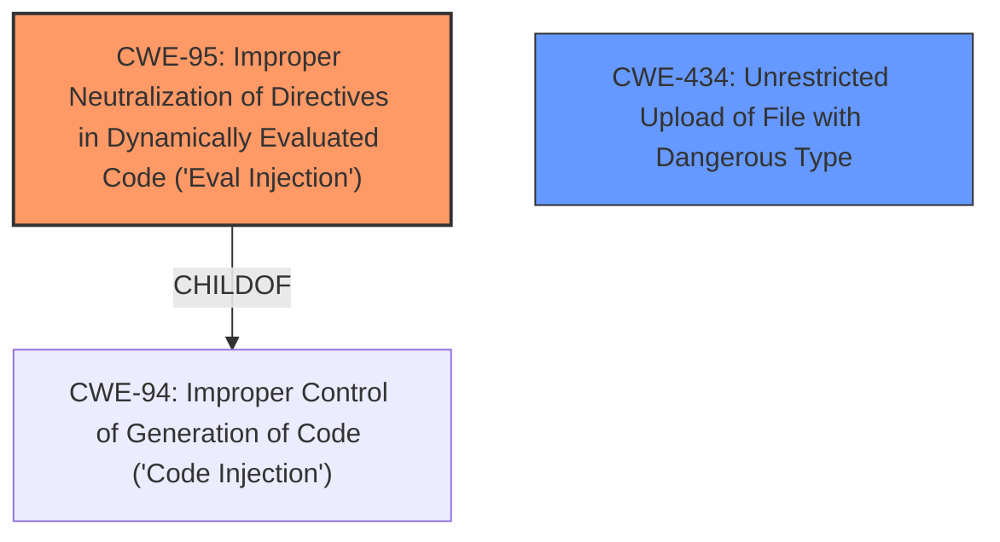

# Raw Analyzer Response for CVE-2022-25812

# Summary
| CWE ID    | CWE Name                                                                                                       | Confidence | CWE Abstraction Level | CWE Vulnerability Mapping Label | CWE-Vulnerability Mapping Notes |
| --------- | -------------------------------------------------------------------------------------------------------------- | ---------- | ----------------------- | ------------------------------- | ------------------------------- |
| CWE-95    | Improper Neutralization of Directives in Dynamically Evaluated Code ('Eval Injection')                       | 0.9        | Variant               | Primary                         | Allowed                         |
| CWE-434   | Unrestricted Upload of File with Dangerous Type                                                              | 0.7        | Base                  | Secondary                       | Allowed                         |

## Evidence and Confidence

*   **Confidence Score:** 0.8
*   **Evidence Strength:** HIGH

## Relationship Analysis
The primary CWE is CWE-95, which is a variant of CWE-94. The vulnerability involves injecting code into dynamically evaluated code, hence the selection of CWE-95. CWE-434 is included as a secondary weakness, which can occur when the attacker is able to upload an arbitrary file with a dangerous type.

## Vulnerability Chain
The chain of events is as follows:
1.  **Root Cause:** **does not validate its debug settings** (Implied: Improper Input Validation)
2.  Weakness: Attacker injects PHP code into the "Remote debug IP" field and/or log filename. (CWE-95)
3.  Weakness: The "log filename" is also not validated, allowing an attacker to write to an arbitrary file in the webroot (CWE-434)
4.  Impact: Remote code execution (RCE) on the server

## Summary of Analysis
The initial assessment identified that the plugin **does not validate its debug settings**, leading to remote code execution. This vulnerability arises because the plugin **fails to properly sanitize or validate input** provided by high privilege users, specifically in the debug settings. The primary weakness is the improper neutralization of directives in dynamically evaluated code, which aligns with CWE-95. The secondary weakness of unrestricted file upload is also present (CWE-434) because the log filename is not validated.

Evidence from the "CVE Reference Links Content Summary" section:
*   "The plugin does not properly validate its debug settings, specifically the log filename and the remote debug IP fields, allowing an attacker to inject PHP code."
*   "Lack of input validation on the debug settings, allowing arbitrary PHP code injection into the "Remote debug IP" field."
*   "The "log filename" is also not validated, allowing an attacker to write to an arbitrary file in the webroot."

The retriever results also support the selection of CWE-95 as a candidate, as well as CWE-434.

CWE-96 was considered but rejected because the code is not injected into statically saved code.

The selected CWEs are at the optimal level of specificity, representing the root cause and a contributing factor to the vulnerability.