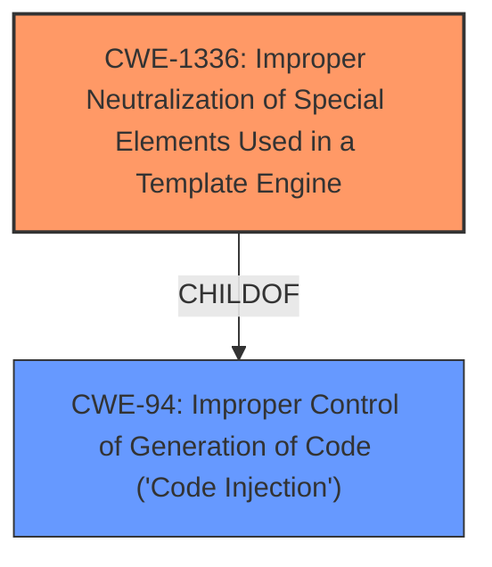

# Enhanced Analysis for CVE-2022-25813

# Summary
| CWE ID  | CWE Name                                                                   | Confidence | CWE Abstraction Level | CWE Vulnerability Mapping Label | CWE-Vulnerability Mapping Notes |
| ------- | -------------------------------------------------------------------------- | ---------- | --------------------- | ------------------------------- | ----------------------------- |
| CWE-1336 | Improper Neutralization of Special Elements Used in a Template Engine      | 1          | Base                  | Primary                         | Allowed                       |
| CWE-94  | Improper Control of Generation of Code ('Code Injection')                 | 0.7        | Base                  | Secondary                       | Allowed-with-Review         |

## Evidence and Confidence

*   **Confidence Score:** 0.85
*   **Evidence Strength:** HIGH

## Relationship Analysis
The primary CWE is CWE-1336, which indicates the root cause is an improper neutralization of special elements within a template engine. CWE-1336 is a child of CWE-94, meaning that code injection is a broader category that encompasses template injection. The relationship highlights how the vulnerability could lead to arbitrary code execution (CWE-94) through the exploitation of the template engine.



## Vulnerability Chain
The vulnerability chain begins with an anonymous user injecting malicious content into the Subject field of a Contact Us message. This input is then processed by a party manager listing communications, triggering the **SSTI** (**weakness**). The **SSTI** can then lead to remote code execution (**impact**).
  - Initial Flaw: Malicious content injection in the message subject field
  - **Weakness**: **Server-Side Template Injection (SSTI)**
  - Impact: Remote Code Execution (RCE)

## Summary of Analysis
The primary vulnerability is **Server-Side Template Injection (SSTI)**, which occurs because the application fails to properly neutralize special elements in the template engine. This allows an attacker to inject malicious code, leading to remote code execution. The **Vulnerability Description Key Phrases** section lists **SSTI** as a **weakness**, and the **CVE Reference Links Content Summary** explicitly mentions "Server-Side Template Injection (SSTI)" as a **weakness/vulnerability**. The root cause is the **improper neutralization** of special elements.

CWE-1336 (Improper Neutralization of Special Elements Used in a Template Engine) is the most appropriate CWE because it directly addresses the **SSTI** vulnerability. It's a Base level CWE, which is the preferred level of abstraction. The description of CWE-1336 precisely matches the vulnerability: "The product uses a template engine to insert or process externally-influenced input, but it does not neutralize or incorrectly neutralizes special elements or syntax that can be interpreted as template expressions or other code directives when processed by the engine."

CWE-94 (Improper Control of Generation of Code ('Code Injection')) is a secondary CWE as a consequence of the **SSTI**. The **SSTI** allows the injection of malicious code that is then executed by the server. However, CWE-1336 is more specific to the root cause, which is the improper handling of template elements.

Other CWEs considered but not used:
- CWE-79 (Improper Neutralization of Input During Web Page Generation ('Cross-site Scripting')): While related to input neutralization, XSS focuses on web page generation, whereas this vulnerability specifically involves template engines.
- CWE-22 (Improper Limitation of a Pathname to a Restricted Directory ('Path Traversal')): Not applicable as the vulnerability does not involve path manipulation.
- CWE-434 (Unrestricted Upload of File with Dangerous Type): Not applicable as the vulnerability does not involve file uploads.

Based on the evidence, CWE-1336 is the most accurate and specific classification for this vulnerability with high confidence. CWE-94 is a secondary classification reflecting the potential for code execution.

Relevant CWE Information:

# Enhanced Context (25 CWEs)
The following CWEs were identified as potentially relevant to this vulnerability:

## CWE-184: Incomplete List of Disallowed Inputs
**Abstraction Level**: Base
**Similarity Score**: 0.79
**Source**: dense

**Description**:
The product implements a protection mechanism that relies on a list of inputs (or properties of inputs) that are not allowed by policy or otherwise require other action to neutralize before additional processing takes place, but the list is incomplete.

**Mapping Guidance**:
- Usage: Allowed
- Rationale: This CWE entry is at the Base level of abstraction, which is a preferred level of abstraction for mapping to the root causes of vulnerabilities.


## CWE-434: Unrestricted Upload of File with Dangerous Type
**Abstraction Level**: Base
**Similarity Score**: 0.78
**Source**: dense

**Description**:
The product allows the upload or transfer of dangerous file types that are automatically processed within its environment.

**Mapping Guidance**:
- Usage: Allowed
- Rationale: This CWE entry is at the Base level of abstraction, which is a preferred level of abstraction for mapping to the root causes of vulnerabilities.


## CWE-74: Improper Neutralization of Special Elements in Output Used by a Downstream Component ('Injection')
**Abstraction Level**: Class
**Similarity Score**: 0.78
**Source**: dense

**Description**:
The product constructs all or part of a command, data structure, or record using externally-influenced input from an upstream component, but it does not neutralize or incorrectly neutralizes special elements that could modify how it is parsed or interpreted when it is sent to a downstream component.

**Mapping Guidance**:
- Usage: Discouraged
- Rationale: CWE-74 is high-level and often misused when lower-level weaknesses are more appropriate.


## CWE-41: Improper Resolution of Path Equivalence
**Abstraction Level**: Base
**Similarity Score**: 0.77
**Source**: dense

**Description**:
The product is vulnerable to file system contents disclosure through path equivalence. Path equivalence involves the use of special characters in file and directory names. The associated manipulations are intended to generate multiple names for the same object.

**Mapping Guidance**:
- Usage: Allowed
- Rationale: This CWE entry is at the Base level of abstraction, which is a preferred level of abstraction for mapping to the root causes of vulnerabilities.


## CWE-73: External Control of File Name or Path
**Abstraction Level**: Base
**Similarity Score**: 0.77
**Source**: dense

**Description**:
The product allows user input to control or influence paths or file names that are used in filesystem operations.

**Mapping Guidance**:
- Usage: Allowed
- Rationale: This CWE entry is at the Base level of abstraction, which is a preferred level of abstraction for mapping to the root causes of vulnerabilities.


## CWE-23: Relative Path Traversal
**Abstraction Level**: Base
**Similarity Score**: 0.77
**Source**: dense

**Description**:
The product uses external input to construct a pathname that should be within a restricted directory, but it does not properly neutralize sequences such as ".." that can resolve to a location that is outside of that directory.

**Mapping Guidance**:
- Usage: Allowed
- Rationale: This CWE entry is at the Base level of abstraction, which is a preferred level of abstraction for mapping to the root causes of vulnerabilities.


## CWE-552: Files or Directories Accessible to External Parties
**Abstraction Level**: Base
**Similarity Score**: 0.77
**Source**: dense

**Description**:
The product makes files or directories accessible to unauthorized actors, even though they should not be.

**Mapping Guidance**:
- Usage: Allowed
- Rationale: This CWE entry is at the Base level of abstraction, which is a preferred level of abstraction for mapping to the root causes of vulnerabilities.


## CWE-1289: Improper Validation of Unsafe Equivalence in Input
**Abstraction Level**: Base
**Similarity Score**: 0.76
**Source**: dense

**Description**:
The product receives an input value that is used as a resource identifier or other type of reference, but it does not validate or incorrectly validates that the input is equivalent to a potentially-unsafe value.

**Mapping Guidance**:
- Usage: Allowed
- Rationale: This CWE entry is at the Base level of abstraction, which is a preferred level of abstraction for mapping to the root causes of vulnerabilities.


## CWE-138: Improper Neutralization of Special Elements
**Abstraction Level**: Class
**Similarity Score**: 0.76
**Source**: dense

**Description**:
The product receives input from an upstream component, but it does not neutralize or incorrectly neutralizes special elements that could be interpreted as control elements or syntactic markers when they are sent to a downstream component.

**Mapping Guidance**:
- Usage: Discouraged
- Rationale: This CWE entry is a level-1 Class (i.e., a child of a Pillar).


## CWE Relationship Analysis

Current CWEs represent these abstraction levels: .


### Vulnerability Chain Analysis

**Chain starting from CWE-552:**
- 552 (Files or Directories Accessible to External Parties) - ROOT


**Chain starting from CWE-434:**
- 434 (Unrestricted Upload of File with Dangerous Type) - ROOT


### CWE Relationship Diagram

```mermaid
graph TD
    classDef primary fill:#f96,stroke:#333,stroke-width:2px
    classDef secondary fill:#69f,stroke:#333
    classDef tertiary fill:#9e9,stroke:#333
```