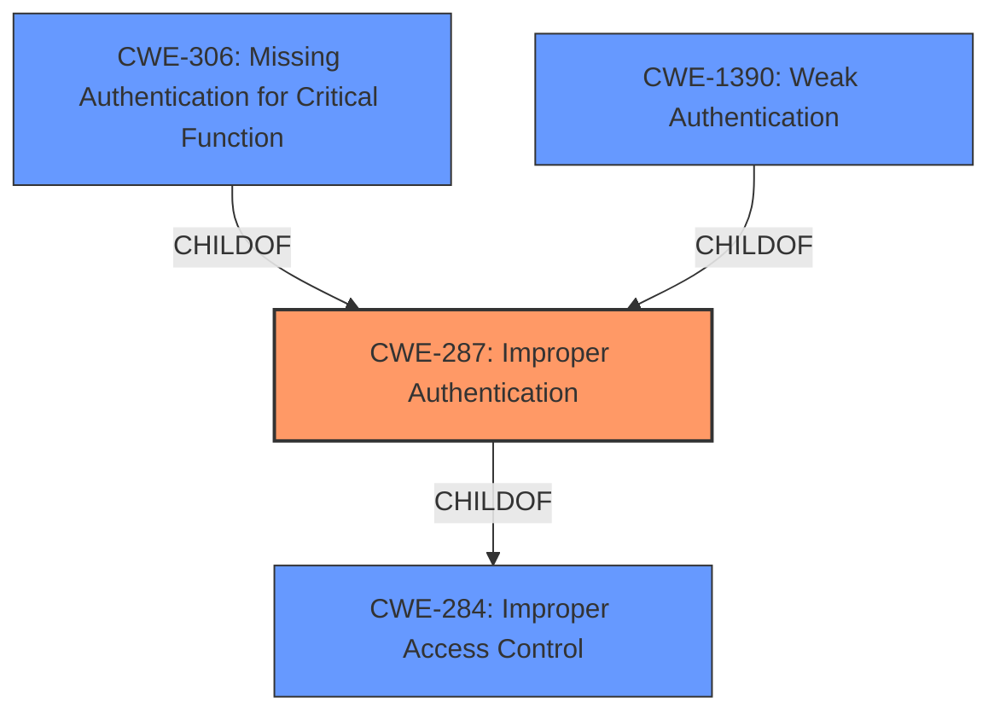

# Enhanced Analysis for CVE-2022-25816

# Summary
| CWE ID | CWE Name | Confidence | CWE Abstraction Level | CWE Vulnerability Mapping Label | CWE-Vulnerability Mapping Notes |
|---|---|---|---|---|---|
| CWE-287 | Improper Authentication | 1.0 | Class | Primary | Discouraged |

## Evidence and Confidence

*   **Confidence Score:** 1.0
*   **Evidence Strength:** HIGH

## Relationship Analysis
The primary relationship that influenced the decision was the ChildOf relationship between CWE-287 and CWE-284. While CWE-284 is a higher-level "Pillar" (Improper Access Control) that is generally discouraged, CWE-287 is a more specific "Class" that directly addresses the **improper authentication** issue. The guidance for CWE-287 suggests considering even more specific children like CWE-306 (Missing Authentication for Critical Function) or CWE-1390 (Weak Authentication). However, based on the description alone, it's difficult to determine if authentication is entirely missing or simply weak. Therefore, CWE-287 is chosen as the most appropriate.



## Vulnerability Chain
The vulnerability chain is relatively simple:

1.  **Root Cause:** **Improper authentication** (CWE-287)
2.  **Impact:** Attacker can change enable/disable configuration without authentication.

## Summary of Analysis
The analysis is based on the provided vulnerability description and the CVE Reference Links Content Summary, both of which explicitly mention "**improper authentication**" as the root cause.
> Vulnerability Description: **Improper authentication** in Samsung Lock and mask apps setting prior to SMR Mar-2022 Release 1 allows attacker to change enable/disable without authentication

> CVE Reference Links Content Summary: "description": "Improper authentication in Samsung Lock and mask apps setting prior to SMR Mar-2022 Release 1 allows attacker to change enable/disable configuration without authentication.", "root_cause": "Improper authentication"

The primary CWE is CWE-287 (Improper Authentication). The retriever results also ranked CWE-287 as the top candidate. Although the mapping guidance discourages direct usage of CWE-287 and suggests considering its children (CWE-306 or CWE-1390), the provided information doesn't offer enough detail to differentiate between missing or weak authentication. Therefore, sticking with CWE-287 as the more general classification is appropriate. The confidence level is high because the vulnerability description and CVE summary both explicitly state "**improper authentication**" as the root cause. The selected CWE is at the optimal level of specificity given the available evidence.


## CWE Relationship Analysis

Current CWEs represent these abstraction levels: .


### Vulnerability Chain Analysis

**Chain starting from CWE-306:**
- 306 (Missing Authentication for Critical Function) - ROOT


**Chain starting from CWE-1390:**
- 1390 (Weak Authentication) - ROOT


### CWE Relationship Diagram

```mermaid
graph TD
    classDef primary fill:#f96,stroke:#333,stroke-width:2px
    classDef secondary fill:#69f,stroke:#333
    classDef tertiary fill:#9e9,stroke:#333
```