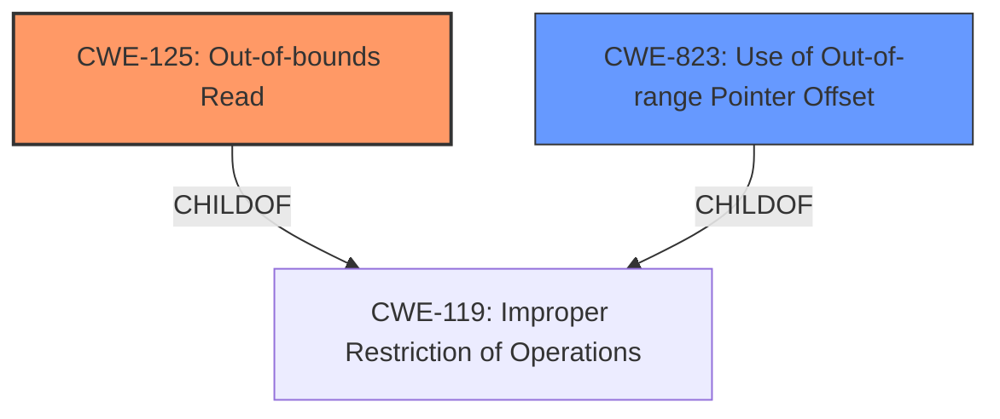

# Analysis Report for CVE-2022-25818

# Vulnerability Analysis Report: CVE-2022-25818

## Description


## Analysis (with Relationship Data)

# Summary
| CWE ID | CWE Name | Confidence | CWE Abstraction Level | CWE Vulnerability Mapping Label | CWE-Vulnerability Mapping Notes |
|---|---|---|---|---|---|
| CWE-125 | Out-of-bounds Read | 0.8 | Base | Allowed | Primary CWE |
| CWE-823 | Use of Out-of-range Pointer Offset | 0.6 | Base | Allowed | Secondary Candidate |

## Evidence and Confidence

*   **Confidence Score:** 0.7
*   **Evidence Strength:** MEDIUM

## Relationship Analysis
The primary relationship influencing the CWE selection is the hierarchical relationship. CWE-125 is a base CWE. The retriever results pointed to several potential CWEs. The primary CWE, CWE-125, is related to out-of-bounds access, and the vulnerability description mentions an **improper boundary check**. CWE-823 is related to using an out-of-range pointer offset and is a child of CWE-119.



## Vulnerability Chain
The vulnerability chain starts with an **improper boundary check**, which leads to an out-of-bounds read, potentially resulting in arbitrary code execution.

## Summary of Analysis
The initial analysis focused on identifying the root cause described as an **"improper boundary check"**. The CVE Reference Links Content Summary further clarifies this by stating "Improper boundary check leading to potential arbitrary memory write." Based on this, CWE-125 (Out-of-bounds Read) was selected as the primary CWE. This selection is supported by the retriever results and the fact that it's a Base level CWE, which is preferred.

The decision is heavily based on the vulnerability description, which explicitly mentions an **improper boundary check**. The graph relationships, particularly the parent-child relationship with CWE-119, helped to confirm that CWE-125 is an appropriate level of specificity.

Relevant CWE Information:

# Enhanced Context (25 CWEs)

## CWE-125: Out-of-bounds Read
**Abstraction:** Base

### Description
The product reads data past the end, or before the beginning, of the intended buffer.

### Extended Description
Not provided

### Relationships
ChildOf -> CWE-119

### Mapping Guidance
**Usage:** Allowed
**Rationale:** This CWE entry is at the Base level of abstraction, which is a preferred level of abstraction for mapping to the root causes of vulnerabilities.

## CWE-823: Use of Out-of-range Pointer Offset
**Abstraction:** Base

### Description
The product performs pointer arithmetic on a valid pointer, but it uses an offset that can point outside of the intended range of valid memory locations for the resulting pointer.

### Relationships
ChildOf -> CWE-119
CanPrecede -> CWE-125
CanPrecede -> CWE-787

### Mapping Guidance
**Usage:** Allowed
**Rationale:** This CWE entry is at the Base level of abstraction, which is a preferred level of abstraction for mapping to the root causes of vulnerabilities.

CWEs considered but not used:

*   CWE-703 (Improper Check or Handling of Exceptional Conditions): Rejected because it is a Pillar-level CWE and too abstract.
*   CWE-927 (Use of Implicit Intent for Sensitive Communication): Rejected because it is specific to Android applications and not applicable to the described vulnerability.
*   CWE-1423 (Exposure of Sensitive Information caused by Shared Microarchitectural Predictor State that Influences Transient Execution): Rejected because it is related to microarchitectural predictor state and not directly relevant to the **improper boundary check**.
*   CWE-926 (Improper Export of Android Application Components): Rejected because it is specific to Android applications and not applicable to the described vulnerability.
*   CWE-1260 (Improper Handling of Overlap Between Protected Memory Ranges): Rejected because, while related to memory protection, the primary issue is the **improper boundary check**, not the overlapping memory ranges.
*   CWE-424 (Improper Protection of Alternate Path): Rejected because it is a Class-level CWE and does not directly address the **improper boundary check**.
*   CWE-1285 (Improper Validation of Specified Index, Position, or Offset in Input): Rejected because although related to validation, the description is a more general **improper boundary check**, and the specificity of this CWE is not supported in the evidence.
*   CWE-285 (Improper Authorization): Rejected because it is a Class-level CWE related to authorization, not boundary checks.

The selected CWEs are at the optimal level of specificity because they directly address the **improper boundary check** (CWE-125).


## CWE Relationship Analysis

Current CWEs represent these abstraction levels: .


### Vulnerability Chain Analysis

**Chain starting from CWE-424:**
- 424 (Improper Protection of Alternate Path) - ROOT


**Chain starting from CWE-823:**
- 823 (Use of Out-of-range Pointer Offset) - ROOT


### CWE Relationship Diagram

```mermaid
graph TD
    classDef primary fill:#f96,stroke:#333,stroke-width:2px
    classDef secondary fill:#69f,stroke:#333
    classDef tertiary fill:#9e9,stroke:#333
```


*Report generated on 2025-03-31 11:43:29*
