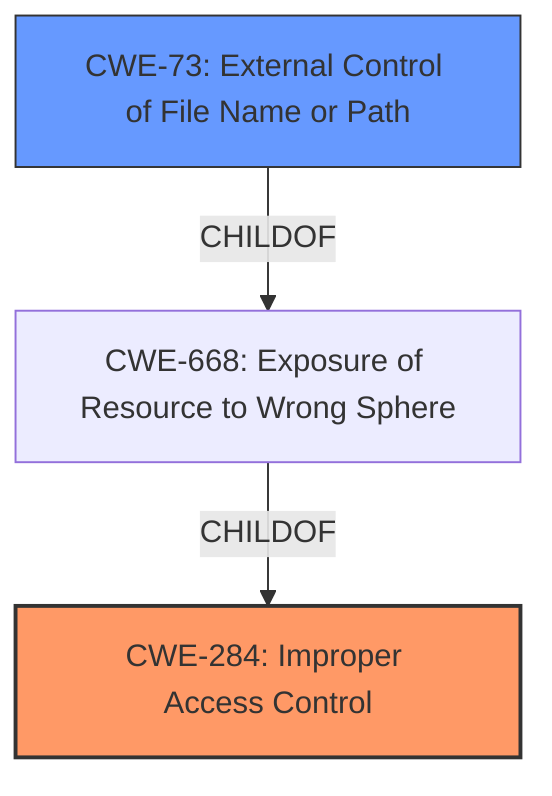

# Raw Analyzer Response for CVE-2022-25824

# Summary
| CWE ID | CWE Name | Confidence | CWE Abstraction Level | CWE Vulnerability Mapping Label | CWE-Vulnerability Mapping Notes |
|---|---|---|---|---|---|
| CWE-284 | Improper Access Control | 0.8 | Pillar | Primary | Discouraged |
| CWE-73 | External Control of File Name or Path | 0.6 | Base | Secondary | Allowed |

## Evidence and Confidence

*   **Confidence Score:** 0.7
*   **Evidence Strength:** MEDIUM

## Relationship Analysis
The primary relationship is that of **Improper Access Control (CWE-284)**, a high-level Pillar, which encompasses a broad range of access control issues. Given the vulnerability description indicating that untrusted applications can load arbitrary URLs and local files due to **improper access control**, CWE-284 serves as an initial classification. However, the ability to load arbitrary URLs and local files suggests that the file path is externally controlled leading to **External Control of File Name or Path (CWE-73)**.

## Vulnerability Chain
The vulnerability chain begins with **Improper Access Control (CWE-284)**, allowing untrusted applications to gain control over which URLs and local files are loaded. This leads to **External Control of File Name or Path (CWE-73)** in WebView, allowing arbitrary resource loading.
- Improper Access Control (CWE-284) -> External Control of File Name or Path (CWE-73)

## Summary of Analysis
The initial assessment considered the **improper access control**, which aligns with **CWE-284 (Improper Access Control)**. However, the MITRE mapping guidance discourages the use of CWE-284 because it's a high-level Pillar and suggests using more specific descendants. The ability to load arbitrary files and URLs indicates that a file name or path can be controlled by an external entity, so **CWE-73 (External Control of File Name or Path)** was added to the analysis.

The evidence from the "Vulnerability Description Key Phrases" section indicates "**Improper access control**" as the **rootcause**. The "CVE Reference Links Content Summary" also supports this by stating: "**Improper Access Control:** The core issue is that Bixby Touch does not properly restrict access, allowing untrusted applications to interact with it in unintended ways."

The final decision considers both the root cause and the specific mechanism. **CWE-284** is the primary weakness due to the stated root cause, but **CWE-73** is a relevant secondary weakness because it describes how the access control issue manifests (loading arbitrary URLs and local files).

Relevant CWE Information:

# Enhanced Context (25 CWEs)

## CWE-284: Improper Access Control
**Abstraction:** Pillar
**Status:** Incomplete

### Description
The product does not restrict or incorrectly restricts access to a resource from an unauthorized actor.

### Mapping Guidance
**Usage:** Discouraged
**Rationale:** CWE-284 is extremely high-level, a Pillar. Its name, "Improper Access Control," is often misused in low-information vulnerability reports. It is not useful for trend analysis.
**Comments:** Consider using descendants of CWE-284 that are more specific to the kind of access control involved, such as those involving authorization (Missing Authorization (CWE-862), Incorrect Authorization (CWE-863), Incorrect Permission Assignment for Critical Resource (CWE-732), etc.); authentication (Missing Authentication (CWE-306) or Weak Authentication (CWE-1390)); Incorrect User Management (CWE-286); Improper Restriction of Communication Channel to Intended Endpoints (CWE-923); etc.

## CWE-73: External Control of File Name or Path
**Abstraction:** Base
**Status:** Draft

### Description
The product allows user input to control or influence paths or file names that are used in filesystem operations.

### Mapping Guidance
**Usage:** Allowed
**Rationale:** This CWE entry is at the Base level of abstraction, which is a preferred level of abstraction for mapping to the root causes of vulnerabilities.