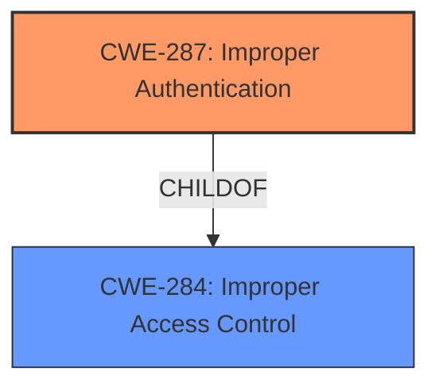

# Analysis for CVE-2022-25833

# Summary
| CWE ID | CWE Name | Confidence | CWE Abstraction Level | CWE Vulnerability Mapping Label | CWE-Vulnerability Mapping Notes |
|---|---|---|---|---|---|
| CWE-287 | Improper Authentication | 1.0 | Class | Primary | Allowed-with-Review |

## Evidence and Confidence

*   **Confidence Score:** 1.0
*   **Evidence Strength:** HIGH

## Relationship Analysis
The primary CWE is CWE-287 **Improper Authentication**, which is a Class-level CWE. It falls under the broader category of CWE-284 **Improper Access Control** (Pillar). Given the specific nature of the vulnerability being related to authentication, selecting CWE-287 is appropriate.

## Vulnerability Chain
The vulnerability chain is straightforward:
1.  **Root Cause:** **Improper authentication** in ImsService.
2.  **Impact:** Attackers can get IMSI without READ_PRIVILEGED_PHONE_STATE permission.

## Summary of Analysis
The primary weakness is **improper authentication**, allowing unauthorized access to sensitive information (IMSI).

The vulnerability description clearly states "**Improper authentication** in ImsService prior to SMR Apr-2022 Release 1 allows attackers to get IMSI without READ_PRIVILEGED_PHONE_STATE permission." The CVE Reference Links Content Summary reinforces this by stating "Root Cause of Vulnerability: - Improper authentication in ImsService" and "Weaknesses/Vulnerabilities Present: - Improper authentication allows attackers to bypass permission checks."

CWE-287 **Improper Authentication** aligns directly with the root cause. It is a Class-level CWE, and while the mapping guidance suggests considering more specific children, the provided information does not allow for a more precise classification.

Other CWEs considered:

*   CWE-285 **Improper Authorization**: While related to access control, the primary issue is with authentication, not authorization.
*   CWE-269 **Improper Privilege Management**: While the impact involves unauthorized access to IMSI (which relates to privileges), the root cause is **improper authentication**, not incorrect privilege management.
*   CWE-926 **Improper Export of Android Application Components**: This is specific to exported Android components, and the description doesn't provide evidence to support that this is the case, so it is not the best fit.
*   CWE-639 **Authorization Bypass Through User-Controlled Key**: While the impact is the attacker can get IMSI, the root cause is **improper authentication**.
*   CWE-306 **Missing Authentication for Critical Function**: The description doesn't say Authentication is missing, just that is improper.