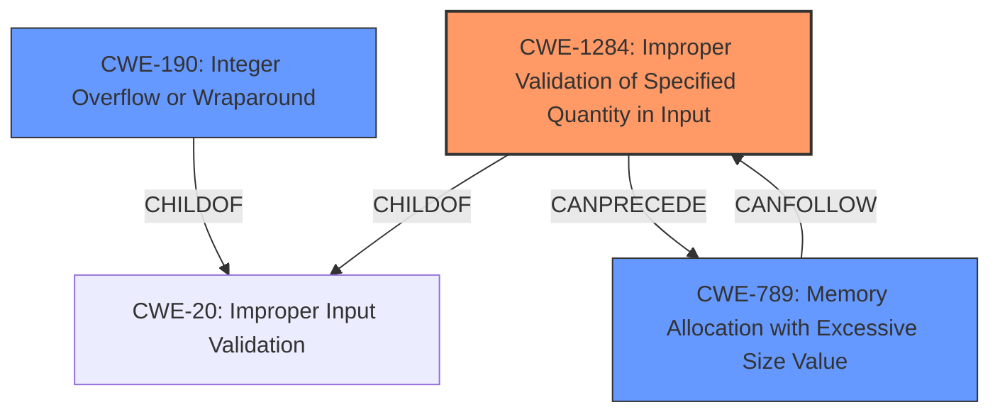

# Analysis Report for CVE-2022-2584

# Vulnerability Analysis Report: CVE-2022-2584

## Description


## Analysis (with Relationship Data)

# Summary
INSERT the assigned CWEs in a table format with the following columns: CWE ID, CWE Name, Confidence, CWE Abstraction Level, CWE Vulnerability Mapping Label, CWE-Vulnerability Mapping Notes
  - The Primary CWE should be first and noted as the Primary CWEs
  - The secondary candidate CWEs should be next and noted as secondary candidates.
  - The confidence is a confidence score 0 to 1 to rate your confidence in your assessment for that CWE.
  - The CWE Abstraction Level as one of these values: Base, Variant, Pillar, Class, Compound
  - The Mapping Notes Usage as one of these values: Allowed, Allowed-with-Review, Prohibited, Discouraged

| CWE ID    | CWE Name                                                                | Confidence | CWE Abstraction Level | CWE Vulnerability Mapping Label | CWE-Vulnerability Mapping Notes |
| --------- | ----------------------------------------------------------------------- | ---------- | --------------------- | ------------------------------- | ------------------------------- |
| CWE-1284  | Improper Validation of Specified Quantity in Input                     | 0.85       | Base                  | Primary                         | Allowed                         |
| CWE-789   | Memory Allocation with Excessive Size Value                            | 0.7        | Variant               | Secondary                       | Allowed                         |
| CWE-190   | Integer Overflow or Wraparound                                            | 0.65       | Base                  | Secondary                       | Allowed                         |

## Evidence and Confidence

*   **Confidence Score:** 0.75
*   **Evidence Strength:** HIGH

## Relationship Analysis
INSERT a concise analysis of the CWE relationships that impacted your decision:
  - Parent-child hierarchical relationships
  - Chain relationships showing progression of vulnerability
  - Peer relationships that offered alternative classifications
  - How abstraction levels influenced your selection

The primary relationship that influenced the selection was a chain starting from **improper input validation**, leading to potential **excessive memory allocation**, which could further lead to an **integer overflow**. CWE-1284 is a child of CWE-20 (Improper Input Validation) and can precede CWE-789, while CWE-789 can lead to CWE-129 (Improper Validation of Array Index) or CWE-1284 itself in a loop. CWE-190 is also related to the improper validation since the size value could be used in a calculation that can cause an integer overflow. The base and variant level CWEs were preferred for their specificity.



## Vulnerability Chain
INSERT the chain of root cause and weaknesses that followed for the Vulnerability Description.
  - Map the sequence from initial flaw to final impact
  - Identify which CWEs represent root causes vs. impacts
  - Note any missing links in the chain based on relationship data

The vulnerability chain starts with **improper input validation** (CWE-1284) where the quantity specified in the input is not properly validated. This can lead to **memory allocation with an excessive size value** (CWE-789). The excessive size value used in memory allocation can potentially result in an **integer overflow or wraparound** (CWE-190) if the allocated size exceeds the maximum allowed value. The ultimate impact is a panic (Denial of Service).

## Summary of Analysis
INSERT your analysis of both the initial analysis and criticism and your resulting conclusion.
  - Highlight how much your assessment is based on the provided evidence only, and show or quote that evidence.
  - Explain how the graph relationships influenced your final selection
  - Provide clear justification for your decision
  - Explain why your selected CWEs are at the optimal level of specificity

The analysis is based on the **root cause of the vulnerability** as described in the CVE Reference Links Content Summary: "The library did not adequately validate the length of the byte sequence representing links during decoding." This directly points to **improper input validation**, making CWE-1284 the most relevant primary CWE.

The retriever results also list CWE-1284, CWE-789, and CWE-190 as potential candidates, reinforcing the idea of a chain of vulnerabilities. The graph relationships show that CWE-1284 can precede CWE-789, and CWE-190 can be a consequence of it, solidifying the selection of these three CWEs.

The selection of the CWEs at the base and variant level is justified by the availability of sufficient information about the vulnerability. The vulnerability description and CVE reference summary provide enough details to pinpoint the **improper validation** and potential consequences like **excessive memory allocation** and **integer overflow**.

Relevant CWE Information:

# Enhanced Context (25 CWEs)
The following CWEs were identified as potentially relevant to this vulnerability:

## CWE-131: Incorrect Calculation of Buffer Size
**Abstraction Level**: Base
**Similarity Score**: 0.79
**Source**: dense

**Description**:
The product does not correctly calculate the size to be used when allocating a buffer, which could lead to a buffer overflow.

**Mapping Guidance**:
- Usage: Allowed
- Rationale: This CWE entry is at the Base level of abstraction, which is a preferred level of abstraction for mapping to the root causes of vulnerabilities.

*Considered but not chosen because the main issue is the lack of validation rather than an incorrect calculation.*

## CWE-667: Improper Locking
**Abstraction Level**: Class
**Similarity Score**: 0.79
**Source**: dense

**Description**:
The product does not properly acquire or release a lock on a resource, leading to unexpected resource state changes and behaviors.

**Mapping Guidance**:
- Usage: Allowed-with-Review
- Rationale: This CWE entry is a Class and might have Base-level children that would be more appropriate

*Considered but not chosen because there is no evidence that locking mechanisms are involved in the vulnerability.*

## CWE-125: Out-of-bounds Read
**Abstraction Level**: Base
**Similarity Score**: 0.78
**Source**: dense

**Description**:
The product reads data past the end, or before the beginning, of the intended buffer.

**Mapping Guidance**:
- Usage: Allowed
- Rationale: This CWE entry is at the Base level of abstraction, which is a preferred level of abstraction for mapping to the root causes of vulnerabilities.

*Considered but not chosen because the vulnerability leads to a panic rather than an out-of-bounds read.*

## CWE-191: Integer Underflow (Wrap or Wraparound)
**Abstraction Level**: Base
**Similarity Score**: 0.78
**Source**: dense

**Description**:
The product subtracts one value from another, such that the result is less than the minimum allowable integer value, which produces a value that is not equal to the correct result.

**Mapping Guidance**:
- Usage: Allowed
- Rationale: This CWE entry is at the Base level of abstraction, which is a preferred level of abstraction for mapping to the root causes of vulnerabilities.

*Considered but not chosen because the vulnerability is more related to excessive allocation and integer overflow rather than underflow.*

## CWE-823: Use of Out-of-range Pointer Offset
**Abstraction Level**: Base
**Similarity Score**: 0.78
**Source**: dense

**Description**:
The product performs pointer arithmetic on a valid pointer, but it uses an offset that can point outside of the intended range of valid memory locations for the resulting pointer.

**Mapping Guidance**:
- Usage: Allowed
- Rationale: This CWE entry is at the Base level of abstraction, which is a preferred level of abstraction for mapping to the root causes of vulnerabilities.

*Considered but not chosen because there is no specific evidence of out-of-range pointer offsets being used.*

## CWE-805: Buffer Access with Incorrect Length Value
**Abstraction Level**: Base
**Similarity Score**: 0.77
**Source**: dense

**Description**:
The product uses a sequential operation to read or write a buffer, but it uses an incorrect length value that causes it to access memory that is outside of the bounds of the buffer.

**Mapping Guidance**:
- Usage: Allowed
- Rationale: This CWE entry is at the Base level of abstraction, which is a preferred level of abstraction for mapping to the root causes of vulnerabilities.

*Considered but not chosen because the root cause is the **improper validation** of the input,


## CWE Relationship Analysis

Current CWEs represent these abstraction levels: .


### Vulnerability Chain Analysis

**Chain starting from CWE-190:**
- 190 (Integer Overflow or Wraparound) - ROOT


**Chain starting from CWE-131:**
- 131 (Incorrect Calculation of Buffer Size) - ROOT


### CWE Relationship Diagram

```mermaid
graph TD
    classDef primary fill:#f96,stroke:#333,stroke-width:2px
    classDef secondary fill:#69f,stroke:#333
    classDef tertiary fill:#9e9,stroke:#333
```


*Report generated on 2025-03-30 23:24:40*
