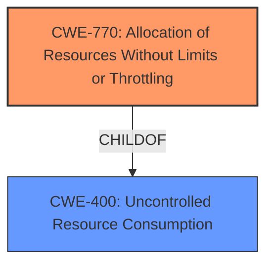

# Raw Analyzer Response for CVE-2022-25857

# Summary
| CWE ID | CWE Name | Confidence | CWE Abstraction Level | CWE Vulnerability Mapping Label | CWE-Vulnerability Mapping Notes |
|---|---|---|---|---|---|
| CWE-770 | Allocation of Resources Without Limits or Throttling | 0.9 | Base | Allowed | Primary CWE |
| CWE-400 | Uncontrolled Resource Consumption | 0.6 | Class | Allowed-with-Review | Secondary CWE |

## Evidence and Confidence

*   **Confidence Score:** 0.8
*   **Evidence Strength:** HIGH

## Relationship Analysis
The primary CWE is CWE-770, which is a Base level CWE that directly addresses the **allocation of resources without limits or throttling**. CWE-400 is a parent Class of CWE-770 and describes the more general problem of uncontrolled resource consumption. Since the vulnerability is specifically related to resource allocation, CWE-770 is a more precise fit. The relationship between CWE-770 and CWE-400 helped to refine the selection to the more specific Base CWE.

## Vulnerability Chain
The vulnerability chain starts with the **missing nested depth limitation** in SnakeYAML, leading to the **allocation of excessive resources** when processing a maliciously crafted YAML input, and finally resulting in a **denial of service**.

## Summary of Analysis
Initially, the description pointed towards a **Denial of Service** due to a **missing nested depth limitation**. After analyzing the CVE Reference Links Content Summary, the root cause was pinpointed as the **allocation of resources without limits or throttling (CWE-770)**. The lack of a limit allows attackers to craft YAML inputs that consume excessive resources.

The evidence for CWE-770 is strong: "The vulnerability is due to a missing nested depth limitation for collections (sequences and mappings) in the SnakeYAML library. This allows for deeply nested YAML structures." The impact is clearly stated as "Processing this input can lead to excessive resource consumption, potentially causing a stack overflow, and making the system unresponsive."

CWE-770 is at the optimal level of specificity because it directly describes the **root cause**, which is the **unrestricted allocation of resources**. While CWE-400 (Uncontrolled Resource Consumption) is also relevant, it represents a broader category.

Relevant CWE Information:

# Enhanced Context (25 CWEs)

## CWE-404: Improper Resource Shutdown or Release
**Abstraction Level**: Class
**Similarity Score**: 0.76
**Source**: dense

**Description**:
The product does not release or incorrectly releases a resource before it is made available for re-use.
**Not Selected:** This CWE relates to improper release of resources, which is not the primary issue in this vulnerability. The vulnerability is about allocating excessive resources in the first place, not failing to release them.

## CWE-639: Authorization Bypass Through User-Controlled Key
**Abstraction Level**: Base
**Similarity Score**: 0.76
**Source**: dense

**Description**:
The system's authorization functionality does not prevent one user from gaining access to another user's data or record by modifying the key value identifying the data.
**Not Selected:** This CWE is not relevant because the vulnerability is not about authorization bypass.

## CWE-668: Exposure of Resource to Wrong Sphere
**Abstraction Level**: Class
**Similarity Score**: 0.76
**Source**: dense

**Description**:
The product exposes a resource to the wrong control sphere, providing unintended actors with inappropriate access to the resource.
**Not Selected:** This CWE is not relevant because the vulnerability is not about exposing resources to the wrong control sphere.

## CWE-915: Improperly Controlled Modification of Dynamically-Determined Object Attributes
**Abstraction Level**: Base
**Similarity Score**: 0.76
**Source**: dense

**Description**:
The product receives input from an upstream component that specifies multiple attributes, properties, or fields that are to be initialized or updated in an object, but it does not properly control which attributes can be modified.
**Not Selected:** This CWE is not relevant because the vulnerability is not about controlling object attribute modifications.

## CWE-212: Improper Removal of Sensitive Information Before Storage or Transfer
**Abstraction Level**: Base
**Similarity Score**: 0.75
**Source**: dense

**Description**:
The product stores, transfers, or shares a resource that contains sensitive information, but it does not properly remove that information before the product makes the resource available to unauthorized actors.
**Not Selected:** This CWE is not relevant because the vulnerability is not about sensitive information exposure.

## CWE-405: Asymmetric Resource Consumption (Amplification)
**Abstraction Level**: Class
**Similarity Score**: 0.75
**Source**: dense

**Description**:
The product does not properly control situations in which an adversary can cause the product to consume or produce excessive resources without requiring the adversary to invest equivalent work or otherwise prove authorization, i.e., the adversary's influence is "asymmetric."
**Not Selected:** While this CWE is related to resource consumption, it focuses on the asymmetric nature of the consumption, which is not the primary factor in this vulnerability. The core issue is the lack of limits on resource allocation.

## CWE-1289: Improper Validation of Unsafe Equivalence in Input
**Abstraction Level**: Base
**Similarity Score**: 0.75
**Source**: dense

**Description**:
The product receives an input value that is used as a resource identifier or other type of reference, but it does not validate or incorrectly validates that the input is equivalent to a potentially-unsafe value.
**Not Selected:** This CWE is not applicable, as the vulnerability doesn't revolve around validating input equivalence.

## CWE-74: Improper Neutralization of Special Elements in Output Used by a Downstream Component ('Injection')
**Abstraction Level**: Class
**Similarity Score**: 0.75
**Source**: dense

**Description**:
The product constructs all or part of a command, data structure, or record using externally-influenced input from an upstream component, but it does not neutralize or incorrectly neutralizes special elements that could modify how it is parsed or interpreted when it is sent to a downstream component.
**Not Selected:** This CWE relates to injection vulnerabilities, which are not the focus of this vulnerability.

## CWE-226: Sensitive Information in Resource Not Removed Before Reuse
**Abstraction Level**: Base
**Similarity Score**: 0.75
**Source**: dense

**Description**:
The product releases a resource such as memory or a file so that it can be made available for reuse, but it does not clear or "zeroize" the information contained in the resource before the product performs a critical state transition or makes the resource available for reuse by other entities.
**Not Selected:** This CWE is not applicable because it deals with sensitive information and resource reuse, whereas the described vulnerability is about resource allocation limits.

## CWE-807: Reliance on Untrusted Inputs in a Security Decision
**Abstraction Level**: Base
**Similarity Score**: 0.75
**Source**: dense

**Description**:
The product uses a protection mechanism that relies on the existence or values of an input, but the input can be modified by an untrusted actor in a way that bypasses the protection mechanism.
**Not Selected:** The vulnerability doesn't involve reliance on untrusted inputs for security decisions.

## CWE-776: Improper Restriction of Recursive Entity References in DTDs ('XML Entity Expansion')
**Abstraction Level**: Base
**Similarity Score**: 5046.16
**Source**: sparse

**Description**:
The product uses XML documents and allows their structure to be defined with a Document Type Definition (DTD), but it does not properly control the number of recursive definitions of entities.
**Not Selected:** While this is related to uncontrolled recursion and resource exhaustion, it is specific to XML DTDs. The vulnerability is in YAML, so this is not a good fit.

## CWE-1333: Inefficient Regular Expression Complexity
**Abstraction Level**: Base
**Similarity Score**: 5004.50
**Source**: sparse

**Description**:
The product uses a regular expression with an inefficient, possibly exponential worst-case computational complexity that consumes excessive CPU cycles.
**Not Selected:** This vulnerability does not involve regular expressions.

## CWE-789: Memory Allocation with Excessive Size Value
**Abstraction Level**: Variant
**Similarity Score**: 4969.17
**Source**: sparse

**Description**:
The product allocates memory based on an untrusted, large size value, but it does not ensure that the size is within expected limits, allowing arbitrary amounts of memory to be allocated.
**Not Selected:** This is close, but CWE-770 is a better fit because it refers to general resource allocation, while CWE-789 is specific to memory allocation based on size.

## CWE-1284: Improper Validation of Specified Quantity in Input
**Abstraction