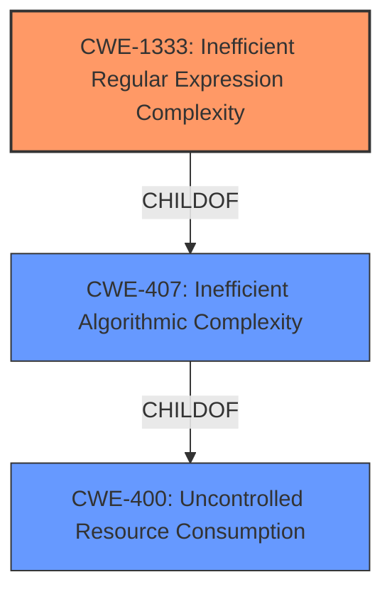

# Analysis Report for CVE-2022-25858

# Vulnerability Analysis Report: CVE-2022-25858

## Description


## Analysis (with Relationship Data)

# Summary
| CWE ID  | CWE Name                                                           | Confidence | CWE Abstraction Level | CWE Vulnerability Mapping Label | CWE-Vulnerability Mapping Notes |
| :-------- | :----------------------------------------------------------------- | :--------- | :-------------------- | :------------------------------ | :------------------------------ |
| CWE-1333 | Inefficient Regular Expression Complexity                         | 1.0        | Base                  | Primary                         | Allowed                       |
| CWE-400 | Uncontrolled Resource Consumption ('Resource Exhaustion')   | 0.7        | Class                   | Secondary                      | Allowed-with-Review         |

## Evidence and Confidence

*   **Confidence Score:** 0.9
*   **Evidence Strength:** HIGH

## Relationship Analysis
The primary relationship influencing the decision is that CWE-1333 is a child of CWE-407 (Inefficient Algorithmic Complexity), which itself is a type of resource consumption issue, making CWE-400 (Uncontrolled Resource Consumption) a broader, related category. CWE-1333 directly addresses the specific type of algorithmic inefficiency: regular expression complexity. The relationship helps clarify that while resource consumption is the impact, the **root cause** lies in the inefficient regular expression.



## Vulnerability Chain
The chain of events for this vulnerability is as follows:

1.  **Root Cause:** CWE-1333 - The product utilizes an inefficient regular expression.
2.  **Impact:** Excessive CPU consumption due to catastrophic backtracking in the regex engine, leading to a denial-of-service condition.
    *   Implicit: CWE-400 - Uncontrolled Resource Consumption

The vulnerability chain clearly shows that the **inefficient regular expression** is the root cause, directly leading to the consumption of excessive CPU resources, which results in a denial-of-service condition.

## Summary of Analysis
Initially, the description clearly points to a Regular Expression Denial of Service (ReDoS) vulnerability in the `terser` package. The **weakness** is the **regular expression denial of service** due to **insecure usage of regular expressions**. The CVE reference links confirm this by stating, "The vulnerability stems from the insecure use of regular expressions within the `terser` library,".

The primary CWE selected is CWE-1333 (Inefficient Regular Expression Complexity). This selection is based on the fact that the vulnerability's **root cause** is the use of a regular expression with inefficient complexity, leading to excessive CPU consumption. The description states, "The core issue is the potential for catastrophic backtracking in the regular expression engine when processing specific patterns." This aligns perfectly with the definition of CWE-1333.

CWE-400 (Uncontrolled Resource Consumption) was considered as a secondary CWE since the ReDoS leads to excessive CPU consumption. While ReDoS is a type of resource consumption, the **root cause** is the inefficient regular expression and CWE-1333 is a more precise classification.

The selection of CWE-1333 is at the optimal level of specificity (Base). It directly addresses the **root cause** of the vulnerability, which is the inefficient regular expression. While CWE-400 is also relevant as a consequence of the vulnerability, CWE-1333 provides a more precise and actionable classification for the **root cause**.
### Relevant CWE Information:

# Enhanced Context (25 CWEs)

## CWE-1333: Inefficient Regular Expression Complexity
**Abstraction Level**: Base
**Similarity Score**: 1.00
**Source**: alternate_terms

**Description**:
The product uses a regular expression with an inefficient, possibly exponential worst-case computational complexity that consumes excessive CPU cycles.

**Mapping Guidance**:
- Usage: Allowed
- Rationale: This CWE entry is at the Base level of abstraction, which is a preferred level of abstraction for mapping to the root causes of vulnerabilities.

## CWE-400: Uncontrolled Resource Consumption ('Resource Exhaustion')
**Abstraction Level**: Class
**Similarity Score**: N/A
**Source**: N/A

**Description**:
The product does not properly control the consumption of resources, which leads to a resource exhaustion.

**Mapping Guidance**:
- Usage: Allowed-with-Review
- Rationale: This CWE entry is a Class and might have Base-level children that would be more appropriate.

The other CWEs in the Retriever Results, such as CWE-617 (Reachable Assertion), CWE-777 (Regular Expression without Anchors), and CWE-918 (Server-Side Request Forgery (SSRF)), were not selected as they did not directly address the **root cause** of the vulnerability. While some might be tangentially related, they are not the primary **weakness** being exploited in this instance.


## CWE Relationship Analysis

Current CWEs represent these abstraction levels: .


### Vulnerability Chain Analysis

**Chain starting from CWE-918:**
- 918 (Server-Side Request Forgery (SSRF)) - ROOT


**Chain starting from CWE-400:**
- 400 (Uncontrolled Resource Consumption) - ROOT


### CWE Relationship Diagram

```mermaid
graph TD
    classDef primary fill:#f96,stroke:#333,stroke-width:2px
    classDef secondary fill:#69f,stroke:#333
    classDef tertiary fill:#9e9,stroke:#333
```


*Report generated on 2025-03-31 05:09:29*
