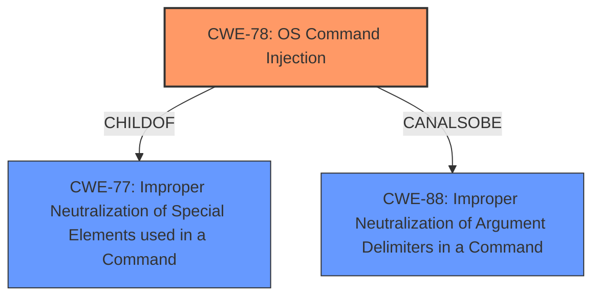

# Enhanced Analysis for CVE-2022-25865

# Summary
| CWE ID | CWE Name | Confidence | CWE Abstraction Level | CWE Vulnerability Mapping Label | CWE-Vulnerability Mapping Notes |
|---|---|---|---|---|---|
| CWE-78 | Improper Neutralization of Special Elements used in an OS Command ('OS Command Injection') | 1.0 | Base | Allowed | Primary CWE |
| CWE-88 | Improper Neutralization of Argument Delimiters in a Command ('Argument Injection') | 0.7 | Base | Allowed | Secondary CWE |

## Evidence and Confidence

*   **Confidence Score:** 0.9
*   **Evidence Strength:** HIGH

## Relationship Analysis
The primary CWE is CWE-78, which is a Base level CWE and a child of the Class CWE-77 (Improper Neutralization of Special Elements used in a Command). CWE-78 focuses specifically on OS commands. CWE-88 (Improper Neutralization of Argument Delimiters in a Command) is a Base level CWE that can also be related to command injection. The relationship between CWE-78 and CWE-88 is that CWE-88 can sometimes precede CWE-78.



## Vulnerability Chain
The vulnerability chain starts with **improper input sanitization** in the `fetchRemoteBranch` function. This leads to **command injection** (CWE-78) because the `remote` and `remoteBranch` parameters are passed to the `git fetch` command without proper escaping or validation. The attacker can then inject arbitrary git options, leading to arbitrary command execution and potentially a full system compromise.

## Summary of Analysis
The initial assessment indicates that CWE-78 (Improper Neutralization of Special Elements used in an OS Command) is the most appropriate primary CWE. The vulnerability description states that the `fetchRemoteBranch` function passes the `remote` and `remoteBranch` parameters directly to the `git fetch` command without proper sanitization, allowing an attacker to inject arbitrary git options and execute arbitrary commands on the system.

The evidence from the CVE Reference Links Content Summary supports this, stating:
"The vulnerability stems from the `fetchRemoteBranch` function in the `workspace-tools` package. This function passes the `remote` and `remoteBranch` parameters directly to the `git fetch` command without proper sanitization. This allows an attacker to inject arbitrary git options via the `remote` and `remoteBranch` parameters."

The **Vulnerability Description Key Phrases** also highlight "**improper input sanitization**" and "**command injection**".

The retriever results show a high score for CWE-78.

CWE-88 (Improper Neutralization of Argument Delimiters in a Command) is included as a secondary CWE because the injected git options are essentially argument delimiters that are not properly neutralized.

The selected CWEs are at the optimal level of specificity, as CWE-78 directly addresses the OS command injection aspect, and CWE-88 covers the argument injection aspect.

Other CWEs Considered and Rejected:

*   CWE-77: While this is a parent of CWE-78, CWE-78 is more specific to OS command injection, making it a better fit.
*   CWE-94, CWE-95, CWE-1336: These relate to code injection or template injection, which are not the primary issues in this vulnerability.
*   CWE-116: Improper Encoding or Escaping of Output: While encoding/escaping could have prevented the injection, the core issue is the lack of sanitization leading to command execution, making CWE-78 a more direct fit.
*   CWE-184: Incomplete List of Disallowed Inputs: While a list of disallowed inputs *could* theoretically help, the core issue is the lack of *any* sanitization, not an incomplete list.
*   CWE-73: External Control of File Name or Path: This isn't about controlling filenames or paths, but about injecting commands.

Final Conclusion:

CWE-78 is the primary CWE because the root cause is the lack of input sanitization, leading to OS command injection via the `git fetch` command. CWE-88 is a secondary CWE because the injected git options act as argument delimiters.


## CWE Relationship Analysis

Current CWEs represent these abstraction levels: .


### Vulnerability Chain Analysis

**Chain starting from CWE-184:**
- 184 (Incomplete List of Disallowed Inputs) - ROOT


**Chain starting from CWE-78:**
- 78 (Improper Neutralization of Special Elements used in an OS Command ('OS Command Injection')) - ROOT


### CWE Relationship Diagram

```mermaid
graph TD
    classDef primary fill:#f96,stroke:#333,stroke-width:2px
    classDef secondary fill:#69f,stroke:#333
    classDef tertiary fill:#9e9,stroke:#333
```