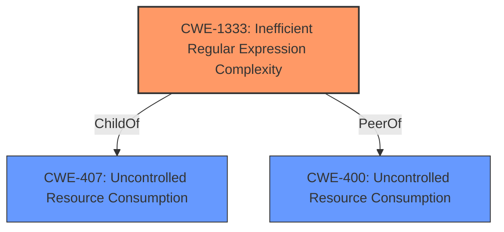

# Analysis Report for CVE-2022-25887

# Vulnerability Analysis Report: CVE-2022-25887

## Description


## Analysis (with Relationship Data)

# Summary
| CWE ID  | CWE Name                                                       | Confidence | CWE Abstraction Level | CWE Vulnerability Mapping Label | CWE-Vulnerability Mapping Notes |
| :-------- | :------------------------------------------------------------- | :---------- | :---------------------- | :------------------------------ | :------------------------------ |
| CWE-1333  | Inefficient Regular Expression Complexity                    | 1          | Base                   | Primary CWE                     | Allowed                       |
| CWE-400 | Uncontrolled Resource Consumption ('Resource Exhaustion')  | 0.7         | Base                   | Secondary CWE                      | Allowed                       |

## Evidence and Confidence

*   **Confidence Score:** 0.9
*   **Evidence Strength:** HIGH

## Relationship Analysis
The primary relationship influencing the decision is that CWE-1333 **ChildOf** CWE-407 (Uncontrolled Resource Consumption). This indicates that an inefficient regular expression is a specific type of uncontrolled resource consumption. Since the description mentions CPU cycle consumption, this relationship is relevant. Also, CWE-1333 has alternate terms like ReDos which aligns with the vulnerability description.



## Vulnerability Chain
The vulnerability chain starts with the **weakness** of using an inefficient regular expression (CWE-1333), which leads to excessive CPU consumption (CWE-400), ultimately resulting in a denial-of-service (DoS) condition.

## Summary of Analysis
The initial analysis strongly pointed towards CWE-1333 (Inefficient Regular Expression Complexity) as the primary CWE, given the vulnerability description's explicit mention of "Regular Expression Denial of Service (ReDoS)" and "insecure global regular expression replacement logic." The "CVE Reference Links Content Summary" section further solidified this by highlighting the root cause as a vulnerable regular expression pattern causing excessive backtracking. The retriever results also ranked CWE-1333 as the top match.

The MITRE mapping guidance for CWE-1333 states that it is at the Base level of abstraction, which is preferred. The description of CWE-1333 aligns perfectly with the vulnerability, as it describes how an attacker can craft inputs that intentionally cause the regular expression to use excessive backtracking, leading to a spike in CPU consumption. The confidence in this mapping is very high (1.0).

CWE-400 (Uncontrolled Resource Consumption) was considered as a secondary CWE because the ReDoS directly leads to resource exhaustion, specifically CPU cycles. While CWE-1333 captures the root cause, CWE-400 represents the direct consequence of the vulnerability.

CWE-777 (Regular Expression without Anchors) was considered but ultimately rejected as it focuses on missing anchors in regular expressions, which is not the primary issue in this vulnerability. The core problem is the inefficient complexity of the regex, not the lack of anchors.

CWE-617 (Reachable Assertion) was considered but rejected because the vulnerability does not involve triggering assertions.

CWE-185 (Incorrect Regular Expression) and CWE-186 (Overly Restrictive Regular Expression) were also considered but deemed less appropriate than CWE-1333. While the regex might be technically "incorrect," the primary concern is its inefficient complexity, not its failure to match intended values or its restrictiveness.

The selection of CWE-1333 is at the optimal level of specificity, as it directly addresses the root cause of the vulnerability: the use of an inefficient regular expression that leads to excessive CPU consumption and denial of service.

Relevant CWE Information:

## Vulnerability Description
The package sanitize-html before 2.7.1 are vulnerable to Regular Expression Denial of Service (ReDoS) due to insecure global regular expression replacement logic of HTML comment removal.

### Vulnerability Description Key Phrases
- **weakness:** **regular expression denial of service**
- **product:** sanitize-html
- **version:** before 2.7.1

## CVE Reference Links Content Summary
Based on the provided content, here's an analysis of CVE-2022-25887:

**Root Cause:**
The vulnerability stems from insecure global regular expression replacement logic used for removing HTML comments within the `sanitize-html` library. The regular expression used was susceptible to catastrophic backtracking, a condition that can lead to a Regular Expression Denial of Service (ReDoS).

**Weaknesses/Vulnerabilities:**
- **ReDoS vulnerability:** The core **weakness** is the use of a vulnerable regular expression pattern for removing HTML comments. This pattern could cause the regex engine to perform an excessive amount of backtracking when processing specific malicious inputs.
- **Insecure global regex replacement:** The use of global regular expression replacement logic, specifically when handling HTML comment removal was the source of the issue, which was corrected by replacing it with a more efficient implementation.

**Impact of Exploitation:**
- **Denial of Service (DoS):** By providing crafted HTML inputs with a large number of nested or repeating comment-like structures, an attacker can cause the `sanitize-html` library to consume excessive CPU resources. This leads to a denial-of-service condition, making the application unresponsive or slow for legitimate users. The vulnerability is termed a "Regular Expression Denial of Service (ReDoS)".
- **Reduced Availability:** The service's performance is reduced or there are interruptions in resource availability, potentially impacting the entire application using the vulnerable library.

**Attack Vectors:**
- **Network:** The vulnerability is remotely exploitable, meaning an attacker can send malicious inputs over the network, without prior authentication or user interaction.
- **Input manipulation:** Attackers can exploit this vulnerability by providing malicious HTML content to be processed by `sanitize-html`.

**Required Attacker Capabilities/Position:**
- **No special privileges required:** The attacker does not require any access to settings or files of the vulnerable system, only the ability to send crafted input.
- **Remote Access:** The attacker can exploit the vulnerability remotely through the network.
- **Ability to provide user input:** The attacker needs to be able to provide an HTML input that will be processed by the vulnerable function.

**Additional Notes:**
- The fix involves replacing the global regular expression replacement logic for comment removal with a new implementation, which avoids catastrophic backtracking, as shown in the github commit diff.
- The vulnerability is present in versions of `sanitize-html` prior to 2.7.1.
- The Snyk vulnerability information indicates a medium severity rating (5.3), while NVD rates it as high severity (7.5), which could indicate differing interpretations of the vulnerability's impact.

This information provides a comprehensive understanding of the CVE-2022-25887 vulnerability and how it can be exploited.


## CWE Relationship Analysis

Current CWEs represent these abstraction levels: .


### Vulnerability Chain Analysis

**Chain starting from CWE-400:**
- 400 (Uncontrolled Resource Consumption) - ROOT


**Chain starting from CWE-777:**
- 777 (Regular Expression without Anchors) - ROOT


### CWE Relationship Diagram

```mermaid
graph TD
    classDef primary fill:#f96,stroke:#333,stroke-width:2px
    classDef secondary fill:#69f,stroke:#333
    classDef tertiary fill:#9e9,stroke:#333
```


*Report generated on 2025-03-31 12:56:44*
