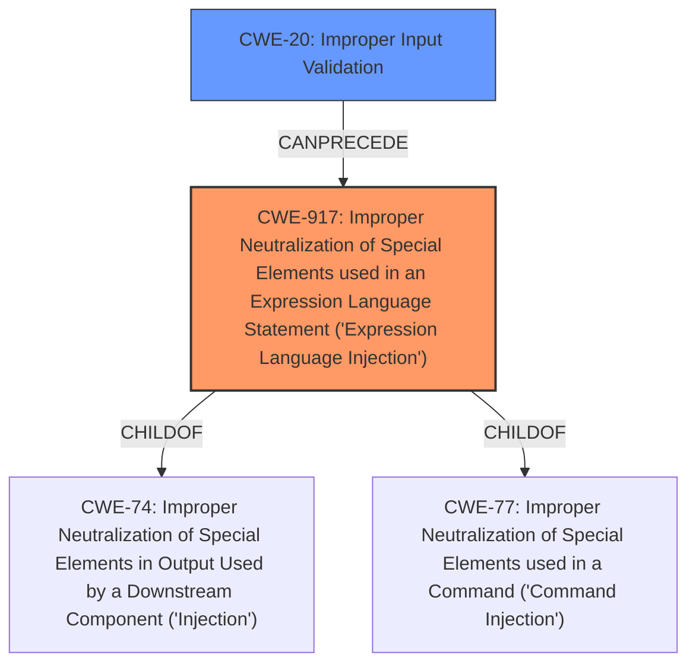

# Analysis for CVE-2022-25894

# Summary
| CWE ID  | CWE Name                                                                                                       | Confidence | CWE Abstraction Level | CWE Vulnerability Mapping Label | CWE-Vulnerability Mapping Notes |
| :-------- | :------------------------------------------------------------------------------------------------------------- | :---------- | :---------------------- | :------------------------------ | :-------------------------------- |
| CWE-917 | Improper Neutralization of Special Elements used in an Expression Language Statement ('Expression Language Injection') | 0.9        | Base                    | Allowed                       | Primary CWE                       |
| CWE-20  | Improper Input Validation                                                                                      | 0.6         | Class                    | Discouraged                     | Secondary Candidate              |

## Evidence and Confidence

*   **Confidence Score:** 0.8
*   **Evidence Strength:** HIGH

## Relationship Analysis
The primary weakness is CWE-917, which is a base-level CWE describing expression language injection. It's related to CWE-74 (Improper Neutralization of Special Elements in Output Used by a Downstream Component ('Injection')) and CWE-77 (Improper Neutralization of Special Elements used in a Command ('Command Injection')). CWE-20 (Improper Input Validation) is a class-level CWE that is often too general, but is related to the root cause. The hierarchical structure and chain relationships highlight how improper input validation can lead to expression language injection and potentially code execution.

## Vulnerability Chain
The vulnerability chain starts with **improper user input validation**, leading to the injection of malicious expressions into the `jexl.createExpression(expression).evaluate(context)` functionality, ultimately resulting in Remote Code Execution (RCE).

## Summary of Analysis
The primary focus of this analysis is to pinpoint the most accurate CWE representation for a Remote Code Execution (RCE) vulnerability within the `com.bstek.uflouflo-core` package. The vulnerability arises from **improper user input validation** in the `ExpressionContextImpl` class, specifically impacting the `jexl.createExpression(expression).evaluate(context)` functionality. This flaw allows for the injection of malicious expressions, leading to RCE.

The selection of CWE-917 (Improper Neutralization of Special Elements used in an Expression Language Statement ('Expression Language Injection')) as the primary CWE is based on its precise alignment with the vulnerability's root cause and mechanism. The vulnerability description clearly states that the issue stems from the **improper handling of user input** within an expression language context, which directly corresponds to the characteristics defined by CWE-917.

While CWE-20 (Improper Input Validation) is also relevant, it is a broader, class-level CWE that does not capture the specific nuances of expression language injection. The retriever results and CWE specifications both indicate that using more specific, base-level CWEs like CWE-917 is preferable when the evidence supports it.

*   **Vulnerability Description Key Phrases:**
    *   **Rootcause:** **improper user input validation**
    *   **Impact:** Remote Code Execution (RCE)
    *   **Vector:** jexl.createExpression(expression).evaluate(context) functionality

*   **CVE Reference Links Content Summary:**
    *   "The vulnerability stems from **improper user input validation** within the `ExpressionContextImpl` class, specifically in the `jexl.createExpression(expression).evaluate(context);` functionality. This allows for the injection of malicious expressions."

The graph relationships further support the selection of CWE-917, as it is directly linked to injection-related weaknesses such as CWE-74 and CWE-77.

Therefore, CWE-917 is the optimal choice due to its precise alignment with the vulnerability's root cause, mechanism, and the established MITRE mapping guidance. CWE-20, while relevant, is too general and does not fully capture the specific nature of the expression language injection vulnerability.