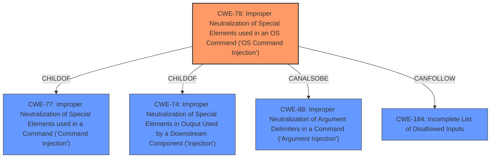

# Analysis for CVE-2022-25908

# Summary
| CWE ID | CWE Name | Confidence | CWE Abstraction Level | CWE Vulnerability Mapping Label | CWE-Vulnerability Mapping Notes |
|---|---|---|---|---|---|
| CWE-78 | Improper Neutralization of Special Elements used in an OS Command ('OS Command Injection') | 1.0 | Base | Primary | Allowed |
| CWE-184 | Incomplete List of Disallowed Inputs | 0.7 | Base | Secondary | Allowed |

## Evidence and Confidence

*   **Confidence Score:** 0.9
*   **Evidence Strength:** HIGH

## Relationship Analysis
The primary CWE is CWE-78, which is a Base level CWE. It is related to CWE-77 (Class) and CWE-74 (Class) through ChildOf relationships. CWE-78 can also be related to CWE-88 (Base) through a CanAlsoBe relationship. The chain of relationships shows that a more general Command Injection (CWE-77) can lead to OS Command Injection (CWE-78) if the commands are executed at the OS level.



## Vulnerability Chain
The vulnerability chain starts with **improper user-input sanitization**, which leads to Command Injection. Specifically, since the commands are executed at the OS level, it is OS Command Injection (CWE-78). If the application implements a protection mechanism using a list of disallowed inputs, but this list is incomplete, it can lead to exploitation. Thus, CWE-184 can follow CWE-78 in the chain.

## Summary of Analysis
The initial assessment pointed towards Command Injection due to **improper user-input sanitization**. After reviewing the provided evidence, the specific type of Command Injection is OS Command Injection (CWE-78) because the commands are executed at the OS level. The vulnerability description and the CVE Reference Links Content Summary clearly indicate that the `devInstall` function in the `create-choo-electron` package does not properly sanitize user input, allowing an attacker to inject arbitrary commands. The impact of this is arbitrary command execution on the system. The high retriever score and the clear description of the vulnerability support the choice of CWE-78.

CWE-184 is also considered because the root cause is **improper user-input sanitization**, suggesting that a list of disallowed inputs might be incomplete.

CWE-77 was considered but deemed less specific than CWE-78, as CWE-78 explicitly refers to OS command injection, which is more fitting to the vulnerability description.

CWE-88 was considered due to the CanAlsoBe relationship with CWE-78, but the description doesn't focus on argument delimiters, so it's not appropriate.

```
## Vulnerability Description
All versions of the package create-choo-electron are vulnerable to Command Injection via the devInstall function due to **improper user-input sanitization**.

### Vulnerability Description Key Phrases
- **rootcause:** **improper user-input sanitization**
- **weakness:** **command injection**

## CVE Reference Links Content Summary
- **Weaknesses/vulnerabilities present:** Command Injection (CWE-78). The `devInstall` function doesn't properly sanitize user-supplied input, allowing an attacker to inject arbitrary commands.
```

The selected CWEs are at the optimal level of specificity, with CWE-78 being a Base CWE that directly addresses the OS Command Injection vulnerability and CWE-184 addressing the root cause of improper sanitization.

Relevant CWE Information:

# Enhanced Context (25 CWEs)

## CWE-78: Improper Neutralization of Special Elements used in an OS Command ('OS Command Injection')
**Abstraction:** Base
**Status:** Stable

### Description
The product constructs all or part of an OS command using externally-influenced input from an upstream component, but it does not neutralize or incorrectly neutralizes special elements that could modify the intended OS command when it is sent to a downstream component.

## CWE-184: Incomplete List of Disallowed Inputs
**Abstraction:** Base
**Status:** Stable

### Description
The product implements a protection mechanism that relies on a list of inputs (or properties of inputs) that are not allowed by policy or otherwise require other action to neutralize before additional processing takes place, but the list is incomplete.