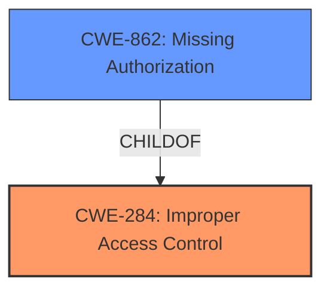

# Enhanced Analysis for CVE-2022-25915

# Summary
| CWE ID    | CWE Name                                                                              | Confidence | CWE Abstraction Level | CWE Vulnerability Mapping Label | CWE-Vulnerability Mapping Notes |
| :--------- | :------------------------------------------------------------------------------------ | :--------- | :---------------------- | :------------------------------ | :------------------------------ |
| CWE-284     | Improper Access Control                                                                 | 0.95       | Pillar                  | Primary                         | Discouraged                     |
| CWE-862     | Missing Authorization                                                                 | 0.75      | Base                   | Secondary                       | Allowed                         |

## Evidence and Confidence

*   **Confidence Score:** 0.9
*   **Evidence Strength:** HIGH

## Relationship Analysis
The primary CWE selected is CWE-284, "Improper Access Control," which is a high-level Pillar. While the description clearly states an "Improper access control" vulnerability, the CWE specifications recommend using more specific descendants. CWE-862, "Missing Authorization," is a more specific Base-level weakness and a child of CWE-284, offering a more granular classification if authorization is indeed missing. The relationship between CWE-284 and CWE-862 influenced the decision to include both, with CWE-284 as the primary, acknowledging the general nature of the finding, and CWE-862 as a secondary, suggesting a potential underlying cause.



## Vulnerability Chain
The chain of events for this vulnerability is as follows:

1.  **Root Cause:** **Improper Access Control** (CWE-284): The system **fails to properly restrict access** to the management screen. This is the fundamental flaw.
2.  **Weakness:** The vulnerability may be due to **Missing Authorization** (CWE-862): The system does not properly verify if the attacker has authorization to access the management screen.
3.  **Impact:** Bypass access restriction and access the management screen.

## Summary of Analysis
The initial assessment identified the **improper access control** vulnerability as described. The main decision was to determine the most specific CWE.

The evidence from the "**Vulnerability Description**" section states: "**Improper access control** vulnerability in ELECOM LAN routers... allows a network-adjacent authenticated attacker to bypass access restriction and to access the management screen of the product via unspecified vectors." The "**CVE Reference Links Content Summary**" section confirms this, stating: "**Root Cause of Vulnerability: Improper Access Control:** The vulnerability stems from a lack of proper access controls on the affected devices. This allows unauthorized access to the device's management interface."

The retriever results listed CWE-284 "Improper Access Control" as the top match. However, CWE-284 is a Pillar-level CWE, and the MITRE mapping guidance discourages its use. Therefore, while CWE-284 accurately describes the general problem, a more specific CWE is preferred.

CWE-862 "Missing Authorization" was considered because it is more specific. The vulnerability description indicates that an attacker can bypass access restrictions, which suggests that the system is not properly checking if the user has the necessary privileges to access the management screen. This aligns with the description of CWE-862.

The final decision was to assign CWE-284 as the primary CWE, given that is what is explicitly stated in the vulnerability, and assign CWE-862 as a secondary CWE to provide more specific information about the nature of the access control failure.

Relevant CWE Information:

# Enhanced Context (25 CWEs)

## CWE-74: Improper Neutralization of Special Elements in Output Used by a Downstream Component ('Injection')
**Abstraction Level**: Class
**Similarity Score**: 0.78
**Source**: dense

**Description**:
The product constructs all or part of a command, data structure, or record using externally-influenced input from an upstream component, but it does not neutralize or incorrectly neutralizes special elements that could modify how it is parsed or interpreted when it is sent to a downstream component.

**Mapping Guidance**:
- Usage: Discouraged
- Rationale: CWE-74 is high-level and often misused when lower-level weaknesses are more appropriate.

*   **Why it was not selected:** This vulnerability is not about injection.

## CWE-41: Improper Resolution of Path Equivalence
**Abstraction Level**: Base
**Similarity Score**: 0.78
**Source**: dense

**Description**:
The product is vulnerable to file system contents disclosure through path equivalence. Path equivalence involves the use of special characters in file and directory names. The associated manipulations are intended to generate multiple names for the same object.

**Mapping Guidance**:
- Usage: Allowed
- Rationale: This CWE entry is at the Base level of abstraction, which is a preferred level of abstraction for mapping to the root causes of vulnerabilities.

*   **Why it was not selected:** This vulnerability is not about file system issues.

## CWE-807: Reliance on Untrusted Inputs in a Security Decision
**Abstraction Level**: Base
**Similarity Score**: 0.78
**Source**: dense

**Description**:
The product uses a protection mechanism that relies on the existence or values of an input, but the input can be modified by an untrusted actor in a way that bypasses the protection mechanism.

**Mapping Guidance**:
- Usage: Allowed
- Rationale: This CWE entry is at the Base level of abstraction, which is a preferred level of abstraction for mapping to the root causes of vulnerabilities.

*   **Why it was not selected:** While this *could* be the case, it isn't explicitly stated or apparent that untrusted inputs are directly involved in the security decision leading to the bypass. It is more directly related to **improper access control.**

## CWE-184: Incomplete List of Disallowed Inputs
**Abstraction Level**: Base
**Similarity Score**: 0.77
**Source**: dense

**Description**:
The product implements a protection mechanism that relies on a list of inputs (or properties of inputs) that are not allowed by policy or otherwise require other action to neutralize before additional processing takes place, but the list is incomplete.

**Mapping Guidance**:
- Usage: Allowed
- Rationale: This CWE entry is at the Base level of abstraction, which is a preferred level of abstraction for mapping to the root causes of vulnerabilities.

*   **Why it was not selected:** Not related.

## CWE-425: Direct Request ('Forced Browsing')
**Abstraction Level**: Base
**Similarity Score**: 0.77
**Source**: dense

**Description**:
The web application does not adequately enforce appropriate authorization on all restricted URLs, scripts, or files.

**Mapping Guidance**:
- Usage: Allowed
- Rationale: This CWE entry is at the Base level of abstraction, which is a preferred level of abstraction for mapping to the root causes of vulnerabilities.

*   **Why it was not selected:** Not related.

## CWE-472: External Control of Assumed-Immutable Web Parameter
**Abstraction Level**: Base
**Similarity Score**: 0.77
**Source**: dense

**Description**:
The web application does not sufficiently verify inputs that are assumed to be immutable but are actually externally controllable, such as hidden form fields.

**Mapping Guidance**:
- Usage: Allowed
- Rationale: This CWE entry is at the Base level of abstraction, which is a preferred level of abstraction for mapping to the root causes of vulnerabilities.

*   **Why it was not selected:** Not related.

## CWE-639: Authorization Bypass Through User-Controlled Key
**Abstraction Level**: Base
**Similarity Score**: 0.77
**Source**: dense

**Description**:
The system's authorization functionality does not prevent one user from gaining access to another user's data or record by modifying the key value identifying the data.

**Mapping Guidance**:
- Usage: Allowed
- Rationale: This CWE entry is at the Base level of abstraction, which is a preferred level of abstraction for mapping to the root causes of vulnerabilities.

*   **Why it was not selected:** Not related.

## CWE-799: Improper Control of Interaction Frequency
**Abstraction Level**: Class
**Similarity Score**: 0.77
**Source**: dense

**Description**:
The product does not properly limit the number or frequency of interactions that it has with an actor, such as the number of incoming requests.

**Mapping Guidance**:
- Usage: Allowed-with-Review
- Rationale: This CWE entry is a Class and might have Base-level children that would be more appropriate

*   **Why it was not selected:** Not related.

## CWE-668: Exposure of Resource to Wrong Sphere
**Abstraction Level**: Class
**Similarity Score**: 0.76
**Source**: dense

**Description**:
The product exposes a resource to the wrong control sphere, providing unintended actors with inappropriate access to the resource.

**Mapping Guidance**:
- Usage:


## CWE Relationship Analysis

Current CWEs represent these abstraction levels: .


### Vulnerability Chain Analysis

**Chain starting from CWE-862:**
- 862 (Missing Authorization) - ROOT


**Chain starting from CWE-425:**
- 425 (Direct Request ('Forced Browsing')) - ROOT


### CWE Relationship Diagram

```mermaid
graph TD
    classDef primary fill:#f96,stroke:#333,stroke-width:2px
    classDef secondary fill:#69f,stroke:#333
    classDef tertiary fill:#9e9,stroke:#333
```