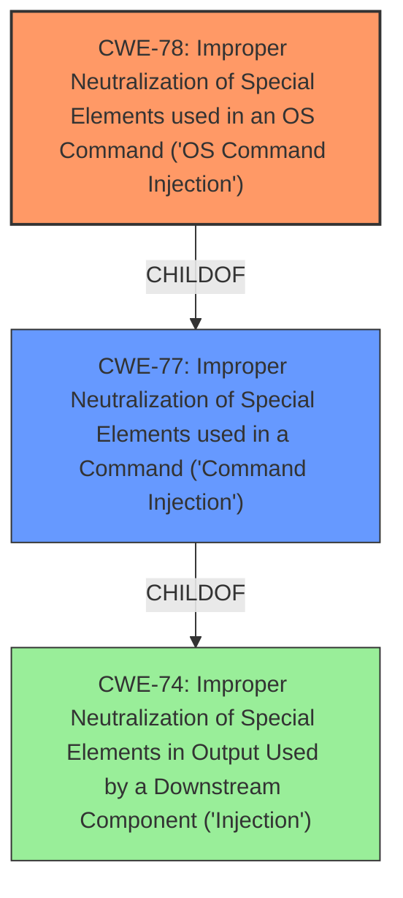

# Analysis Report for CVE-2022-25916

# Vulnerability Analysis Report: CVE-2022-25916

## Description


## Analysis (with Relationship Data)

# Summary
| CWE ID | CWE Name | Confidence | CWE Abstraction Level | CWE Vulnerability Mapping Label | CWE-Vulnerability Mapping Notes |
|---|---|---|---|---|---|
| CWE-78 | Improper Neutralization of Special Elements used in an OS Command ('OS Command Injection') | 1.0 | Base | Allowed | Primary CWE |

## Evidence and Confidence

*   **Confidence Score:** 1.0
*   **Evidence Strength:** HIGH

## Relationship Analysis
The primary relationship is that CWE-78 is a base CWE which is more specific than the Class CWE-77.



## Vulnerability Chain
The **improper input sanitization** leads directly to **command injection**, allowing an attacker to execute arbitrary commands.

## Summary of Analysis
The vulnerability description clearly states that there is **improper input sanitization** that leads to **command injection** in the `wiscan.scan` function. The `CVE Reference Links Content Summary` section states that the root cause is "Improper input sanitization in the 'wiscan.scan' function" and the weakness/vulnerability present is "Command Injection".

The Retriever Results lists CWE-77 as the top result and CWE-78 as the second result. CWE-77 is a Class level CWE while CWE-78 is a Base level CWE. Since the vulnerability is specifically related to OS commands, CWE-78 is a better fit than CWE-77.

Relevant CWE Information:

# Enhanced Context (25 CWEs)
The following CWEs were identified as potentially relevant to this vulnerability:

## CWE-77: Improper Neutralization of Special Elements used in a Command ('Command Injection')
**Abstraction:** Class

### Mapping Guidance
**Usage:** Allowed-with-Review
**Rationale:** CWE-77 is often misused when OS command injection (CWE-78) was intended instead [REF-1287].

## CWE-78: Improper Neutralization of Special Elements used in an OS Command ('OS Command Injection')
**Abstraction:** Base

### Mapping Guidance
**Usage:** Allowed
**Rationale:** This CWE entry is at the Base level of abstraction, which is a preferred level of abstraction for mapping to the root causes of vulnerabilities.

## CWE-138: Improper Neutralization of Special Elements
**Abstraction:** Class

### Mapping Guidance
**Usage:** Discouraged
**Rationale:** This CWE entry is a level-1 Class (i.e., a child of a Pillar). It might have lower-level children that would be more appropriate

## CWE-790: Improper Filtering of Special Elements
**Abstraction:** Class

### Mapping Guidance
**Usage:** Allowed-with-Review
**Rationale:** This CWE entry is a Class and might have Base-level children that would be more appropriate

I am selecting CWE-78 since the vulnerability is specifically an OS Command Injection due to **improper input sanitization**.
CWE-77 was considered, but not used, since it is a more general class of command injection.
CWE-138 was considered, but not used, because it is a class level of abstraction.
CWE-790 was considered, but not used, because it is a class level of abstraction.


## CWE Relationship Analysis

Current CWEs represent these abstraction levels: .


### Vulnerability Chain Analysis

**Chain starting from CWE-78:**
- 78 (Improper Neutralization of Special Elements used in an OS Command ('OS Command Injection')) - ROOT


**Chain starting from CWE-138:**
- 138 (Improper Neutralization of Special Elements) - ROOT


### CWE Relationship Diagram

```mermaid
graph TD
    classDef primary fill:#f96,stroke:#333,stroke-width:2px
    classDef secondary fill:#69f,stroke:#333
    classDef tertiary fill:#9e9,stroke:#333
```


*Report generated on 2025-03-30 11:13:12*
